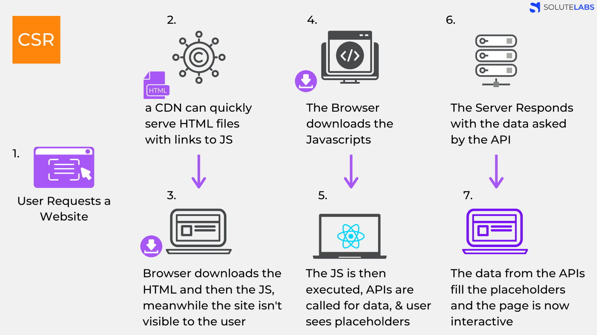
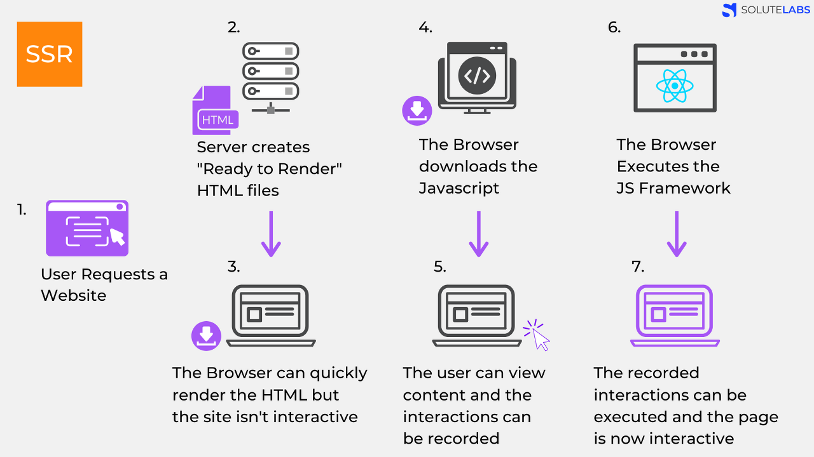

# 렌더링 전략에 대해 설명해 주세요.(CSR, SSR, SSG, ISR 등)

## CSR

Client Side Rendering의 약자로 클라이언트 측에서 렌더링을 하는 방식.
최초에 한번 서버에서 전체 페이지를 로딩하여 보여주고 이후에는 사용자의 요청이 올 때마다 리소스를 서버에서 제공한 후 클라이언트가 해석하고 렌더링을 하는 방식

1. User가 Website 요청을 보냄.
2. CDN이 HTML 파일과 JS로 접근할 수 있는 링크를 클라이언트로 보낸다.     CDN : aws의 cloudflare를 생각하면 됨. 엔드 유저의 요청에 '물리적'으로 가까운 서버에서 요청에 응답하는 방식
3. 클라이언트는 HTML과 JS를 다운로드 받는다.     (이때 SSR과 달리 유저는 아무것도 볼 수 없다.)
4. 생략
5. 다운이 완료된 JS가 실행된다. 데이터를 위한 API가 호출된다.     (이때 유저들은 placeholder를 보게된다. )
6. 서버가 API로부터의 요청에 응답한다.
7. API로부터 받아온 data를 placeholder 자리에 넣어준다. 이제 페이지는 상호작용이 가능해진다.

### CSR 장점

- js만으로 완전히 페이지를 만들 수 있으며 js를 최대한도로 활용하여 HTML,CSS를 동적으로 생성할 수 있다.
- 컴포넌트 단위로 코드를 나누고 다양한 디자인 패턴을 적용하는 등, 클라이언트 개발의 수준을 한 단계 끌어올릴 수 있다.
- Full page load 없이 라우팅이 가능하다. (로딩x->사용자 경험 상승) : js를 사용해서 동적으로 돔을 그려내기 때문에 원하는 내용만 업데이트 할 수 있다.
  예를 들어 링크를 이동했을 때 header와 footer와 같이 중복되는 내용은 고정으로 두고 안에 컨텐츠만 업데이트해 로드할 수 있다.

### CSR 단점

- SEO에 취약하다 : html파일을 하나만 받아와서 작동하다 보니 각각 페이지에 대한 정보를 담기 힘들며, Crawler가 서버에서 페이지 요청해서 html만을 읽어서 페이지에 어떤 정보가 있는지 확인하고 db에 저장하고 유저가 검색하면 db에서 정보를 꺼내준다.
- 첫 로드시 모든 로직이 담겨있는 js를 다운로드 하다보니 첫 진입 시 로딩 속도가 길다는 단점이있다.

## SSR

SSR은 CSR과 반대되는 개념으로 서버에서 페이지를 렌더링해서 클라이언트에 전달해주는 방식이다.  
SSR은 사용자가 요청할때 마다 그 시점에 페이지를 새롭게 렌더링한다.  
그래서 Fetching 해야하는 데이터가 빈번하게 변경될 때 사용한다.

1. User가 Website 요청을 보냄.
2. Server는 'Ready to Render'. 즉, 즉시 렌더링 가능한 html파일을 만든다.     (리소스 체크, 컴파일 후 완성된 HTML 컨텐츠로 만든다.)
3. 클라이언트에 전달되는 순간, 이미 렌더링 준비가 되어있기 때문에 HTML은 즉시 렌더링 된다.
       그러나 사이트 자체는 조작 불가능하다. (Javascript가 읽히기 전이다.)
4. 클라이언트가 자바스크립트를 다운받는다.
5. 다운 받아지고 있는 사이에 유저는 컨텐츠는 볼 수 있지만 사이트를 조작 할 수는 없다. 이때의 사용자 조작을 기억하고 있는다.
6. 브라우저가 Javascript 프레임워크를 실행한다.
7. JS까지 성공적으로 컴파일 되었기 때문에 기억하고 있던 사용자 조작이 실행되고 이제 웹 페이지는 상호작용 가능해진다.

처음 HTML문서를 받았을때 TTV가 먼저 일어나고 이후 클릭을 했을때의 서버로부터 클릭에 대한 처리 코드를 받음으로써 TTI가 일어난다. 따라서 TTV와 TTI의 공백이 길다

## SSR 장점

- SEO(Search Engine Optimization), 검색엔진 최적화에 유리 : Crawler는 페이지를 Indexing하기 위해 페이지에 관한 많은 정보가 필요한데, SSR을 활용하여 미리 페이지를 빌드를 하면 Crawler에게 많은 정보를 줄 수 있다.
- 빠른 초기 로딩 : SSR은 클라이언트에서 요청한 페이지의 html을 다운로드 하기 때문에 CSR보다 초기 진입시 로딩이 빠르다.
- 서버에서 렌더링 후 각각의 페이지를 넘겨받는 것이므로 각각 페이지에 대한 정보를 입력하기 쉽다.
  \*💡Crawler는 HTML을 읽어서 검색가능한 색인을 만들어낸다.

## SSR 단점

- 사용자 경험 : 클릭했을 때 새로운 html을 받아오기 때문에 요청시마다 새로고침 되기 때문에 깜빡임이 생긴다.
- header나 footer처럼 중복되는 내용도 다시 렌더링 하여 받아야 하기 때문에
  초기진입은 CSR보다 빠를지언정 페이지 이동은 SSR이 느린편에 속한다.
- 완성된 html을 js보다 먼저 받아오기 때문에 완성된 html로 화면은 확인 되지만 js다운로드가 늦어진다면 기능이 먹통일 경우가 발생할 수 있다.
- TTV(Time to view) !== TTI(Time to interactive)

## SSGvsISR

빌드타임 장소가 서로 다르다

## SSG(Static Site Generation)

클라이언트에서 필요한 페이지들을 사전에 미리 준비해뒀다가 요청을 받으면 이미 완성된 파일을 단순히 반환하여 브라우저에서 뷰를 보여준다.
단, 빌드하는 시점에 페이지가 미리 생성되기 때문에 fetching 하는 데이터가 변경되더라도 다시 빌드하지 않는 이상 반영되지 않는다.

### SSG 장점

- SEO가 굉장히 좋다
- 렌더링속도가 빠르다

### SSG 단점

- 동적인페이지에서 쓰면 ISR를 쓴다해도 성능상 문제가 된다.

### SSR VS SSG

서버에서 요청할 때 즉시만드느냐 혹은 미리 만들어 놓느냐에 따라 차이가 있다.

### SSR

- SSR은 매 요청마다 HTML을 생성하기 때문에 응답 속도가 느리고 서버에 더 많은 부담
- SSR은 요청시 서버에서 즉시 HTML을 만들어서 응답하기 때문에 데이터가 달라져서 미리 만들어 두기 어려운 페이지에 적합하다.

### SSG

- SSG는 빌드 시에 HTML이 생성되고 매 요청마다 HTML을 재사용
- SSG에서 HTML은 next build 명령어를 사용할 때 생성됩니다.그 후에는 CDN으로 캐시가 되어지고 요청마다 HTML을 재사용

#### 언제 사용하나?

SSG 미리 다 만들어두고 요청시에 해당 페이지를 응답하기 때문에 바뀔일이 거의없어서 캐싱해두면 좋은 페이지에 사용된다.

## ISR (Incremental Static Regeneration)

ISR은 빌드 시점에 페이지를 렌더링 한 후, 설정한 시간 마다 페이지를 새로 렌더링한다.  
SSG에 포함되는 개념이다.

SSG와 차이는 SSG는 빌드 시에 페이지를 생성하기 때문에 fetching 하는 데이터가 변경되면 다시 빌드해야 하지만 ISR은 일정 시간마다 알아서 페이지를 업데이트 해준다.
혹은 어떤 행동에 의해서 트리거를 통해서 페이지를 업데이트 해줄 수 있다.

#### ISR 장점

SSR과 달리 페이지가 즉시 제공되며(fallback page), 빠른 경험으로 사용자 경험도 좋아진다.

#### ISR 단점

페이지 디자인에 따라 첫번째 의미있는 페인팅을 지연시킬 수도 있다.

#### 언제 사용하나?

블로그와 같이 컨텐츠가 동적이지만 자주 변경되지 않는 사이트인 경우 ISR을 사용하는 것이 좋습니다.

## Reference

https://velog.io/@ka0son/%EB%A0%8C%EB%8D%94%EB%A7%81-%EC%82%BC%ED%98%95%EC%A0%9C-CSR-SSR-SSG-%EC%9D%B4%ED%95%B4%ED%95%98%EA%B8%B0

https://hahahoho5915.tistory.com/52

https://velog.io/@bbaa3218/Next-js-SSG-SSR-ISR

https://d2.naver.com/helloworld/7804182

https://enjoydev.life/blog/nextjs/1-ssr-ssg-isr#isr-incremental-static-regeneration

https://enjoydev.life/blog/nextjs/1-ssr-ssg-isr#ssgstatic-site-generation
