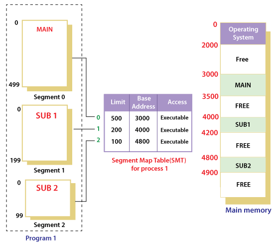

# 메모리 단편화

주기억장치는 CPU가 직접 접근하여 처리할 수 있는 고속의 기억장치 (Memory) 로, 현재 수행되는 프로그램과 데이터를 저장한다. 그종류로는 RAM과 ROM이 있다.

메모리 단편화는 메모리의 공간이 작은 조각으로 나뉘어져 충분히 사용 가능한 메모리가 있음에도 시스템이 메모리 할당을 할 수 없는 상태

메모리 단편화에는 내부 단편화와 외부 단편화가 있다.

## 내부 단편화

- 메모리를 할당할 때, 프로세스가 필요로 하는 크기보다 더 큰 메모리가 할당되어서 프로세스에서 사용하는 메모리 공간이 낭비되는 현상.
  

## 외부 단편화 (External Fragmentation)

- 메모리를 나눈 크기보다 프로그램이 커서 들어가지 못하는 공간이 많이 발생하는 현상
- 메모리가 할당되고 해제되는 작업이 반복되면서 중간중간 작은 메모리가 존재하 됨. 이때 중간중간 생긴 사용하지 않는 메모리가 발생하면서 메모리의 총 공간은 충분하지만 실제로는 할당할 수 없는 상황  
   
  압축(Compaction)
- 외부 단편화를 해소하기 위한 방법으로 Scattered Holes를 모으는 방법
- Scattered Holes를 합치는 과정에서 메모리에 적재된 프로세스를 정지시키고 한쪽으로 이동시키는 작업이 필요해 비효율적
- 또한, Scattered Holes를 어느 자유공간을 기준으로 모을지 결정하는 알고리즘도 모호

## 해결방법

### 1. 페이징 (Paging) - 가상메모리 사용, 외부 단편화 해결, 내부 단편화 존재

```
연속적이지 않은 공간도 활용할 수 있기 때문에 외부 단편화 문제를 해결 가능.
하지만  페이지 단위에 알맞게 꽉채워 쓰지 않을 때도 있을 수 있기 때문에 내부 단편화 문제는 여전히 존재
```


- 페이지(Page): 보조기억장치를 이용한 가상메모리를 같은 크기의 블록으로 나눈 것
- 프레임(Frame): 주기억장치를 페이지와 같은 크기로 나눈 것을 프레임(Frame)
- 페이징은 사용하지 않는 프레임을 페이지에 옮기고, 필요한 메모리를 페이지 단위로 프레임에 옮기는 것
- 페이징 기법을 사용하면 연속적이지 않은 공간도 활용할 수 있기 때문에 외부 단편화 문제를 해결 가능
- 하지만 페이지 단위에 알맞게 꽉채워 쓰지 않을 때도 있을 수 있기 때문에 내부 단편화 문제는 여전히 존재한다.페이지 단위를 작게 하면 내부 단편화 문제도 해결할 수 있겠지만, 대신 페이지와 프레임을 대응 시키는 과정인 Page Mapping 과정이 많아지기 때문에 오히려 효율이 떨어질 수 도 있다.(페이지와 프레임을 대응시키기 위해 페이지 매핑과정이 필요하기 때문에 페이징 테이블이 필요하다.)

#### 페이지의 크기를 결정하는 기준

- 내부 단편화
- Page-in, Page-out 시간 - I/O Overhead
- 페이지 테이블(Page Table) 크기
- 메모리 해상도(Memory resolution) - 필요한 내용만 메모리에 담을 수 있는 정도
- 페이지 부재(Page Fault) 발생 확률

### 2.세그먼테이션(Segmentation) - 가상 메모리 사용, 내부 단편화 해결, 외부 단편화 존재

```
프로세스가 요구하는 메모리 크기에 맞게 할당하기 때문에 내부 단편화해결 하지만 중간에 프로세스 해제시 구멍이생기는 등의 외부 단편화 문제 존제
```



- 세그먼테이션 기법:가상 메모리를 서로 크기가 다른 논리적 단위인 세그먼트로 분할해서 메모리 할당을 하고, 실제 메모리 주소로 변환하는 방법
- 각 세그먼트는 연속적인 공간에 저장되어 있다. 세그먼트들의 크기가 다르기 때문에 미리 분할해 둘 수 없고 메모리에 적재될 때 빈 공간을 찾아 할당한다.
- mapping을 위해 segment table이 필요합니다. table에는 각 세그먼트 항목별로 세그먼트 시작 주소와 세그먼트의 길이 정보를 가지고 있다.
- 프로세스가 요구하는 메모리 크기에 맞게 할당하기 때문에 내부 단편화는 일어나지 않지만,
  중간에 프로세스가 메모리를 해제하면 생기는 구멍, 즉, 외부 단편화 문제는 여전히 존재

### 3.메모리 풀 (Memory Pool)

```
내부 단편화와 외부 단편화 해결. 하지만 메모리 풀을 만들고 쓰지 않았을때 메모리낭비가 심하여 자주써야 효과적
```

- 필요한 메모리 공간을 적절한 크기, 개수만큼 사용자가 직접 지정하여 미리 할당받아 필요할 때마다 사용하고 반납하는 방법
- 메모리 풀 없이 동적 할당과 해제를 반복하면 메모리의 랜덤한 (실제로는 알고리즘에 의한) 위치에 할당과 해제가 반복되면서 단편화를 일으킬 수 있겠지만, 미리 공간을 할당해놓고 가져다 쓰고 반납하기 때문에 할당과 해제로 인한 외부 단편화가 발생않는다.
  또한 필요한 크기만큼 할당 하기 문에 내부 단편화 또한 생기지 않는다.
- 하지만 메모리 단편화로 인한 메모리 낭비량보다 메모리 풀을 만들었지만 쓰지 않았을 때 메모리 낭비가 심하기에 메모리 할당, 해제가 잦은 경우 사용하면 효과적

## Reference

https://velog.io/@hanhs4544/%EB%A9%94%EB%AA%A8%EB%A6%AC-%EB%8B%A8%ED%8E%B8%ED%99%94Memory-Fragmentation
https://beenii.tistory.com/162
https://beankong-devlog.tistory.com/56
