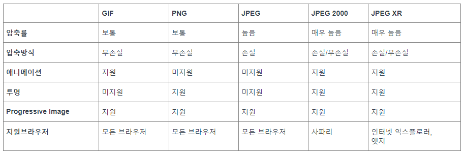

# HTML 태그만을 사용해서 이미지를 최대한 최적화 할 수 있는 방법에 대해 설명해 주세요 

## 이미지의 종류 및 특성

디지털 이미지는 일반적으로 브라우저에서 어떻게 렌더링 되느냐에 따라 레스터 이미지 타입과 벡터 이미지 타입, 그리고 이미지의 손실을 어느 정도 허용하는지에 따라, 무손실 이미지 타입과 손실 이미지로 구분

### 레스터 이미지와 백터 이미지
#### 래스터 이미지
픽셀에 표현하고자 하는 색상을 그려 이미지 형태로 표현하는 방식 ex) JPEG, PNG, GIF

 레스터 이미지는 여러 픽셀이 모여서 하나의 이미지를 만들기 때문에, 사이즈가 크거나 품질이 더 좋은 이미지를 만들기 위해서는 그만큼의 정보를 담은 픽셀들을 추가해야만 컴퓨터가 이를 정상적으로 표현할 수 있다. 사이즈가 커지면 커질수록 이미지의 용량도 늘어나고 렌더링 속도도 현저히 떨어지게 된다.

#### 백터 이미지
픽셀값으로 그림을 그리는 게 아닌 이미지 안에 수많은 수학 방정식을 포함하고 있는 방식의 이미지 형태

ex) SVG

컴퓨터는 선의 표현, 크기, 색상 등의 정보를 이미지안에 있는 계산식으로 연산하여 이미지를 제공.
연산을 사용하는 이미지 렌더링 방식 덕분에, 벡터 이미지는 사이즈가 커지거나, 작아져도 이미지가 깨지거나 정보가 달라지지 않는다.그러기에 항상 같은 이미지 품질을 유지.

벡터 이미지는 보통 아이콘, 폰트 등에 주로 사용., 이미지가 복잡하면 복잡할수록 이미지 안에 수학적인 정보는 계속해서 늘어나고, 이미지 용량 또한 같이 늘어난다. 

### 무손실 이미지와 손실 이미지
#### 무손실 이미지
**무손실 이미지 ≠ 원본 이미지**  
- 원본 이미지:이미지의 모든 정보를 가지고 있는 이미지
- 무손실 이미지:원본 이미지에서 이미지를 렌더링하는데 필요하지 않은 정보들을 제거한 이미지를 무손실 이미지 ex) GIF, PNG

#### 손실 이미지
손실 이미지는 무손실 이미지의 화질 감소를 감수하면서도 사이즈를 줄여 빠른 렌더링을 할 수 있는 이미지 ex) JPEG



## HTML 태그에서 이미지 최적화 방법
### img태그의 loading=lazy사용
웹사이트의 이미지는 최대한 사용자가 보이는 부분부터 로드되도록 처리하며, 사용자가 보이지 않는 부분은 Lazy Loading을 적용하여 사용자의 사용자 경험 저하를 막을 수 있도록 한다.
```
loading="lazy"
```
### img태그의 srcset 속성 사용
img태그의 srcset 속성은 이미지 소스의 세트라는 의미, 
같은 비율의 다양한 크기를 가지는 동일 이미지들을 명시하는 속성. 
(단, 주의사항은 이미지의 크기로 px단위가 아닌 w디스크립터 혹은 x디스크립터를 입력해야 하며, 작은 크기 이미지부터 순서대로 입력해야 합니다), 또한 sizes는 미디어 조건과 그 조건에 해당하는 이미지의 최적화 출력 크기를 지정한다. 
```

```
하지만 img태그는 몇가지 단점이 있다.브라우저가 사용하는 연산 방식이나 메모리, 혹은 파워가 충분한지에 따라 낮은 해상도가 선택될 수도 있고, 해상도별로 다른 비율의 이미지를 사용하거나 부분만 확대한 이미지를 사용할 때 이미지가 비정상적으로 보이는 이슈가 존재 

### picture태그를 사용
하지만 picture태그는 img 태그의 단점을 보완하는 방법입니다. picture는 특정 브라우저에서 특정 이미지를 사용할 수 있도록 강제할 수 있으며, 조건에 맞지 않는 이미지는 다운로드 하지 않는다. 

또한 picture태그는 이미지를 숨겨도 이미지를 다운로드하고 이미지를 줄여도 다른 이미지가 보여지지 않는 img 태그와는 다르게 해당 문제를 모두 해결할 수 있는 가장 효과적인 방법입니다. 

하지만 HTML 소스가 길어진다는 점과 IE 및 안드로이드 구버전 브라우저에서는 지원하지 않는다는 점이 단점입니다. (다만 pollyfill을 사용하면 어느정도 해결은 가능합니다.)
```
<picture>
    <source media="(min-width: 700px)" srcset="/examples/images/people_960.jpg">
    <source media="(min-width: 400px)" srcset="/examples/images/people_575.jpg">
    
</picture>
```
### 레이아웃 이동 방지
레이아웃 이동 방지를 신경써야한다.. 이미지 다운로드 전에 이미지의 정확한 크기를 지정해놓지 않으면, 이미지가 로드될 때 레이아웃 이동이 발생한다. 
1. 정확한 이미지의 width와 height 속성을 지정
```

```
2. aspect-ratio를 사용. 이 속성을 사용하면 이미지의 정확한 너비와 높이는 알 필요가 없고 종횡비만 알면 된다.
```


.my-image {
  aspect-ratio: 5 / 3;
  width: 100%;
  /* 이미지의 원래 종횡비가 달라도, 가능한 공간을 채운다. */
  object-fit: cover; 
}
```

### 비동기 이미지 디코딩
이미지에 decoding="async"를 지정해서 브라우저가 이미지 디코딩을 메인 스레드에서 처리하지 않게 할 수도 있다. MDN은 이걸 화면 밖으로 벗어난 이미지에 사용할 것을 추천한다.
```

```

### 리소스 힌트(fetchpriority)
fetchpriority사용.
이 속성은 이미지가 LCP 이미지처럼 우선순위가 아주 높은 이미지인지 브라우저에게 힌트를 줄 수 있습니다.
```


<div class="carousel">
  
  
  
</div>

```
## Reference
https://oliveyoung.tech/blog/2021-11-22/How-to-Improve-Web-Performance-with-Image-Optimization/

https://velog.io/@cnsrn1874/%EB%B2%88%EC%97%AD-HTML%EC%97%90%EC%84%9C-%EC%9D%B4%EB%AF%B8%EC%A7%80-%EC%B5%9C%EC%A0%81%ED%99%94%ED%95%98%EA%B8%B0#%EB%B8%8C%EB%9D%BC%EC%9A%B0%EC%A0%80-%EB%84%A4%EC%9D%B4%ED%8B%B0%EB%B8%8C-%EB%A0%88%EC%9D%B4%EC%A7%80-%EB%A1%9C%EB%94%A9