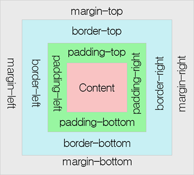

# 박스 모델(box model)
CSS에는 크게 두 가지 박스(블록 박스와 인라인 박스)가 있다.   

블록박스는  
- 박스는 인라인 방향으로 연장되어 상위 콘테이너에서 사용 가능한 공간을 채웁니다. 대부분은 경우 이것은 박스가 사용 가능한 공간을 100%로 채우면서 상위 콘테이너 너비만큼 된다는 의미입니다.  
- 박스는 새 줄로 행갈이를 합니다.
- 패딩과 여백, 테두리로 인해 다른 요소들이 박스로부터 밀려납니다.
- width와 height 속성이 인정된다. 

인라인 박스는 
- 박스는 새 줄로 행갈이를 하지 않습니다.
- width와 height 속성은 적용되지 않습니다.
- 패딩과 여백, 테두리는 다른 인라인 박스들이 당 박스로부터 멀어지지게 하지 않습니다.

CSS 박스 모델은 블록 박스에 적용되며, 인라인 박스는 박스 모델에 정의된 일부 동작만 사용한다.

이 모델은 페이지에서 볼 수 있는 박스를 생성하기 위해 박스의 서로 다른 부분인 여백, 테두리, 패딩 및 콘텐츠등이 어떻게 함께 작동할 것인지를 정의한다.

모든 HTML 요소는 박스(box) 모양으로 구성되며, 이것을 박스 모델(box model)이라고 부릅니다.

박스 모델은 HTML 요소를 패딩(padding), 테두리(border), 마진(margin), 그리고 내용(content)으로 구분한다

1. 내용(content) : 텍스트나 이미지가 들어있는 박스의 실질적인 내용 부분입니다.

2. 패딩(padding) : 내용과 테두리 사이의 간격입니다. 패딩은 눈에 보이지 않습니다.

3. 테두리(border) : 내용와 패딩 주변을 감싸는 테두리입니다.

4. 마진(margin) : 테두리와 이웃하는 요소 사이의 간격입니다. 마진은 눈에 보이지 않습니다.

**height와 width 속성의 이해**
모든 웹 브라우저에서 정확하게 HTML 요소들을 표현하려면 이러한 박스 모델이 어떻게 동작하는지 정확히 알아야만 합니다.

CSS에서 height와 width 속성을 설정할 때 그 크기가 가르키는 부분은 내용(content) 부분만을 대상으로 합니다.

HTML 요소의 height와 width 속성으로 설정된 높이와 너비에 패딩(padding), 테두리(border), 마진(margin)의 크기는 포함되지 않습니다.

**HTML 요소의 전체 너비(width)를 계산하는 공식**

width + left padding + right padding + left border + right border + left margin + right margin 입니다.

 
**HTML 요소의 전체 높이(height)를 계산하는 공식**

height + top padding + bottom padding + top border + bottom border + top margin + bottom margin 입니다.

## Reference 
https://tcpschool.com/css/css_boxmodel_boxmodel  
https://developer.mozilla.org/ko/docs/Learn/CSS/Building_blocks/The_box_model