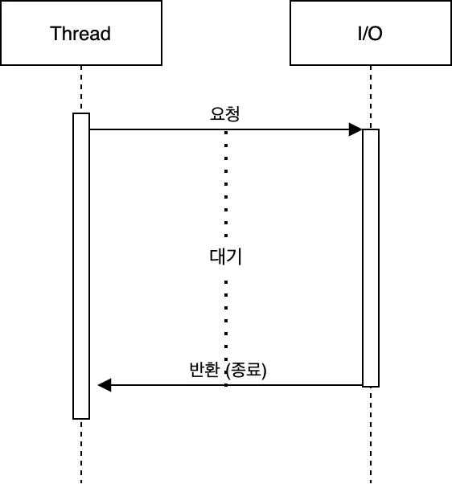
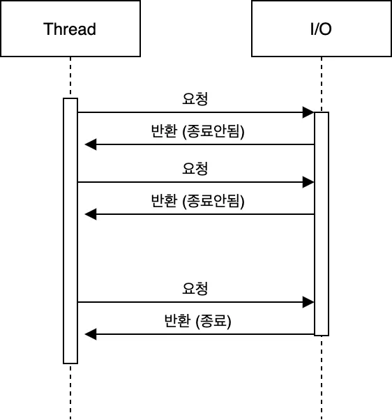

# 블로킹&논블로킹과 동기&비동기에 대해 설명해주세요

## Blocking / Non-Blocking

다른 요청의 작업을 처리하기 위해 현재 작업을 block(차단, 대기) 하냐 안하냐의 유무를 나타내는 프로세스의 실행 방식

### 블로킹 (Blocking)

블로킹은 요청에 대한 결과를 바로 줄 수 없는 경우 그 결과를 기다리도록 하는것을 의미. 요청에 대한 결과를 바로 받을 수 없는 상황에서, 블로킹의 경우엔 결과가 나타날 때 까지 기다리게된다.

블로킹은 요청에 대한 결과가 올 때 까지 쓰레드는 아무것도 하지 못하고 대기한다.

### 논 블로킹 (Non-Blocking)

요청에 대한 응답을 기다리지 않고, 다음 작업을 바로 수행

## Synchronous / Asynchronous

Synchronous는 요청한 작업에 대해 완료 여부를 따져 순차대로 처리
Asynchronous는  동기와 반대로 요청한 작업에 대해 완료 여부를 따지지 않기 때문에 자신의 다음 작업을 그대로 수행
따라서 동기 작업은 요청한 작업에 대해 순서가 지켜지는 것을 말하는 것이고, 비동기 작업은 순서가 지켜지지 않을 수 있다는 것을 말함.

## 블로킹/논블로킹과 동기/비동기의 차이

동기/비동기는 요청한 작업에 대해 완료 여부를 신경 써서 작업을 순차적으로 수행할지 아닌지에 대한 관점이고,  
블로킹/논블록킹은 단어 그대로 현재 작업이 block(차단, 대기) 되느냐 아니냐에 따라 다른 작업을 수행할 수 있는지에 대한 관점

## Reference

https://choi-geonu.medium.com/%EB%B0%B1%EC%97%94%EB%93%9C-%EA%B0%9C%EB%B0%9C%EC%9E%90%EB%93%A4%EC%9D%B4-%EC%95%8C%EC%95%84%EC%95%BC%ED%95%A0-%EB%8F%99%EC%8B%9C%EC%84%B1-2-%EB%B8%94%EB%A1%9C%ED%82%B9%EA%B3%BC-%EB%85%BC%EB%B8%94%EB%A1%9C%ED%82%B9-%EB%8F%99%EA%B8%B0%EC%99%80-%EB%B9%84%EB%8F%99%EA%B8%B0-e11b3d01fdf8

https://inpa.tistory.com/entry/%F0%9F%91%A9%E2%80%8D%F0%9F%92%BB-%EB%8F%99%EA%B8%B0%EB%B9%84%EB%8F%99%EA%B8%B0-%EB%B8%94%EB%A1%9C%ED%82%B9%EB%85%BC%EB%B8%94%EB%A1%9C%ED%82%B9-%EA%B0%9C%EB%85%90-%EC%A0%95%EB%A6%AC
