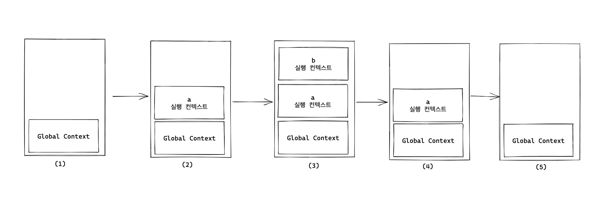

# 실행 콘텍스트에 대해서 설명해주세요

```
선요약
실행 컨텍스트는 함수가 실행되는 환경을의미 하며, 실행 가능한 코드에 제공할 환경 정보를 모아놓은 객체입니다.
해당 객체에는 변수,매개변수, 내장함수 객체, 스코프 체인, this 정보가 담겨있습니다.
자동으로 전역 컨텍스트가 생성된 후 함수 호출시마다 함수 컨텍스트가 생성되고, 컨텍스트 생성이 완료된 후에 함수가 실행됩니다. 함수 실행 중에 사용 되는 변수들을 변수 객체 안에서 값을 찾고 값이 존재하지 않는다면 Lexical 환경의 outerEnvironmentReference를 통해 Scope 체인을 따라 올라가면서 탐색합니다.
함수 실행이 마무리가 되면 해당 컨텍스트는 사라지고, 페이지가 종료되면 전역 컨텍스트도 사라집니다.

```

실행 컨텍스트(Execution Context)는 소스코드를 실행에 필요한 환경을 제공하고 코드 실행결과를 관리하는 영역이다.

자바스크립트는 동일한 환경에 있는 환경 정보들을 모은 실행 컨텍스트를 콜스택에 쌓아올린 후 실행하여 코드의 환경과 순서를 보장할수 있게 된다.

실행컨텍스트에서 식별자를 관리하고, 코드 실행 순서를 관리한다.

식별자와 스코프는 실행컨텍스트의 렉시컬 환경으로 관리하고, 실행 순서는 실행 컨텍스트 스택(스택의 경우 FILO (First In, Last Out) 의 구조이기에)으로 관리한다.

실행 컨텍스트는 전역 컨텍스트와 함수 컨텍스트로 나뉩니다. 전역 컨텍스트는 코드의 가장 바깥쪽에서 실행되며, 함수 컨텍스트는 함수가 실행될 때 생성됩니다.

함수가 실행될 때마다 새로운 실행 컨텍스트가 생성되며, 이전 실행 컨텍스트는 스택(Stack)에 저장됩니다. 함수가 실행을 마치면 해당 실행 컨텍스트는 스택에서 제거된다.

소스코드가 로드되면 자바스크립트 엔진은 전역코드를 평가합니다.

## 자바스크립트에서 소스코드를 4가지

- 전역 코드  - 전역에 존재하는 소스코드를 말하며 이는 전역 실행 컨텍스트를 생성,  전역 코드는 전역 변수를 관리하기 위해 최상위 스코프인 전역 스코프를 생성

- 함수 코드: 지역 스코프를 생성하고 지역 변수, 매개변수, arguments 객체를 관리

- eval 코드:strict mode에서 독자적인 스코프를 생성한다.

- 모듈 코드: 모듈별로 독립적인 모듈 스코프를 생성한다.

## 실행컨텍스트 속 정보

### VariableEnvironment

VariableEnvironment 란 현재 컨텍스트 내부의 식별자 정보 , 외부 환경 정보가 포함되어 있다.
VariableEnvironment 에 먼저 정보를 담고, 그대로 LexicalEnvironment 에 복사해 사용한다.

### LexicalEnvironment = lexical scope

VariableEnvironment 초기 상태를 기억하고 있으며, LexicalEnvironment 최신 상태를 저장한다.
그리고 environmentRecord를 통해 현재 컨텍스트와 관련된 식별자와 식별자에 바인딩된 값을 기록하는 공간이다.그리고 실행 컨텍스트 내부 전체를 처음부터 끝까지 확인하며 순서대로 수집합니다.

```
environmentRecord 의 경우 해당 컨텍스트 환경에 필요한 식별자와 식별자의 값이 기록되며, 함수 실행 시 실행 컨텍스트가 생성되므로 (함수 실행보다 environmentRecord 수집이 먼저 되므로) 변수와 같은 식별자를 끌어올리는 것과 같다 라는 개념의 호이스팅이 생겨났습니다.
```

### this binding

this 란 실행 컨텍스트 생성시 (함수를 실행할 때) 할당해주는 것으로 상황에 따라 가끔은 전역객체, instance 를 가르킵니다.
실행 컨텍스트에서의 this 로 지정된 객체의 정보를 갖고 있는 것이 ThisBinding 입니다.

### 실행콘텍스트 콜스텍

```
var temp = 'temp';

function b (){
  console.log('안녕하세용');
}

function a (){
  b();
}

a();
```



1. 콜스택엔 전역 컨텍스트를 제외하곤 다른 컨텍스트가 없기에 전역 컨텍스트와 관련된 코드를 진행합니다.
2. 전역 컨텍스트와 관련된 코드를 진행 중 a함수를 실행하였기에 a 함수의 환경 정보들을 수집하여 a 실행 컨텍스트를 생성, 콜스택에 담습니다.
   콜스택 최상단에 a 실행 컨텍스트가 있기에 기존의 전역 컨텍스트와 관련된 코드의 실행을 일시적으로 중단한 후 a 실행 컨텍스트의 코드를 실행합니다.
3. a 함수 내부에서 b 함수를 실행하였기에 b 함수의 환경 정보들을 수집, 실행 컨텍스트를 생성, 콜스택에 담습니다. 이전과 똑같이 콜스택 최상단에 b 실행 컨텍스트가 있기에 기존 a 실행 컨텍스트와 관련된 코드의 실행을 일시적 중단합니다.
4. b 함수가 종료된 후 b 실행 컨텍스트가 콜스택에서 제거됩니다. 제거 후 콜스택 최상단에는 a 실행 컨텍스트가 있기에 이전에 중단된 지점부터 코드 진행이 재개됩니다.
5. a 함수 또한 종료된 후 실행 컨텍스트가 콜스택에서 제거됩니다.
   이후엔 전역 공간에 실행할 코드가 남아있지 않다면 콜스택에서 전역 컨텍스트 또한 제거되며 콜스택에 아무 것도 남지 않은 상태로 종료됩니다.

## 전역코드 평가 과정

1. 전역 실행 컨텍스트 생성
2. 전역 렉시컬 환경 생성

   2.1 전역 환경 레코드 생성

   2.1.1. 객체 환경 레코드 생성 → var로 선언한 전역변수, 함수 선언문

   2.1.2. 선언적 환경 레코드 생성 → let, const로 선언한 전역변수

   2.2 this 바인딩 → 전역환경 레코드와 함수 환경 레코드에만 존재
   2.3 외부 렉시컬 환경에 대한 참조

## 함수코드 평가

1. 함수 실행 컨텍스트 생성
2. 함수 렉시컬 환경 생성
   1. 함수 환경 레코드 생성
   2. this 바인딩
   3. 외부 렉시컬 환경에 대한 참조

참고:
https://chinggin.tistory.com/642

https://blog.gamguma.dev/post/2022/04/js_execution_context

https://velog.io/@kados22/FE-%EA%B8%B0%EC%88%A0-%EB%A9%B4%EC%A0%91-%EC%8B%A4%ED%96%89-%EC%BB%A8%ED%85%8D%EC%8A%A4%ED%8A%B8%EA%B0%80-%EB%AC%B4%EC%97%87%EC%9D%B8%EA%B0%80%EC%9A%94
