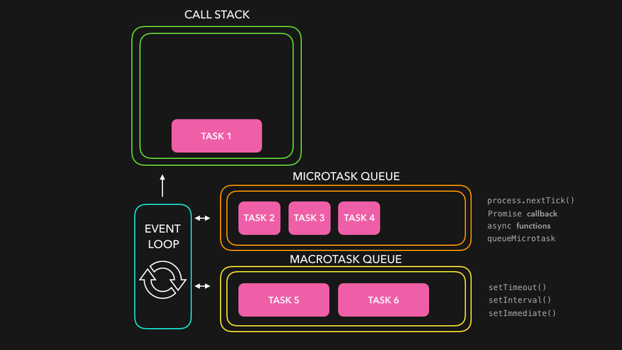

# 이벤트 루프와 태스크 큐에 대해 설명해주세요

## 선요약 
- JavaScript는 비동기 처리 방식을 지원하여, 이벤트 루프와 태스크 큐를 통해 비동기적으로 작업을 처리
- 싱글 스레드로 작동하기에, 자바스크립트의 동시성을 지원하는 것이 이벤트 루프라고함.
-  이벤트루프는 콜스택에 현재 진행중인 실행 컨텍스트가 있는지, 그리고 태스크 큐에 대기중인 콜백함수, 이벤트 핸들러와 같은 함수가 있는지 반복해서 확인하는데, 만약 콜스택이 비어있고 태스크 큐에 대기중인 함수가 있으면 이벤트 루프는 순차적으로 태스크큐에 대기중인 함수를 콜스택에 이동시킵니다. 이때 콜 스택으로 이동한 함수는 실행

JavaScript는 단일 쓰레드 기반으로 동작합니다. 이 말은 하나의 쓰레드로 코드가 실행되며, 동시에 처리할 수 있는 작업의 수가 제한적이라는 것을 의미합니다. 그러나 JavaScript는 비동기 처리 방식을 지원하여, 이벤트 루프와 태스크 큐를 통해 비동기적으로 작업을 처리합니다.  

이렇게 자바스크립트는 싱글 스레드로 작동하기에, 자바스크립트의 동시성을 지원하는 것이 이벤트 루프라고 합니다. 이벤트루프는 콜스택에 현재 진행중인 실행 컨텍스트가 있는지, 그리고 태스크 큐에 대기중인 콜백함수, 이벤트 핸들러와 같은 함수가 있는지 반복해서 확인하는데, 만약 콜스택이 비어있고 태스크 큐에 대기중인 함수가 있으면 이벤트 루프는 순차적으로 태스크큐에 대기중인 함수를 콜스택에 이동시킵니다. 이때 콜 스택으로 이동한 함수는 실행이 됩니다.

이벤트 루프는 콜 스택, 백그라운드, 태스크 큐 세 가지 요소로 이루어져 있습니다. 콜 스택은 현재 실행중인 함수의 정보를 저장하는 스택이고, 백그라운드는 타이머, HTTP 요청, 이벤트 등의 비동기 작업을 처리하는 곳입니다. 태스크 큐는 백그라운드에서 처리된 작업들의 콜백 함수를 보관하는 큐입니다.

JavaScript 엔진은 콜 스택이 비어있는지를 지속적으로 확인하며, 비어있을 경우 태스크 큐에서 작업을 꺼내 콜 스택에 넣습니다. 이때, 태스크 큐에서 꺼낸 작업은 해당 작업의 실행 순서와 관계없이 콜 스택에 넣습니다. 이를 통해 JavaScript는 동기적으로 실행되는 코드와 비동기적으로 실행되는 코드를 함께 처리할 수 있습니다.

예를 들어, setTimeout() 함수를 사용하여 1초 후에 실행되는 함수를 등록한다면, 이 함수는 백그라운드에서 처리되며 1초가 지난 후 태스크 큐에 콜백 함수가 등록됩니다. 그리고 콜 스택이 비어있을 때 콜백 함수가 콜 스택으로 이동하여 실행됩니다.

```
console.log('start');

setTimeout(() => {
  console.log('setTimeout');
}, 1000);

console.log('end');


//  실행 결과
// start
// end
// setTimeout
```
이벤트 루프와 태스크 큐를 이용하면, 비동기적으로 실행되는 코드를 효율적으로 처리할 수 있습니다. 예를 들어, Ajax 요청을 보내고 응답이 오면 콜백 함수를 실행하는 코드는 비동기 처리 방식을 이용해야 합니다. 이를 동기적으로 처리한다면, 응답이 오기까지 기다리는 동안 다른 작업을 수행하지 못하기 때문입니다.


 
 자바스크립트 엔진은 크게 2개의 영역으로 나뉜다.
```
Call Stack(호출 스택)
작업이 요청되면(함수가 호출되면) 요청된 작업은 순차적으로 Call Stack에 쌓이게 되고 순차적으로 실행된다.
자바스크립트는 단 하나의 Call Stack을 사용하기 때문에 해당 task가 종료하기 전까지는 다른 어떤 task도 수행될 수 없다.
 
Heap
힙은 객체가 저장되는 메모리 공간 콜스택의 요소인 실행 컨텍스트는 힙에 저장된 객체를 참조한다.
동적으로 생성된 객체 인스턴스가 할당되는 영역이다.
```
이와 같이 자바스크립트 엔진은 단순히 작업이 요청되면 Call Stack을 사용하여 요청된 작업을 순차적으로 실행할 뿐이다. 앞에서 언급한 동시성(Concurrency)을 지원하기 위해 필요한 비동기 요청(이벤트를 포함) 처리는 자바스크립트 엔진을 구동하는 환경 즉 브라우저(또는 Node.js)가 담당한다.
```
Event Queue(Task Queue)
비동기 처리 함수의 콜백 함수, 비동기식 이벤트 핸들러, Timer 함수(setTimeout(), setInterval())의 콜백 함수가 보관되는 영역으로
이벤트 루프(Event Loop)에 의해 특정 시점(Call Stack이 비어졌을 때)에 순차적으로 Call Stack으로 이동되어 실행된다.

Event Loop(이벤트 루프)
Call Stack 내에서 현재 실행중인 task가 있는지 그리고 Event Queue에 task가 있는지 반복하여 확인한다.
이벤트 루프는 태스크가 들어오길 기다렸다가 태스크가 들어오면 이를 처리하고, 처리할 태스크가 없는 경우엔 잠드는,
끊임없이 돌아가는 자바스크립트 내 루프입니다
```
### 이벤트 루프 알고리즘

1. 매크로태스크 큐에서 가장 오래된 태스크를 꺼내 실행합니다(예: 스크립트를 실행).
2. 모든 마이크로태스크를 실행합니다.
 이 작업은 마이크로태스크 큐가 빌 때까지 이어지고
 태스크는 오래된 순서대로 처리됩니다.
3. 렌더링할 것이 있으면 처리합니다.
4. 매크로태스크 큐가 비어있으면 새로운 매크로태스크가 나타날 때까지 기다립니다.
5. 다시 1번으로 돌아간다.

자바스크립트 엔진은 대부분의 시간 동안 아무런 일도 하지 않고 쉬고 있다가 스크립트나 핸들러, 이벤트가 활성화될 때만 돌아간다.

자바스크립트 엔진을 활성화하는 대표적인 태스크는 다음과 같다.
```
- 외부 스크립트 <script src="...">가 로드될 때, 이 스크립트를 실행하는 것
- 사용자가 마우스를 움직일 때 mousemove 이벤트와 이벤트 핸들러를 실행하는 것
- setTimeout에서 설정한 시간이 다 된 경우, 콜백 함수를 실행하는 것
- 기타 등등
```



### 매크로태스크와 마이크로태스크
둘 다 콜백 함수나 이벤트 핸들러를 일시 저장한다는 점에서 동일하지만, 태스크 큐보다 마이크로태스크 큐가 더 우선순위가 높다.
즉, 이벤트 루프는 콜 스택이 비면 먼저 마이크로태스크 큐에서 대기하고 있는 함수를 가져와 실행한다.
이후 마이크로태스크 큐가 비면 태스크 큐에 대기하고 있는 함수를 가져와 실행한다.

microtask queue 👉 Promise
task queue, macrotask queue 👉 setTimeout, setInterval

### 마이크로 태스크 큐 & 매크로 태스크 큐
태스크 큐는 구체적으로 마이크로 태스크큐(Event Queue) 와 매크로 태스크큐(Job Queue) 로 나뉘어진다.

API에 따라 마이크로 태스크 큐를 사용하거나, 매크로 태스크 큐를 사용한다.
      

참고:  
https://ko.javascript.info/event-loop    

https://poiemaweb.com/js-event    

https://velog.io/@yejineee/%EC%9D%B4%EB%B2%A4%ED%8A%B8-%EB%A3%A8%ED%94%84%EC%99%80-%ED%83%9C%EC%8A%A4%ED%81%AC-%ED%81%90-%EB%A7%88%EC%9D%B4%ED%81%AC%EB%A1%9C-%ED%83%9C%EC%8A%A4%ED%81%AC-%EB%A7%A4%ED%81%AC%EB%A1%9C-%ED%83%9C%EC%8A%A4%ED%81%AC-g6f0joxx    

https://velog.io/@minyoung22222/%ED%83%9C%EC%8A%A4%ED%81%AC-%ED%81%90%EB%A7%A4%ED%81%AC%EB%A1%9C%ED%83%9C%EC%8A%A4%ED%81%AC-%ED%81%90-VS-%EB%A7%88%EC%9D%B4%ED%81%AC%EB%A1%9C%ED%83%9C%EC%8A%A4%ED%81%AC-%ED%81%90
