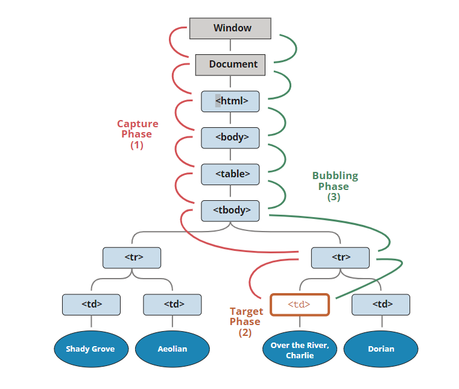

# 자바스크립트에서 이벤트

이벤트(event) 는 무언가 일어났다는 신호입니다. 모든 DOM 노드는 이런 신호를 만들어 낸다. 그리고 이벤트는 DOM에만 한정되진 않는다.

### 마우스 이벤트:

- click – 요소 위에서 마우스 왼쪽 버튼을 눌렀을 때(터치스크린이 있는 장치에선 탭 했을 때) 발생합니다.
- contextmenu – 요소 위에서 마우스 오른쪽 버튼을 눌렀을 때 발생합니다.
- mouseover와 mouseout – 마우스 커서를 요소 위로 움직였을 때, 커서가 요소 밖으로 움직였을 때 발생합니다.
- mousedown과 mouseup – 요소 위에서 마우스 왼쪽 버튼을 누르고 있을 때, 마우스 버튼을 뗄 때 발생합니다.
- mousemove – 마우스를 움직일 때 발생합니다.

### 폼 요소 이벤트:

- submit – 사용자가 <form>을 제출할 때 발생합니다.
- focus – 사용자가 <input>과 같은 요소에 포커스 할 때 발생합니다.

### 키보드 이벤트:

- keydown과 keyup – 사용자가 키보드 버튼을 누르거나 뗄 때 발생합니다.

### 문서 이벤트:

- DOMContentLoaded – HTML이 전부 로드 및 처리되어 DOM 생성이 완료되었을 때 발생합니다.

### CSS 이벤트:

- transitionend – CSS 애니메이션이 종료되었을 때 발생합니다.

## 이벤트 핸들러

이벤트에 반응하려면 이벤트가 발생했을 때 실행되는 함수인 핸들러(handler) 를 할당해야 한다.

핸들러는 사용자의 행동에 어떻게 반응할지를 자바스크립트 코드로 표현한 것입니다.

이벤트 핸들러는 3가지 방법으로 할당할 수 있다.

- HTML 속성: onclick="...".
- DOM 프로퍼티: elem.onclick = function.
- 메서드: elem.addEventListener(event, handler[, phase])로 핸들러를 추가하고, removeEventListener 로 핸들러를 제거함

## 이벤트 위임

이벤트 위임(Event Delegation)은 다수의 자식 요소에 각각 이벤트 핸들러를 바인딩하는 대신

하나의 부모 요소에 이벤트 핸들러를 바인딩하는 방법이다.

이벤트 위임을 통해 상위 DOM요소에 이벤트 핸들러를 등록하면 여러개의 하위 DOM요소에 이벤트 핸드러를 등록할 필요없다.  
또한 동적으로 하위 DOM요소를 추가하더라도 일일이 추가된 DOM요소에 이벤트 핸들러를 등록할 필요가없다.

이벤트 위임은 다음과 같은 알고리즘으로 동작합니다.

1. 컨테이너에 하나의 핸들러를 할당합니다.
2. 핸들러의 event.target을 사용해 이벤트가 발생한 요소가 어디인지 알아냅니다.
3. 원하는 요소에서 이벤트가 발생했다고 확인되면 이벤트를 핸들링합니다.

이벤트 위임의 장점

- 많은 핸들러를 할당하지 않아도 되기 때문에 초기화가 단순해지고 메모리가 절약됩니다.
- 요소를 추가하거나 제거할 때 해당 요소에 할당된 핸들러를 추가하거나 제거할 필요가 없기 때문에 코드가 짧아집니다.
- innerHTML이나 유사한 기능을 하는 스크립트로 요소 덩어리를 더하거나 뺄 수 있기 때문에 DOM 수정이 쉬워집니다.

이벤트 위임의 단점

- 이벤트 위임을 사용하려면 이벤트가 반드시 버블링 되어야 합니다. 하지만 몇몇 이벤트는 버블링 되지 않습니다. 그리고 낮은 레벨에 할당한 핸들러엔 event.stopPropagation()를 쓸 수 없습니다.
- 컨테이너 수준에 할당된 핸들러가 응답할 필요가 있는 이벤트이든 아니든 상관없이 모든 하위 컨테이너에서 발생하는 이벤트에 응답해야 하므로 CPU 작업 부하가 늘어날 수 있습니다. 그런데 이런 부하는 무시할만한 수준이므로 실제로는 잘 고려하지 않습니다

## 이벤트 버블링

한 요소에 이벤트가 발생하면, 이 요소에 할당된 핸들러가 동작하고, 이어서 부모 요소의 핸들러가 동작합니다. 가장 최상단의 조상 요소를 만날 때까지 이 과정이 반복되면서 요소 각각에 할당된 핸들러가 동작하는 것을 이벤트 버블링이라 함.

## event.target

이벤트가 발생한 가장 안쪽의 요소는 타깃(target) 요소라고 불리고, event.target을 사용해 접근할 수 있다.

```
event.target과 this(=event.currentTarget)는 차이점

- event.target은 실제 이벤트가 시작된 ‘타깃’ 요소입니다. 버블링이 진행되어도 변하지 않습니다.
- this는 ‘현재’ 요소로, 현재 실행 중인 핸들러가 할당된 요소를 참조합니다.
```

**Q.버블링 중단하기**

A. 핸들러에게 이벤트를 완전히 처리하고 난 후 버블링을 중단하도록 명령가능한데,
이벤트 객체의 메서드인 event.stopPropagation()를 사용하면 된다.

### event.stopPropagation() vs event.stopImmediatePropagation()

## 이벤트 캡쳐링

버블링 단계 – 이벤트가 상위 요소로 전파되는 단계

## 이벤트 흐름

표준 DOM 이벤트에서 정의한 이벤트 흐름엔 3가지 단계가 있습니다.

캡처링 단계 – 이벤트가 하위 요소로 전파되는 단계

타깃 단계 – 이벤트가 실제 타깃 요소에 전달되는 단계

버블링 단계 – 이벤트가 상위 요소로 전파되는 단계


## Reference

https://ko.javascript.info/event-delegation

https://ko.javascript.info/bubbling-and-capturing
