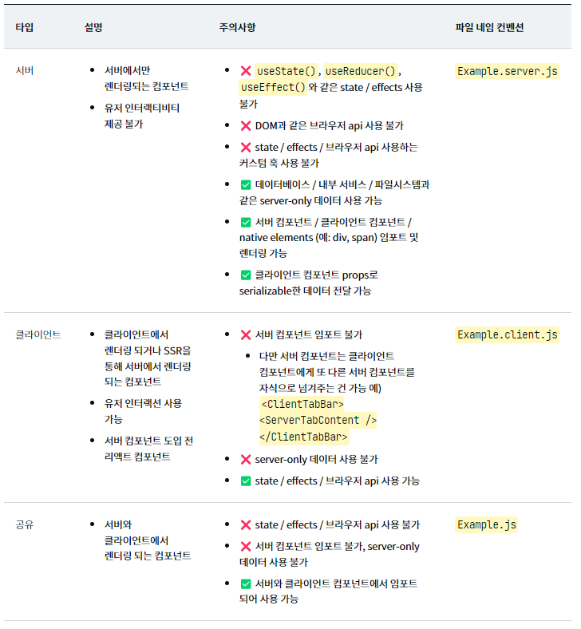

# 리액트 서버 컴포넌트(React Server Component)

리액트 서버 컴포넌트는 용어 그대로 서버에서 동작하는 리액트 컴포넌트. React 컴포넌트를 서버로 옮겨서 사용한다고 생각하면된다.

서버 컴포넌트를 사용하면 컴포넌트 렌더링을 클라이언트가 아닌 서버에서 수행할 수 있다.

네트워크를 통해 왕복하지 않고도 파일 시스템 및 데이터 저장소와 같은 서버 인프라에 액세스할 수 있다.
서버에서 Render를 수행하기 때문에 API를 통한 데이터 요청의 latency를 줄일 수 있고, 클라이언트에서의 연속된 API 호출을 제거하여 client-server waterfall를 막을 수 있다.

```
 client-server waterfall이란?
 현재 작업을 시작하기 위해 이전 것의 응답이 완료되기를 기다리는 현상
 부모 컴포넌트는 네트워크 호출이 완료될 때까지 렌더링되지 않는다는 것입니다. 따라서 자식 컴포넌트들의 렌더링도 홀딩 한다.
 클라이언트와 서버 간의 상호 작용을 단계별 순서로 구성하여 요청 처리의 명확하고 예측 가능한 흐름을 제공한다.

 요청 - 처리 - 응답 - 렌더링 순으로 진행되며

 장점으로는 단순성과 예측가능성 그로 인해 디버깅이 용이하다는 장점이 있지만,
 단점으로는 비동기성 부족, 확장성 부족, 변경관리가 힘들다는 단점이 있다.
```

## 서버컴포넌트의 이점

클라이언트 컴포넌트에서 발생하던 client-server waterfall을 제거하여 컴포넌트에서 필요한 데이터만 fetching하는 방식을 유지하면서 퍼포먼스를 향상시킬 수 있다.

서버 컴포넌트는 서버에서 동작하고 렌더링 된다는 특성상 다양한 종류의 백엔드 리소스에 접근할 수 있고 HTML이 아닌 ‘특별한’ 형태로 렌더링 되어 클라이언트에 전달되기 때문에 클라이언트로 전달되는 번들 사이즈 또한 감소시킬 수 있다.

### 자유로운 서버 리소스 접근

서버 컴포넌트는 서버에서 동작하기 때문에 데이터베이스, 파일 시스템 그리고 인터널 서비스 같은 서버 사이드 데이터 소스에 직접 접근할 수 있습니다.

### 제로 번들 사이즈 컴포넌트

유저 인터랙션이 없는 컴포넌트들을 서버 컴포넌트로 마이그레이션 한다면 동일한 뷰를 제공함과 동시에 번들 사이즈와 초기 로딩 시간을 감소시킬 수 있을 것입니다.

### 자동 코드 분할

서버 컴포넌트에서 import 되는 모든 클라이언트 컴포넌트를 code splitting 포인트로 간주하기 때문에 더 이상 React.lazy로 메뉴얼 하게 명시하지 않아도 됩니다. 또한 서버에서 미리 필요한 컴포넌트를 선택하기 때문에 클라이언트는 렌더링 프로세스 초기에 번들을 다운로드할 수 있습니다.

## 서버, 클라이언트 그리고 공유 컴포넌트

서버 컴포넌트가 도입되면서 리액트 컴포넌트는 크게 세 가지 컴포넌트로 분류



## 리액트 서버 컴포넌트(RSC)의 한계

- RSC는 서버에 남아 있고 서버에서 렌더링됩니다. 클라이언트 사이드과 관련된 것이 없습니다. 이것은 서버 컴포넌트에 사용자 인터렉션을 추가할 수 없음을 의미합니다. 예를 들어, 이벤트 핸들러나 useState, useReducer, useEffect와 같은 React 훅을 서버 컴포넌트에서 사용할 수 없습니다.
- 서버 컴포넌트에서 localstorage, bluetooth, web USB와 같은 브라우저 웹 API를 사용할 수 없습니다.
- 클라이언트 상호 작용과 관련된 모든 것에 대해서는, 계속 클라이언트 컴포넌트를 사용해야 합니다.

## 리액트 서버 컴포넌트(RSC) VS 서버 사이드 렌더링(SSR)

서버 사이드 렌더링(SSR)에서는, 서버에서 날것의 HTML을 클라이언트로 보내고, 그런 다음 모든 클라이언트 사이드 자바스크립트가 다운로드됩니다. React는 HTML을 상호작용 가능한 React 컴포넌트로 변환하기 위해 하이드레이션(hydration) 프로세스를 시작합니다. SSR에서 컴포넌트는 서버에 머무르지 않는다.

서버 사이드 렌더링으로 초기 HTML 페이지를 빠르게 보여주고, 서버 컴포넌트로는 클라이언트로 전송되는 자바스크립트 번들 사이즈를 감소시킨다.

### SSR

- 서버 사이드 렌더링을 사용하는 애플리케이션은 클라이언트 애플리케이션의 자바스크립트 파일을 서버에서 먼저 HTML로 렌더링.페이지가 정상적으로 동작하기 위해서는 자바스크립트 번들이 모두 다운로드되고 hydration이 완료되어야 한다.

### RSC

- 서버 컴포넌트의 코드는 클라이언트로 전달되지 않습니다. 하지만 서버 사이드 렌더링의 모든 컴포넌트의 코드는 자바스크립트 번들에 포함되어 클라이언트로 전송된다.

- 서버 컴포넌트는 페이지 레벨에 상관없이 모든 컴포넌트에서 서버에 접근 가능하다.

- 서버 컴포넌트는 클라이언트 상태를 유지하며 refetch 될 수 있습니다. 서버 컴포넌트는 HTML이 아닌 특별한 형태로 컴포넌트를 전달하기 때문에 필요한 경우 포커스, 인풋 입력값 같은 클라이언트 상태를 유지하며 여러 번 데이터를 가져오고 리렌더링하여 전달할 수 있습니다. 하지만 SSR의 경우 HTML로 전달되기 때문에 새로운 refetch가 필요한 경우 HTML 전체를 리렌더링 해야 하며 이로 인해 클라이언트 상태를 유지할 수 없습니다.

### 결론

서버 컴포넌트를 사용한다면 클라이언트 data fetching의 큰 문제점인 네트워크 waterfall을 해결할 수 있습니다. 더불어 번들 사이즈 감소, 다양한 백엔드 data source 사용, 자동 코드 분할, 컴포넌트 별 관심사 분리 등 다양한 이점으로 사용자 경험뿐만이 아니라 개발자 경험 또한 향상될 수 있습니다.

서버 컴포넌트는 클라이언트와 함께 사용될 수 있고 필요에 의해 자유롭게 추가나 마이그레이션 될 수 있습니다. 또한 서버 컴포넌트는 서버 사이드 렌더링과 유사한 점이 있으나 대체제가 아니며 사용자 경험을 향상을 위해 서버 사이드 렌더링과 함께 서로 보완하여 사용될 수 있습니다.

https://tech.kakaopay.com/post/react-server-components/#%EB%A6%AC%EC%95%A1%ED%8A%B8-%EC%84%9C%EB%B2%84-%EC%BB%B4%ED%8F%AC%EB%84%8C%ED%8A%B8rsc%EC%99%80-%EC%84%9C%EB%B2%84-%EC%82%AC%EC%9D%B4%EB%93%9C-%EB%A0%8C%EB%8D%94%EB%A7%81ssr

https://www.freecodecamp.org/korean/news/how-to-use-react-server-components/
