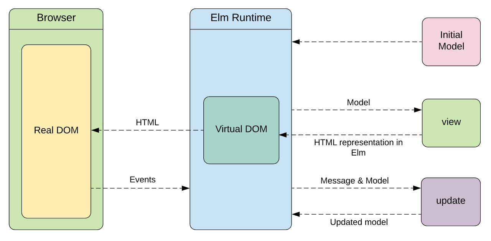

# Virtual DOM에 대해 설명해주세요.

더이상 버츄얼돔에 대한 용어는 사용되지 않는다.

## 돔(DOM)이란?

DOM(Document Object Model)은 웹 페이지를 이루는 태그들을 자바스크립트가 이용할 수 있게끔 브라우저가 트리구조로 만든 객체 모델을 의미한다.

DOM(Document Object Model)을 영어 뜻풀이 그대로 하자면 문서 객체 모델을 의미한다.

문서 객체란 html, head, body와 같은 태그들을 javascript가 이용할 수 있는 (메모리에 보관할 수 있는) 객체를 의미한다.

- Real DOM은 element의 자식노드가 추가되면 전체 문서가 갱신

## 버츄얼 돔이란?

- Virtual DOM은 React에서 사용되는 dom업데이트 개념, 리액트는 virtual dom방식을 통해 dom업데이트를 추상화 함으로써 dom처리 횟수를 최소화하고 효율적으로 진행하는 방법.
- 브라우저의 실제 DOM과 유사한 구조를 가지지만, 메모리 상에 존재하는 가상의 DOM입니다.
- React는 컴포넌트 상태(state)의 변경사항을 감지하면, 이를 Virtual DOM에 반영합니다.
  그리고 Virtual DOM과 이전 Virtual DOM의 차이를 비교하여 실제 DOM을 최소한으로 업데이트하는 최적화 작업을 수행합니다.

## Virtual DOM의 이점

1. 성능 개선: React는 변경사항을 바로 실제 DOM에 적용하는 것이 아니라, 먼저 Virtual DOM에 반영한 후, 이전 Virtual DOM과 비교하여 변경된 부분만 실제 DOM에 적용합니다. 이렇게 함으로써, 필요한 최소한의 DOM 조작만 수행하여 성능을 향상시킬 수 있습니다.
2. 다양한 환경 지원: React는 Virtual DOM을 사용하여, 브라우저 환경 뿐만 아니라, 서버 사이드 렌더링 등 다양한 환경에서도 동작할 수 있습니다.
3. 복잡한 UI 관리: React는 Virtual DOM을 사용하여 복잡한 UI를 관리하기 쉬워집니다. 컴포넌트의 상태를 쉽게 추적하고, 변경사항을 빠르게 적용하여 UI를 관리할 수 있습니다.
4. 개발 생산성 향상: Virtual DOM은 React의 추상화 계층으로, 프로그래머가 DOM 조작을 직접 수행하지 않아도 되어 개발 생산성을 향상시킵니다.

React에서는 Virtual DOM이 기본적으로 사용되며, 이를 활용하여 성능을 최적화하고, 개발 생산성을 향상시키는 것이 좋습니다.

### reconciliation

reconciliation 과정 : 리액트는 Real DOM과 Virtual DOM을 참고한다.그리고 “diffing” 알고리즘을 이용해 변화가 일어난 DOM 요소만 새로 렌더링을 한다.

## Q.버츄얼 돔과 리얼 돔의 차이를 설명해주세요

Real DOM은 element의 자식노드가 추가되면 전체 문서가 갱신되지만
Virtual DOM은 버퍼 역할을 해줌으로서 Real DOM을 추상화한 DOM과 비교하여
변경점만 Real DOM에 적용하여 전체 문서가 갱신되지 않습니다.

문법적인 차이도 조금 있는데 어떠한 element를 찾을때
document 즉 HTML 문서의 querySelector등으로 메소드로 찾는데
Virtual DOM을 사용하는 React의 경우는 ref로 element를 찾습니다.

## Reference

https://hyebeen2658.tistory.com/14#%EA%B8%B0%EC%A1%B4%20%EB%A0%8C%EB%8D%94%EB%A7%81%20%EB%B0%A9%EC%8B%9D-1
