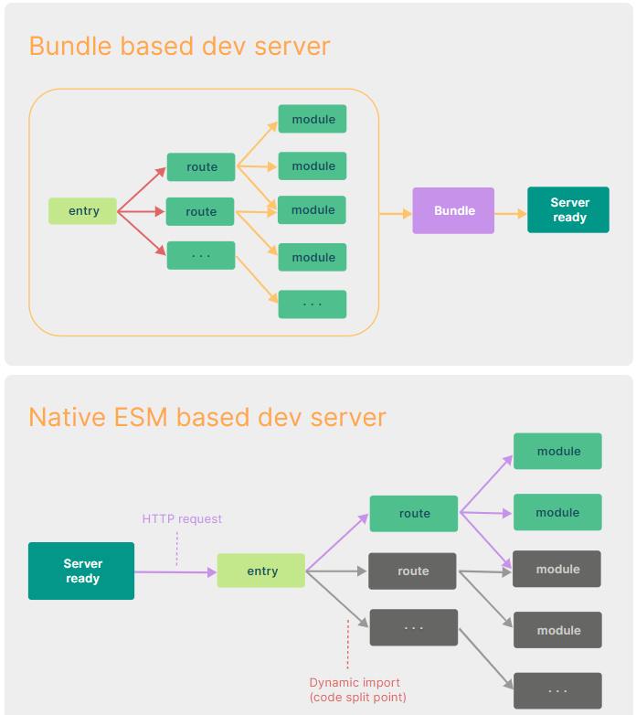

# Vite

Vite는 브라우저에서 지원하는 ES Modules(ESM) 및 네이티브 언어로 작성된 JavaScript 도구를 활용하여

- JavaScript 기반의 도구는 성능 병목 현상이 발생
- 개발 서버를 가동하는 데 오랜 시간이 걸리는 문제
  등을 해결하는 라이브러리

## 선요약

- esbuild를 이용해 종속성을 미리 묶는다.

- esbuild는 golang 언어로 작성된 매우 빠른 번들러로 특화된 병렬 처리를 이용해 빠름

- ESM을 통해 소스코드를 제공

> 이것은 브라우저가 번들러 작업의 일부를 인계받게 하는 것입니다

> Vite는 브라우저가 요청할 때 요청에 따라 소스 코드를 변환하고 제공하기만 하면 됩니다.

##

콜드 스타트 방식으로 개발 서버를 구동할 때, 번들러 기반의 도구의 경우 애플리케이션 내 모든 소스 코드에 대해 크롤링 및 빌드 작업을 마쳐야지만이 실제 페이지를 제공할 수 있습니다

```
콜드 스타트는 최초로 실행되어 이전에 캐싱한 데이터가 없는 경우를 의미
```

## 서버 구동 시간개선

vite는 애플리케이션의 모듈을 **dependencies**와 **source code** 두 가지 카테고리로 나누어 개발 서버의 시작 시간을 개선한다.

### Dependencies

- 개발 시 그 내용이 바뀌지 않을 일반적인(Plain) JavaScript 소스 코드.
- 기존 번들러로는 컴포넌트 라이브러리와 같이 몇 백 개의 JavaScript 모듈을 갖고 있는 매우 큰 디펜던시에 대한 번들링 과정이 매우 비효율적이었고 많은 시간을 필요했음.
- Vite의 사전 번들링 기능은 Go로 작성된**Esbuild**를 사용. Webpack, Parcel과 같은 기존의 번들러 대비 10-100배 빠른 속도를 제공.

### Source code

- vite는 Native ESM을 이용해 소스 코드를 제공. 브라우저에게 번들러의 작업의 일부를 맡긴다.
- vite는 브라우저가 요청하는 대로 소스 코드를 변환하고 제공하기만 하면 됩니다.그후에 나오는 조건부 동적 import 이후의 코드는 현재 화면에서 실제로 사용되는 경우에만 처리됩니다.
  

## 느렸던 소스 코드 갱신

### 기존 번들러의 코드 갱신

- 기존의 번들러 기반으로 개발을 진행할 때, 소스 코드를 업데이트 하게 되면 번들링 과정을 다시했어야... 그래서 서비스가 커질수록 소스 코드 갱신 시간 또한 선형적으로 증가하였다.
- 일부 번들러는 메모리에서 작업을 수행하여 실제로 갱신에 영향을 받는 파일들만을 새롭게 번들링하도록 했지만, 결국 처음에는 모든 파일에 대한 번들링을 수행.
  HMR(Hot Module Replacement) 이라는 대안이 나왔으나, 이 역시 명확한 해답은 아니었음.

### Vite의 코드경신

- vite는 떤 모듈이 수정되면 vite는 그저 수정된 모듈과 관련된 부분만을 교체함.
- 브라우저에서 해당 모듈을 요청하면 교체된 모듈을 전달할 뿐
- 전 과정에서 완벽하게 ESM을 이용하기에, 앱 사이즈가 커져도 HMR을 포함한 갱신 시간에는 영향을 끼치지 않는다.
- vite는 HTTP 헤더를 활용하여 전체 페이지의 로드 속도를 높임.

## Vite를 사용해야 하는 경우

Vite는 특히 새로운 프로젝트를 시작할 때 강력한 선택지가 될 수 있습니다. 설정이 간단하고, 빠른 개발 서버 시작 및 핫 모듈 리로딩은 개발 경험을 크게 향상시킵니다.

왜냐하면 Vite는 최신 프론트엔드 프레임워크와의 호환성도 뛰어나며, ES 모듈을 기반으로 하여 미래 지향적인 개발 환경을 제공하기 때문입니다.

웹팩과 Vite 중 선택은 프로젝트의 요구 사항과 개발 팀의 선호도에 따라 달라질 수 있습니다. 웹팩은 이미 검증된 도구로서 복잡한 프로젝트에 적합할 수 있으며, Vite는 빠른 개발 속도와 간편한 설정을 원하는 새로운 프로젝트에 더 적합할 수 있습니다.

## Webpack과 Vite의 차이점

### 개발 서버

- Webpack: 소스 코드와 모든 종속 관계의 모듈을 번들링 한 후 서버가 준비됩니다.
- Vite: esbuild로 미리 번들링한 모듈을 필요할 때 동적으로 가져오기 때문에 즉각적으로 서버가 구동됩니다.
  dev-server ready time(보일러 플레이트 기준): Vite(1.8s) > Webpack(7.8s)

### 프로덕션 빌드

- Webpack: 각 모듈을 범위마다 함수로 맵핑하여 결합합니다.
- Vite: 하나의 파일에 모든 종속 모듈을 전역 범위로 선언하여 결합합니다. 중복을 제거하기 때문에 가볍고 빠르게 빌드할 수 있다.

## Referece

https://ko.vitejs.dev/guide/why.html

https://f-lab.kr/insight/webpack-vs-vite

https://enjoydev.life/blog/frontend/4-module-bundler
