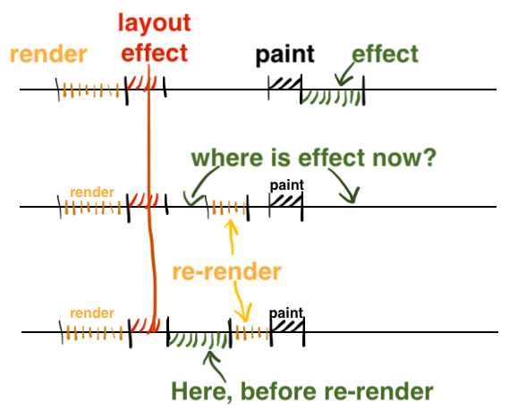

# useEffect는 항상 페인트 단계 이후에 실행되나요

## useEffect

- useEffect 는 일반적으로 React의 Commit Phase를 마친 후, 브라우저가 렌더링 된 후에 실행된다.
- 따라서 useEffect 훅은 대부분의 경우 브라우저의 Layout과 Paint 작업을 마친 이후 실행된다.

## useLayoutEffect

useLayoutEffect는 브라우저가 화면을 다시 그리기 전에 실행되는 useEffect
useLayoutEffect를 호출하여 브라우저가 화면을 다시 그리기 전에 레이아웃을 계산한다.

```ts
import { useState, useRef, useLayoutEffect } from 'react';

function Tooltip() {
  const ref = useRef(null);
  const [tooltipHeight, setTooltipHeight] = useState(0);

  useLayoutEffect(() => {
    const { height } = ref.current.getBoundingClientRect();
    setTooltipHeight(height);
  }, []);
```

- useLayoutEffect는 Hook이므로, 컴포넌트의 최상위 레벨 또는 커스텀 Hook에서만 호출할 수 있다. 반복문이나 조건문 내에서 호출할 수 없다.
- Strict Mode가 켜져 있으면, React는 실제 첫 번째 setup 함수가 실행되기 이전에 개발 모드에만 한정하여 한 번의 추가적인 setup + cleanup 사이클을 실행합니다. 이는 cleanup 로직이 setup 로직을 완벽히 “반영”하고, setup 로직이 수행하는 작업을 중단하거나 되돌리는 지를 확인하는 스트레스 테스트입니다. 이로 인해 문제가 발생하면 cleanup 함수를 구현하세요.
- useLayoutEffect 훅은 컴포넌트가 commit Phase에서 DOM이 수정된 이후에 동기적으로 실행된다.
- 이후 useLayoutEffect 의 작업이 완료되면, React는 제어권을 브라우저에게 위임하고 Paint 작업을 진행하게끔 한다.
- 이는 곧 React에서 Paint 작업을 의도적으로 늦추는 결과를 야기할 가능성이 존재한다는 의미이다.

## useEffect는 가끔 Paint 이전에 실행될 수 있다

이상적인 케이스에서 React는 항상 useEffect 훅이 Paint 작업 이후에 실행되도록 보장한다.

하지만 useLayoutEffect 에서 리렌더링이 발생할 경우, useEffect 의 작업인 Passive Effect가 Paint 작업 이전에 실행한다.

1. 리액트 업데이트 1: 가상 DOM 렌더링, 이펙트 스케쥴링, DOM 업데이트
2. useLayoutEffect 호출
3. 상태 업데이트, 리렌더링 스케쥴링
4. useEffect 호출
5. 리액트 업데이트 2
6. 업데이트 2로 부터 useLayoutEffect 호출
7. 리액트가 제어를 해제하고 브라우저가 새 DOM을 페인팅
8. 업데이트 2로 부터 useEffect 호출



- React 는 기본적으로 새로운 렌더링을 진행하기 전에, 기존의 렌더링 작업에 묶였던 Effect들을 모두 실행시키고, 재수집하는 과정을 거치기 때문이다.
- 따라서 useEffect 훅이 관할하는 Passive Effect의 경우에도 예외없이 실행되고, 이는 Paint 작업 이전에 useEffect 가 호출되게끔 한다.

https://velog.io/@rookieand/useEffect%EC%99%80-useLayoutEffect%EC%9D%98-%EC%B0%A8%EC%9D%B4
