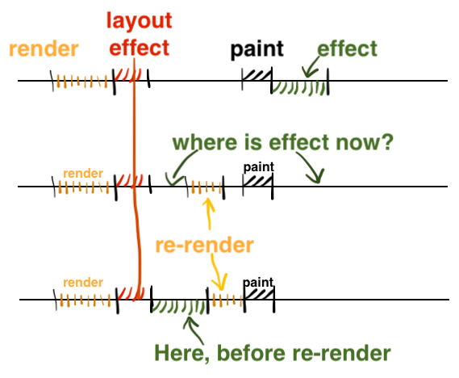

# useEffect는 항상 페인트 단계 이후에 실행되나요

## useEffect
- useEffect 는 일반적으로 React의 Commit Phase를 마친 후, 브라우저가 렌더링 된 후에 실행된다.
- 따라서 useEffect 훅은 대부분의 경우 브라우저의 Layout과 Paint 작업을 마친 이후 실행된다.
## useLayoutEffect
- useLayoutEffect 훅은 컴포넌트가 commit Phase에서 DOM이 수정된 이후에 동기적으로 실행된다.
- 이후 useLayoutEffect 의 작업이 완료되면, React는 제어권을 브라우저에게 위임하고 Paint 작업을 진행하게끔 한다.
- 이는 곧 React에서 Paint 작업을 의도적으로 늦추는 결과를 야기할 가능성이 존재한다는 의미이다.

## useEffect는 가끔 Paint 이전에 실행될 수 있다
이상적인 케이스에서 React는 항상 useEffect 훅이 Paint 작업 이후에 실행되도록 보장한다.  

하지만 useLayoutEffect 에서 리렌더링이 발생할 경우, useEffect 의 작업인 Passive Effect가 Paint 작업 이전에 실행한다.
 
1. 리액트 업데이트 1: 가상 DOM 렌더링, 이펙트 스케쥴링, DOM 업데이트
2. useLayoutEffect 호출
3. 상태 업데이트, 리렌더링 스케쥴링
4. useEffect 호출
5. 리액트 업데이트 2
6. 업데이트 2로 부터 useLayoutEffect 호출
7. 리액트가 제어를 해제하고 브라우저가 새 DOM을 페인팅
8. 업데이트 2로 부터 useEffect 호출

  

- React 는 기본적으로 새로운 렌더링을 진행하기 전에, 기존의 렌더링 작업에 묶였던 Effect들을 모두 실행시키고, 재수집하는 과정을 거치기 때문이다.
- 따라서 useEffect 훅이 관할하는 Passive Effect의 경우에도 예외없이 실행되고, 이는 Paint 작업 이전에 useEffect 가 호출되게끔 한다.

https://velog.io/@rookieand/useEffect%EC%99%80-useLayoutEffect%EC%9D%98-%EC%B0%A8%EC%9D%B4