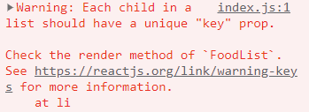

# 리액트에서 배열을 렌더링할 때 key를 써야 하는 이유

배열을 렌더링할 때 key를 지정하지 않으면 다음과 같은 오류가 뜬다.



Key를 지정하더라도 배열의 인덱스 같이 데이터를 구분할 수 없는 고유하지 않은 값으로 Key를 지정하면 렌더링이 잘못될 수 있다.

Key는

1. React가 어떤 항목을 변경, 추가 또는 삭제할지 식별하는 것을 돕고,
2. 엘리먼트에 안정적인 고유성을 부여하기 위해 배열 내부의 엘리먼트에 지정해야 한다.

key prop을 사용하는 이유는 React에서 엘리먼트를 업데이트할 때, 어떤 엘리먼트가 변경되었는지 알아내기 위함입니다.

key 는 그 값이 변하지 않는, 유일한 식별자의 역할을 가진다.또한 key 는 엘리먼트의 변화를 감지한다.

React는 key를 통해 기존 트리와 이후 트리의 자식들이 일치하는지 확인하여 효율적으로 DOM 사용이 가능하다.

## key에 인덱스값을 쓰면안되는 이유:데이터가 변경됐을 때 인덱스와 밸류값이 달라지는 경우가 생길수 있다. 그것을 막기위해 고유한 ID값을 키값에 넣어야한다.

key가 없으면 리액트는 배열의 인덱스를 사용하여 업데이트를 수행한다. 그러나 배열의 인덱스는 항상 일정하지 않기 때문에 예측이 불가능하다.

예를 들어 배열에서 아이템을 삭제하면 인덱스가 변경됩니다. 그 결과, 리액트는 아이템이 삭제된 것으로 판단하지 않고, 단순히 인덱스가 변경된 것으로 판단하여 불필요한 렌더링을 발생시키게 된다..

### 어떤 데이터를 key로 사용해야 하는가?

고유성이 보장되는 데이터를 key로 사용해야 한다.
데이터가 고유하지 않으면 엘리먼트 간에 혼란이 생길 수 있습니다.
데이터베이스에서 가져온 고유한 식별자(ID)나 리스트의 인덱스 등이 일반적으로 key로 사용됩니다.

주의: 리스트가 동적으로 변경되면서 항목이 추가, 삭제, 재정렬되는 경우 인덱스를 key로 사용하는 것이 좋지 않습니다. 이는 예기치 못한 문제를 발생시킬 수 있습니다. 가능하면 고유한 ID나 다른 고유성을 지닌 속성을 key로 선택하는 것이 좋습니다.

math.random을 사용할경우 key값이 변경될 수 있기에 

## fragment에서 key값을 주는방법.

```
<React.Fragment key={item.id}>
```

## Reference

https://junior-datalist.tistory.com/184

https://ko.legacy.reactjs.org/docs/reconciliation.html#recursing-on-children

https://ko.legacy.reactjs.org/docs/lists-and-keys.html

```

```
