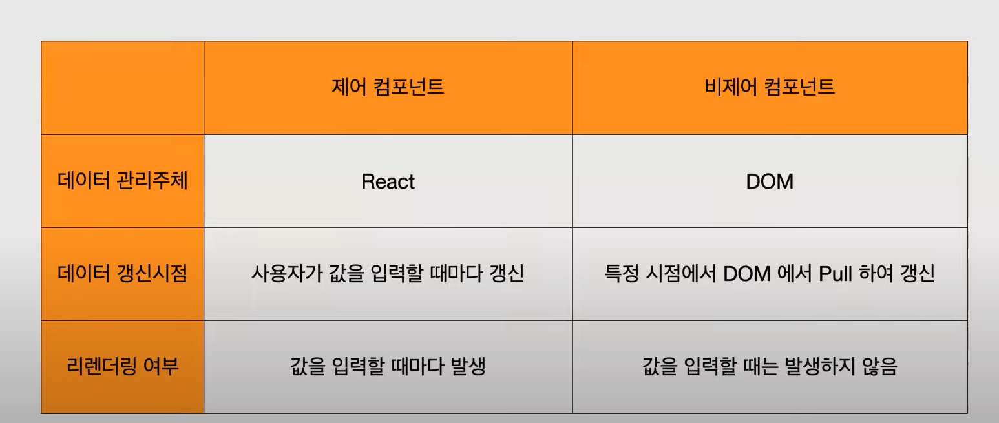

# 제어 컴포넌트와 비제어 컴포넌트의 차이

## 신뢰 가능한 단일출처

:하나의 상태는 한 곳에만 존재해야한다
React에서 Form Element를 다루다보면 DOM 자체에서 상태를 들고 있게되는 경우가 있는데 여기서

- 제어 컴포넌트는 input 태그의 value 어트리뷰트 상태를 React의 상태로 만들어 관리하는 방식.이 방식은 해당 상태가 신뢰 가능함을 React를 통해 보장

- 비제어 컴포넌트는 전통적인 방식인 DOM 자체에서 상태를 관리하는 방식이다.

## 비제어 컴포넌트

비제어 컴포넌트는 각각의 DOM 자체에서 상태를 관리하도록 하므로, 해당 상태에 접근하기 위해서는 ref를 사용하여 DOM에 바인딩 후 특정 시점에서 값을 가져온다.

### 제어 컴포넌트의 장점

- 사용자 입력 값이 변경될 때마다 리렌더링 발생하지 않는다.

- non-React 코드로 작성된 Form Element 통합이 용이

## 제어 컴포넌트

React의 state를 신뢰 가능한 단일출처로 만들어 input 태그의 상태와 React의 상태, 두 요소를 결합할 수 있다.
그러면 Form을 렌더링하는 React 컴포넌트는 Form에 발생하는 사용자 입력값을 제어하게 된다.

### 제어 컴포넌트의 단점

- 사용자 입력 값이 변경될 때마다 리렌더링 발생
- 모든 Form Element에 React 상태를 연결
- non-React 코드로 작성된 Form Element 통합의 어려움

## Reference

https://velog.io/@semnil5202/%EC%A0%9C%EC%96%B4-%EC%BB%B4%ED%8F%AC%EB%84%8C%ED%8A%B8%EC%99%80-%EB%B9%84%EC%A0%9C%EC%96%B4-%EC%BB%B4%ED%8F%AC%EB%84%8C%ED%8A%B8

https://www.youtube.com/watch?v=PBgQKK6nelo
