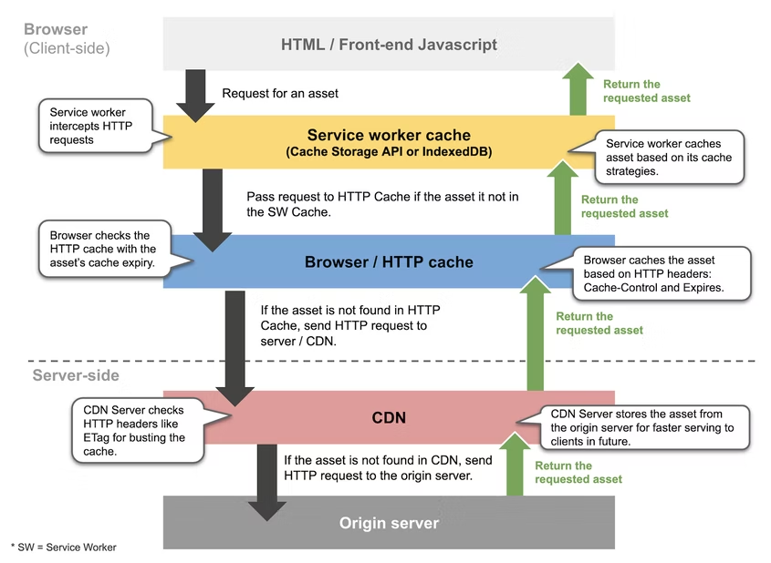

# 웹에서 사용되는 캐시의 종류에 대해 설명해 주세요

## 캐시란?

- 캐시란 데이터에 빠르게 접근하기 위해 자주 사용되는 데이터나 값을 미리 복사해 놓는 임시 장소를 의미
- 캐싱은 어떤 데이터를 한번 받아온 후에 그 데이터를 불러온 저장소보다 가까운곳에 임시로 저장하여 필요시에 더빠르게 불러와서 사용하는 프로세스

## 웹캐시는?

페이지 로딩에 필요한 css, js, html, 이미지 등의 정적 리소스를 캐싱한다면

- 요청을 보내는 네트워크 요청 횟수를 감소
- 서버 응답을 기다려야 할 필요 없어짐

캐시는 차례대로
서비스 워커 캐시 → 브라우저 캐시 → CDN(or 프록시 서버 캐시)
순으로 참조되며, 모든 캐시에 유효한 응답(데이터)이 없을 경우에는 서버에 요청을 보내서 응답을 받게 된다.

## 서비스 워커 캐시

서비스 워커: 웹 워커의 일종, 백그라운드에서 비동기적으로 실행되는 자바스크립트

서비스 워커는 캐시 스토리지 API를 제공.  
캐시 스토리지 API를 사용하여 서비스 워커 내에서 캐싱을 하는 경우에는 브라우저 캐시를 참조하기 전에 서비스 워커에서 HTTP 요청을 가로채고 캐싱 전략에 따라 서비스 워커 캐시 내에 있는 데이터를 먼저 사용한다.

## 브라우저 캐시 (Browser Cache)

- HTTP 캐시라고도 하며, 브라우저 혹은 HTTP 요청을 보내는 클라이언트의 내부 디스크 혹은 메모리에 저장되는 캐시
- 개인화(personalized)된 캐시이므로 클라이언트 간 공유는 불가능
- 모든 HTTP 요청은 먼저 서버로 직접 요청을 보내지 않고 브라우저 캐시로 라우팅되는데, HTTP 캐시 내에 필요한 데이터가 존재한다면 캐시된 데이터를 반환
- 동일한 리소스에 대한 재요청 시, 서버로부터 다시 다운로드하지 않고 로컬에서 바로 로딩하여 성능을 향상시킵니다.

- 브라우저 캐시는 HTML의 메타 태그로 캐시 속성을 지정하거나, HTTP 요청 및 응답 헤더에 지정하는 방법으로 제어가 가능하다.

## 프록시 캐시 (Proxy Cache):

클라이언트와 서버 사이에 위치한 네트워크 상(프록시 서버)에서 동작하는 캐시,공유캐시로, 회사나 IPS의 방화벽에 설치된다. 네트워크 상에 위치한 중간 서버에서 클라이언트와 서버 간의 트래픽을 관리하고, 서버에서 받은 응답을 임시로 저장하는 캐시입니다.

브라우저 캐시와는 달리 다수의 웹 서버에서 공유하여 사용할 수 있다는 장점

이를 통해 동일한 요청에 대한 응답을 여러 클라이언트에게 제공함으로써 대역폭을 절약하고 서버 부하를 줄일 수 있습니다.

## CDN(Content Delivery Network)이란?

CDN은 콘텐츠를 효율적으로 전송하기 위해 지리적으로 분산된 서버 네트워크(분산노드로 구성된 네트워크)

실 서버에 접속하여 리소스를 다운로드하는 것이 아닌 클라이언트와 가장 가까운 곳에 위치한 네트워크에 요청하여 리소스를 받아옴

→ CDN을 적절하게 사용하면 데이터 사용량이 많은 어플리케이션의 페이지 로딩 속도를 개선할 수 있음

CDN은 하나의 커다란 공유 캐시와 같다. 다수의 실 서버가 갖고 있는 데이터를 캐시하여 클라이언트에게 제공한다.

## Reference

https://hahahoho5915.tistory.com/33

https://guiyomi.tistory.com/130

https://yozm.wishket.com/magazine/detail/2341/
