터미널 열고 npm run build 하고 npm run start 입력해두면 서버를 띄울 수 있습니다.

이러면 여러분 컴퓨터에서 서버를 운영할 수 있는데

컴퓨터 24시간 켜둘 것입니까

그러지 말고 안전하게 클라우드 서비스에서 컴퓨터 빌려서 서버를 띄워놔봅시다.

사람들 많이 쓰는 AWS를 이용해봅시다.

AWS Elastic Beanstalk 쓸건데

실은 AWS에는 EC2 상품이 가장 유명한데 그냥 컴퓨터 한대를 빌리는 상품입니다.

하지만 숙련자가 아니면 거기에 서버 띄우고 그런 짓거리하는게 매우 오래걸리고

나중에 이상해졌을 때 해결도 어렵습니다.

그래서 보통 편하게 하려면 AWS Elastic Beanstalk 상품 사용하면 됩니다.

얘는 코드만 올리면 지가 알아서 자동으로 EC2 인스턴스 빌려서

npm install 눌러주고 npm run start 눌러주고 무료 도메인도 하나 연결해주고

유저 많아지면 확장도 쉽게 가능하고 아마 버전관리도 해줍니다.

여러분은 그냥 코드 업로드밖에 신경쓸게 없습니다.

가격도 거의 차이없음

AWS는 새 계정생성 + 새 카드 등록하면 1년간 무료로 저사양 컴퓨터 한대 빌려줍니다.

그러니까 그러고 싶으면 새 계정 만들어서 카드등록까지 마칩시다.

경쟁자 구글 클라우드에는 비슷한 상품으로 App Engine이 있습니다.

얘는 처음 카드 등록시 $300 크레딧으로 줍니다.

아니면 Vercel

실은 Next.js는 Vercel 이런거 이용해도 배포가 매우 쉽습니다.

왜냐면 Next.js를 Vercel이 만들고 관리해서 그렇습니다.

Github repo에 코드 올릴 때 마다 그걸 자동으로 Elastic Beanstalk 스럽게 배포해주는 식으로 동작합니다.

- 월 100GB 트래픽까지 무료계정으로 해결할 수 있어서 작은 사이트 운영할 땐 편리합니다.

월 20달러에 월 트래픽 1TB 까지 사용가능하고 그 이상 넘어가면 추가요금이 비싼 편입니다.

- 서버에서 하드디스크 사용이 불가능합니다.

- 그래서 포트폴리오 용으로는 가장 편리하고 괜찮습니다.

vercel.com 들어가서 그대로 따라하면 되는거라 튜토리얼 그딴거 필요없음

배포전 체크사항

AWS 컴퓨터도 MongoDB에 접속을 해야 데이터를 꺼내든말든 할 것 아닙니까
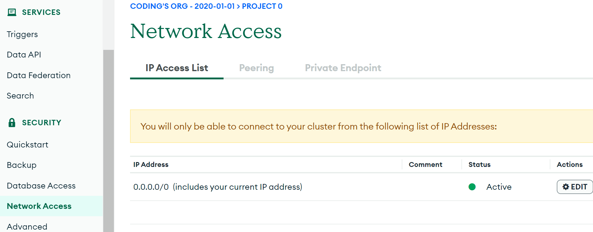
▲ mongodb.com 들어가서 좌측 Network access 메뉴에서

접속가능 IP를 0.0.0.0 으로 (모두접속가능하게) 바꿔줍시다.

더 안전하게 하고 싶으면 나중에 AWS VPC로 mongodb atlas 연결하는 법 같은걸 찾아서 적용해줍시다.

배포하려면 1. 터미널열어서 빌드하기

npm run build
입력하면 여러분의 코드를 성능좋은 코드로 컴파일하고 압축해줍니다.

그래서 그 후에 어디 올리거나 해야합니다.

배포하려면 2. zip 파일로 압축합니다

프로젝트 폴더안에 있는 모든 내용을 .zip 파일로 압축합니다.

- node_modules 폴더는 넣지마쇼

- .next 폴더는 꼭 넣으쇼

배포하려면 3. AWS 로그인하고 카드등록하고

- 카드등록까지 해야 1년 AWS 똥컴 무료이용권을 주기 때문에 카드등록 하면 되고

- 로그인하면 우측 상단에 지역선택을 할 수 있는데 사이트를 서울에서 운영할거면 '서울'로 들어옵시다.

배포하려면 4. IAM 역할만들기
AWS 사이트 상단 검색창에 IAM 검색해서 들어갑시다
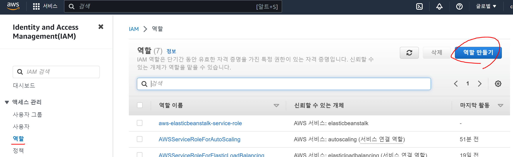

▲ 좌측 메뉴의 역할 눌렀을 때

aws-elasticbeanstalk-ec2-role 역할 이름이 없으면 역할 만들기 누릅니다.

elastic beanstalk이 ec2 맘대로 사용할 수 있게 만드는 부분임

(1단계) 신뢰할 수 있는 엔터티는 AWS 서비스, 사용사례는 EC2 선택
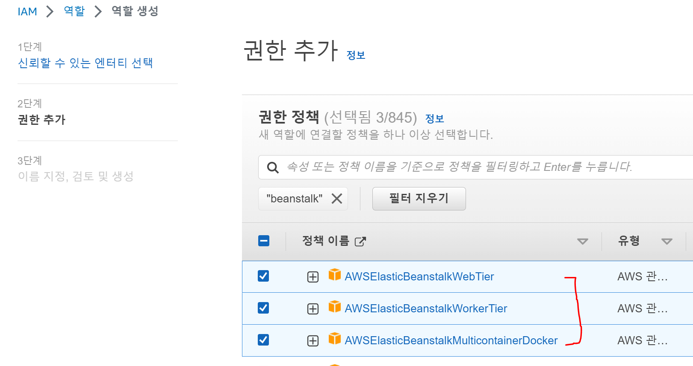
(2단계) 권한추가메뉴에선

AWSElasticBeanstalkWebTier

AWSElasticBeanstalkWorkerTier

AWSElasticBeanstalkMulticontainerDocker

3개 찾아서 체크마크
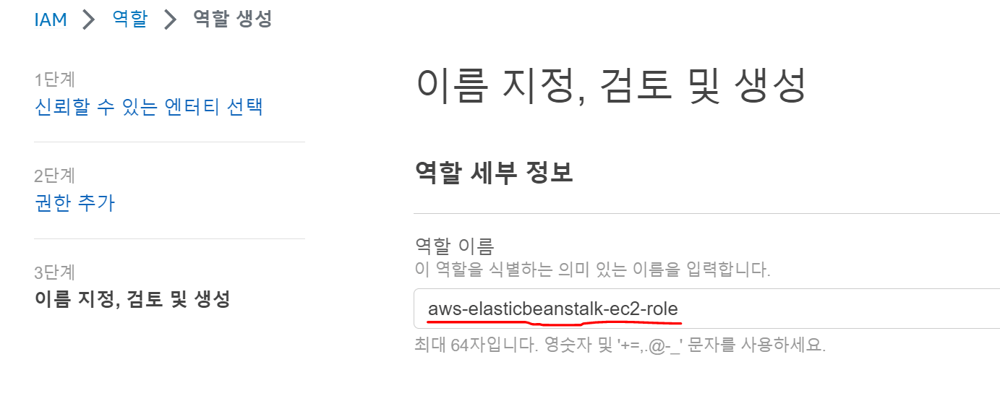
(3단계) 이름 지정부분은 aws-elasticbeanstalk-ec2-role 기입하고 끝냅시다.
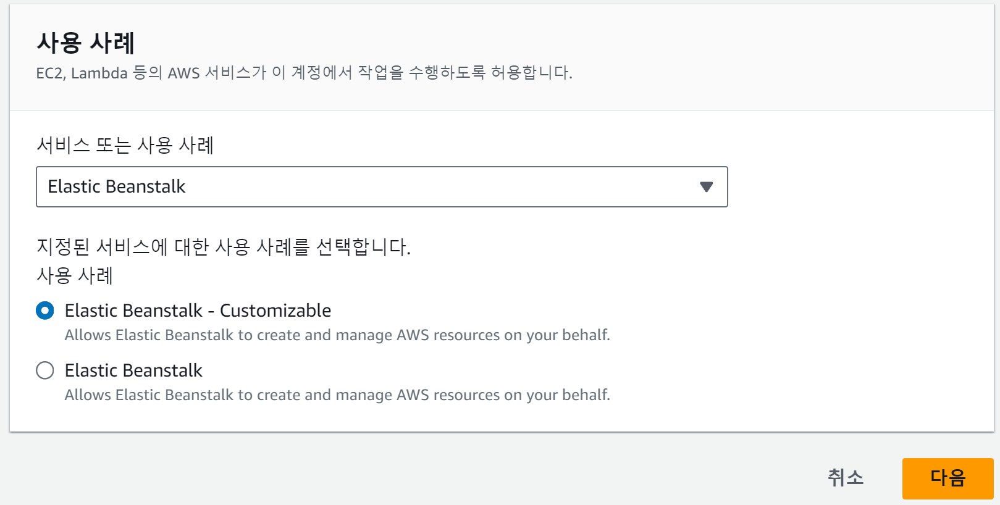

실은 하나 더 만들어야합니다.

(1단계) AWS 서비스, Elastic Beanstalk 선택하고

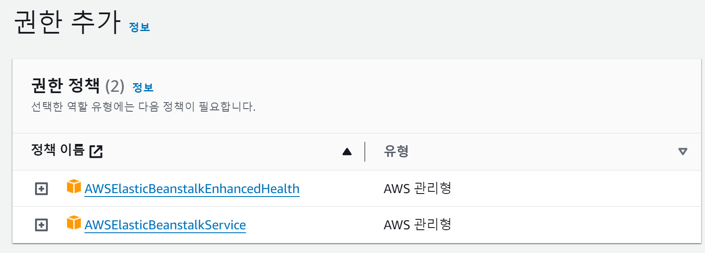

(2단계) 위와 같은 정책 2개 넣어야하고

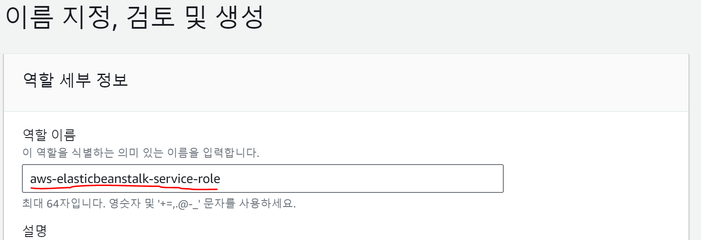
(3단계) 이름 지정부분은 aws-elasticbeanstalk-service-role 기입하고 끝냅시다.

실은 Elastic beanstalk 처음 만들 때 IAM 설정은 알아서 해줬었는데

지금은 쓸데없이 직접 해줘야합니다.

배포하려면 5. Elastic beanstalk

- 상단 검색창에 Elastic beanstalk 검색해서 들어갑시다.

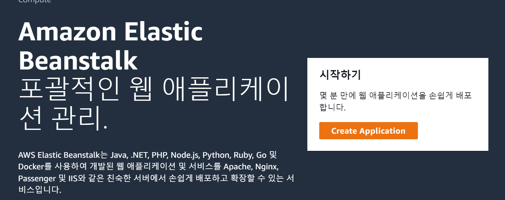

▲ 그럼 앱생성이나 환경생성 버튼 어딘가에 있을텐데 그거 눌러서 진행합시다.

(1단계) 이거저거 적으라고 나올텐데

- 애플리케이션 이름 아무거나 작명하고

- 환경 이름 아무거나 작명하고 (아마 자동생성될듯)

- 플랫폼은 nodejs, 버전은 18버전으로 합시다. 실은 님들이 쓰던 버전이 좋습니다.

- 프리셋 선택하라고 나오면 우리는 거지니까 '단일 인스턴스' 고릅시다.

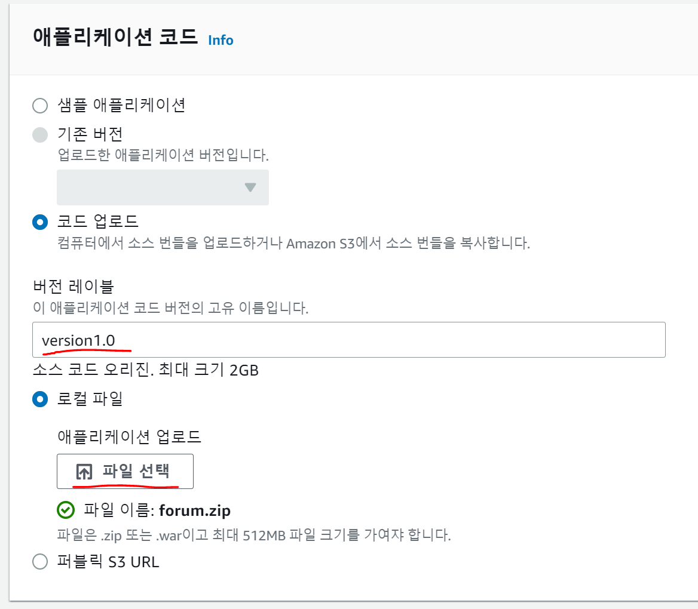

▲ 코드 업로드 눌러서 아까 만든 소스코드 zip 파일 올려줍시다.

버전레이블도 이쁘게 알아서 작성합시다. 방금 업로드한 소스코드 버전 기록용임

다음으로 넘어갑시다.

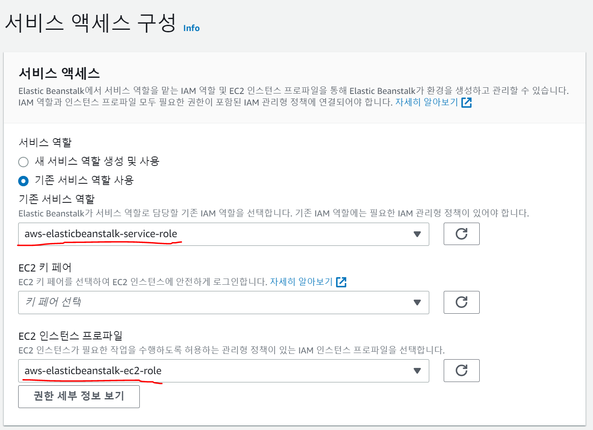

2단계) ▲ 여기서는 위처럼 잘 되어있나 체크하고 넘어갑시다.

안되어있으면 위에서 IAM 설정이 안된 것임

(3단계) 건드릴 필요없음
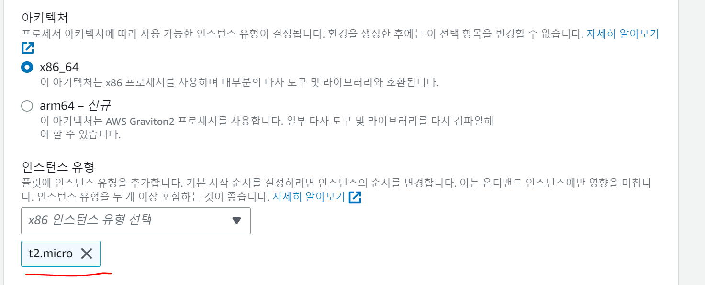
(4단계) ▲ t2.micro가 프리티어에서 쓸 수 있는 기기라서 이거 설정해줍시다.

돈내고 빠른걸 원하면 마음대로 하십시오

간혹 배포이상하게 안되면 램부족 이슈라 t2.small 이상으로 써보면 됩니다.

나머지는 만질 필요 없고 다음 다음 누르면 배포 끝입니다.

몇분 기다리면 어쩌구.com 주소 뜨는데 거기 들어가면 님들 사이트로 개나소나 접속이 가능합니다.

- 까먹고 1년 냅두다가 요금청구되기 싫으면 안쓰면 삭제합시다.

- AWS 검색창에 S3 입력해서 거기 있는 데이터 백업본도 삭제해야 요금으로부터 안전할 수 있습니다.

배포했는데 전 로그인 기능이 안되는데요

Nextauth와 소셜로그인 셋팅같은게 필요합니다.

1. Nextauth의 OAuth를 사용하는 경우

예를 들어 Github 로그인을 구현해봤는데 그 경우

Github.com의 설정 - 개발자설정 - OAuth용 앱 만든거 들어가서
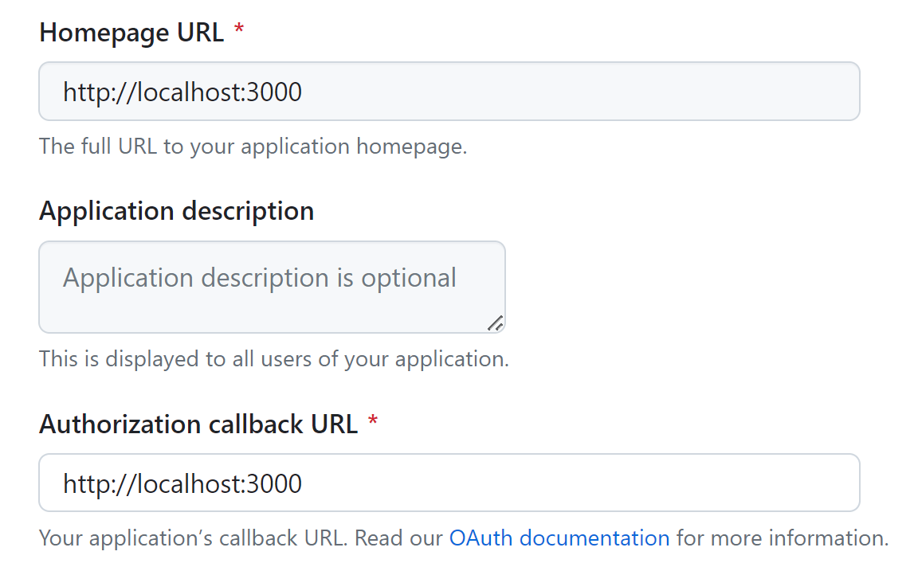
URL 부분들을 전부 배포 후의 홈페이지 주소로 바꿔야합니다.

배포하면 나오는 사이트주소 그거 넣으면 됩니다.

그래서 OAuth용 앱을 2개 만들어놓으면 편리할 수도 있음

2. NEXTAUTH_URL 환경변수도 설정해줘야 로그인 잘 됩니다.

프로젝트 폴더에 .env 라는 이름의 파일을 만들어서

NEXTAUTH_URL=님들배포한사이트주소
라고 적고 저장하고 배포하면 됩니다.

NEXTAUTH_URL=http://어쩌구.com 대충 이렇게요

재배포하려면 그냥 다시 소스코드 zip 파일로 묶어서 다시 올리면 되는데

하지만 그런건 귀찮으니까 이미 배포된 프로젝트의 .env 환경변수를 수정하려면

왼쪽 메뉴에서 구성 눌러서 환경변수 부분 편집 누르면 됩니다.
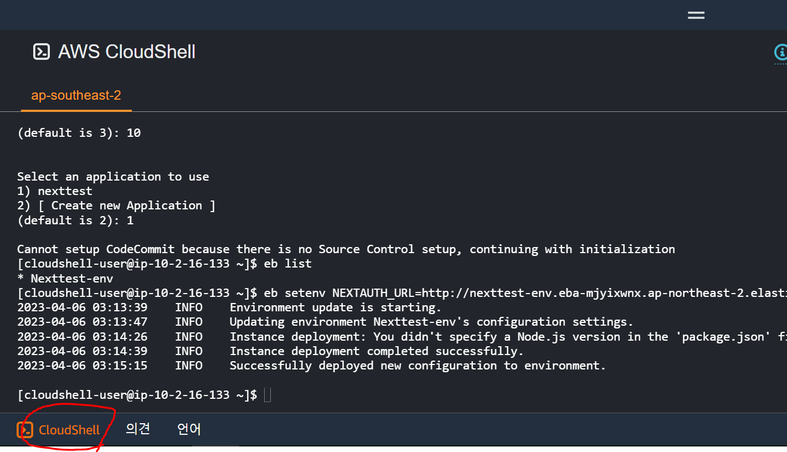
▲ 안되면 AWS 사이트 왼쪽 하단 보면 CloudShell같은 곳이 있는데 여기서

eb use 님들환경이름
eb setenv NEXTAUTH_URL=님들배포한사이트주소
입력하면 환경변수 수정이 가능합니다.
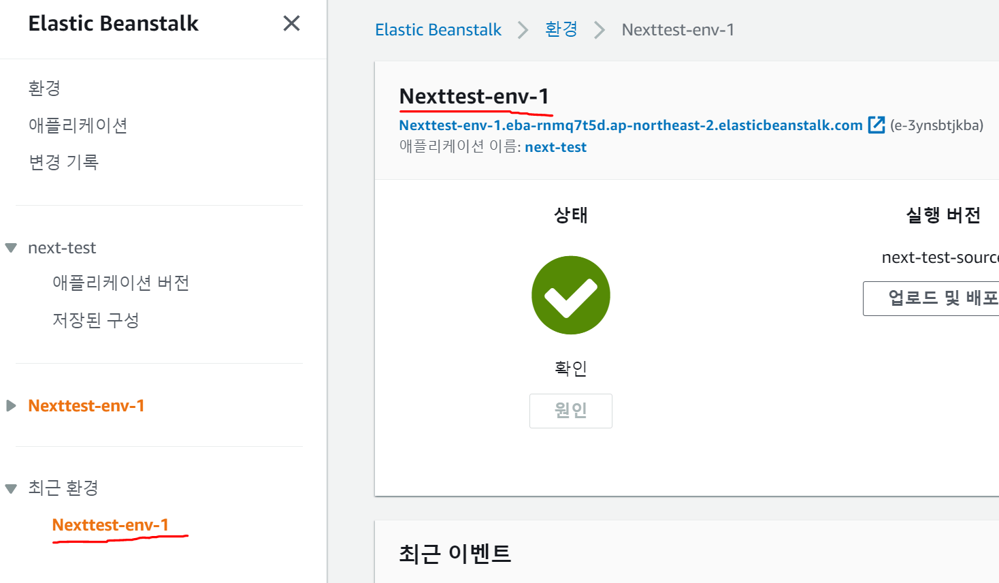

▲ 환경이름은 이런데 나와있습니다.

그래서 제 경우엔 eb use Nexttest-env-1 입력하면 되겠군요.

(참고)

eb list 하면 환경목록들을 출력해줍니다.

eb printenv 입력하면 현재 환경변수 출력도 해볼 수 있습니다.

Q. 저는 사이트 업데이트하고 싶은데요

- 업로드 및 배포 버튼 눌러서 또 코드 zip 파일로 묶어서 업로드하면 됩니다.

자주하면 1년 무료계정도 elastic compute cloud 요금 청구됩니다.

Q. 저는 배포시 이상한 AWS elastic beanstalk 100.0 % of the requests are erroring with HTTP 4xx 에러가 나오는데요

- 메인페이지 접속이 불가능하면 보통 그렇습니다.

보통 DB접속 셋팅안해놔서 그런 경우가 많아서 위에서 MongoDB 셋팅 제대로 했나 확인합시다.

Q. 배포시 안되어서 로그출력해보니 npm ENOMEM 에러가 나오는데요

- 램부족이라 인스턴스 사양을 t2.small 이상으로 수정해봅시다.

Q. The instance profile aws-elasticbeanstalk-ec2-role 어쩌구가 없다는 에러 나오는데요

- 위에서 IAM 역할 만드는게 잘못되면 그렇습니다 역할 지우고 다시만듭시다
  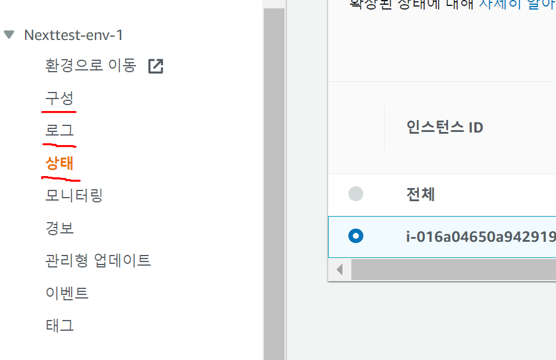
  구성 메뉴에선 님들 환경 설정이 가능합니다.

- 로그 메뉴에선 터미널 로그출력이 가능합니다.

- 상태 메뉴에선 인스턴스 안쓰는게 있으면 끄고 재부팅하고 그럴 수 있습니다.

인스턴스는 가상 컴퓨터 한대임

- 모니터링을 자동으로 해줍니다.

400, 500 에러같은게 너무 잦거나 접속이 안되는 페이지가 있으면 알려줌

참고로 환경마다 하나의 application을 실행해둘 수 있는데

application은 프로젝트 버전1개라고 생각하면 됩니다.
