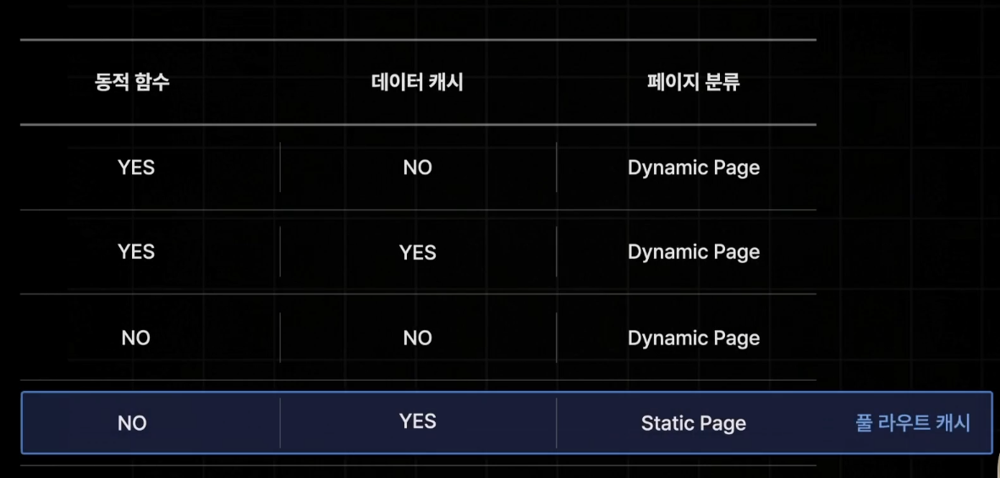

# Dynamic Page로 설정되는 기준

풀 라우트 캐시-Next 서버측에서 빌드타임에 특정페이지의 렌더링 결과를 캐싱하는 기능

특정 페이지가 접속 요청을 받을때 마다 매번 변화가 생기거나, 데이터가 달라질 경우

Dynamic Page로 설정되는 기준

1. 캐시 되지 않는 Data Fetching을 사용할 경우
2. 동적 함수(쿠키,헤더, 쿼리 스트링)을 사용하는 컴포넌트가 있을때

Static Page로 설정되는 기준
Dynamic Page가 아니면 모두 Static Page가 된다.
