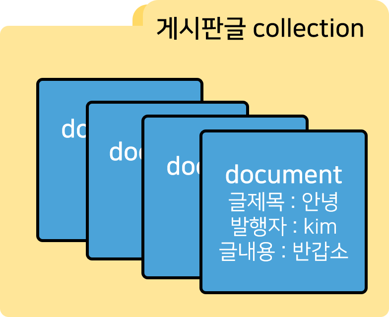
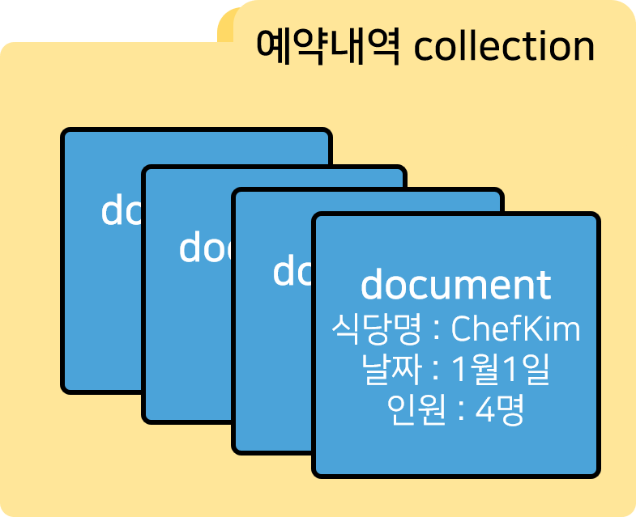
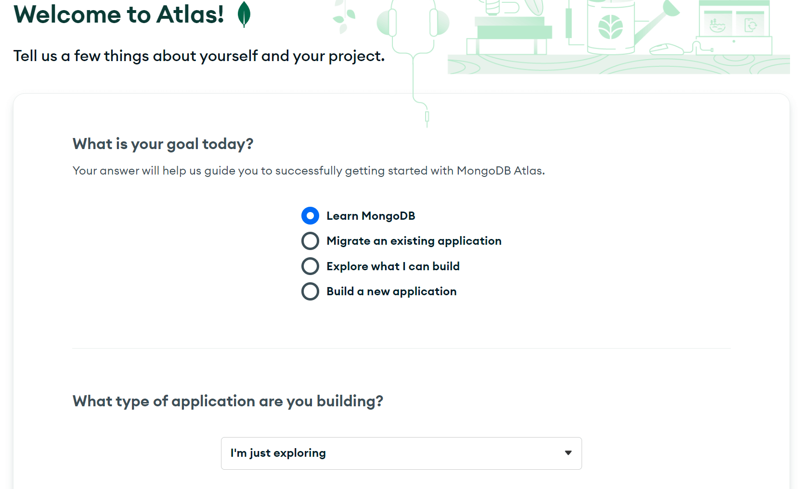
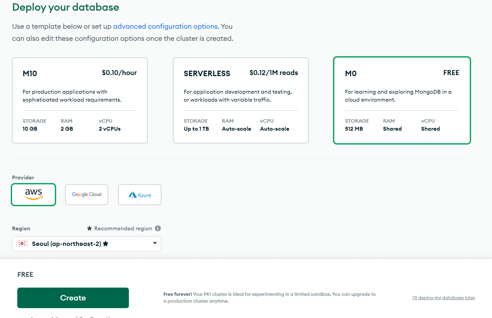
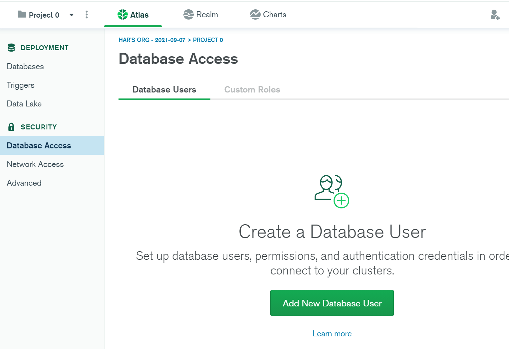
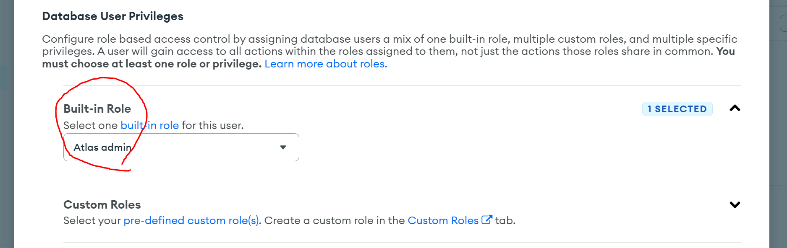
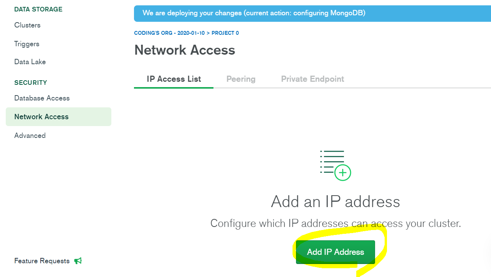
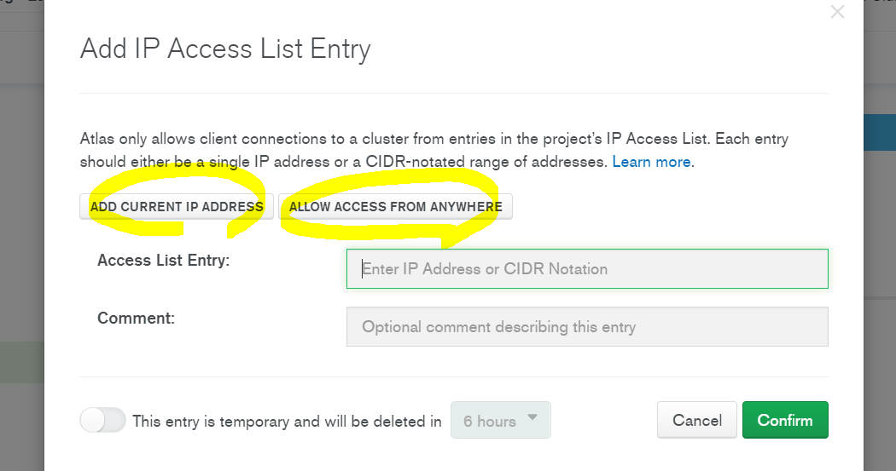

MongoDB 호스팅받기

웹사이트 운영하려면 유저아이디, 유저의 글 이런걸 어디 저장해둬야하는데

유저의 데이터를 영구적으로 안전하게 저장하고 싶으면 Database에 저장합니다.

데이터베이스 종류는 여러가지가 있는데

대표적으로 관계형, 비관계형 데이터베이스가 있습니다.

관계형 데이터베이스는 데이터를 엑셀처럼 표에 저장합니다.

데이터 입출력시 SQL이라는 언어를 사용해야하고 미리 스키마 정의(표만들기)도 해야하고 데이터 중복저장을 피하기 위해 정규화해야하고 여러가지 귀찮은 점들을 신경써야합니다.

주로 안정적인 데이터저장과 운영이 필요한 곳에서 쓰면 좋습니다.

비관계형 데이터베이스는 자료를 조금 더 자유로운 형식으로 저장할 수 있고

SQL 언어, 스키마 정의(표 만들기), 정규화 이런게 대부분 필요없습니다.

분산처리를 기본적으로 잘해서 주로 SNS 서비스처럼 많은 데이터 입출력이 필요할 때도 강점을 보입니다.

우리는 그 중에 비관계형 데이터베이스인 MongoDB를 사용합시다.

데이터를 자바스크립트 object자료형과 똑같은 모양으로 저장할 수 있어서 편리하고

mongodb.com 들어가면 500mb 정도 용량의 DB 무료 호스팅도 받을 수 있습니다.

MongoDB의 데이터 저장 방식

collection을 하나 만들어서 그 안에 document 를 만들어서 데이터를 기록하는 식으로 데이터들을 저장합니다.

비유하자면 collection은 폴더, document는 파일이라고 생각합시다.

Nodejs 강의에선 collection이 폴더, document가 데이터 한 줄이라고 한거같은데 그렇게 생각해도 됩니다.

{ 데이터이름1 : 값1, 데이터이름2 : 값2 ... }
document에 데이터를 기록할 때는 자바스크립트 object 자료형과 똑같이 저장하면 됩니다.

object 자료형은 이렇게 데이터를 저장하는데 이거 그대로 사용하면 됩니다.

▲ 예를 들어 게시판 글들을 저장하고 싶으면 이런 식으로 저장하면 됩니다.

▲ 식당예약서비스 운영하는데 예약내역을 저장하고 싶으면 이렇게 저장하면 됩니다.

아무튼 데이터 한 덩어리는 document에 마음대로 저장해두면 됩니다.

그리고 document 생성, 가져오는 법, 수정, 삭제만 배우면 MongoDB 다루는 법 다 배운 것임

1. mongodb.com 방문

2. 회원가입하고 이메일 인증하라고 하면 합시다.

▼ 3. 뭐 채우라고 하면 잘 채워봅니다 (나중에 변경가능)

▼ 4. 돈없으니까 FREE 티어 & 서버위치를 선택합니다

(서울에서 운영할거면 당연히 서울, 아니면 최대한 가까운 지역을 선택해야 당연히 빠름)

▼ 5. Database Access 메뉴에서 DB 접속용 아이디/비번을 생성합니다.

데이터베이스 접속할 수 있는 아이디/비번을 새로 만들어주는겁니다.

왜냐면 하나의 데이터베이스를 여러사람이 사용할 수도 있으니까요.

아주 안전해보이는 admin/qwer1234 이런 아이디 비번은 어떨까요 아무튼 만들고 잘 기억해두십시오.

▼ 주의점은 역할을 atlas admin으로 설정합시다.

그래야 그 아이디로 DB 접속시 뭐든 다 할 수 있습니다.

▼6. Network Access 메뉴에서 IP를 추가합니다.

데이터베이스 접속할 수 있는 IP를 미리 정의해놓는 일종의 보안장치입니다.

가끔 스타벅스에서 코딩하실게 분명하니 Allow access from anywhere을 누르시거나 0.0.0.0/0 을 추가합니다.

원래는 신뢰할 수 있는 IP만 추가해두는게 좋음

7. 이제 어딘가에 있는 collections 버튼같은거 눌러보면

DB에 여러분의 데이터를 저장해볼 수 있는데 다음 시간에 같이 해봅시다.
