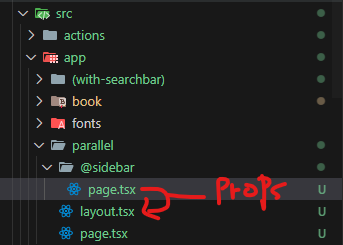
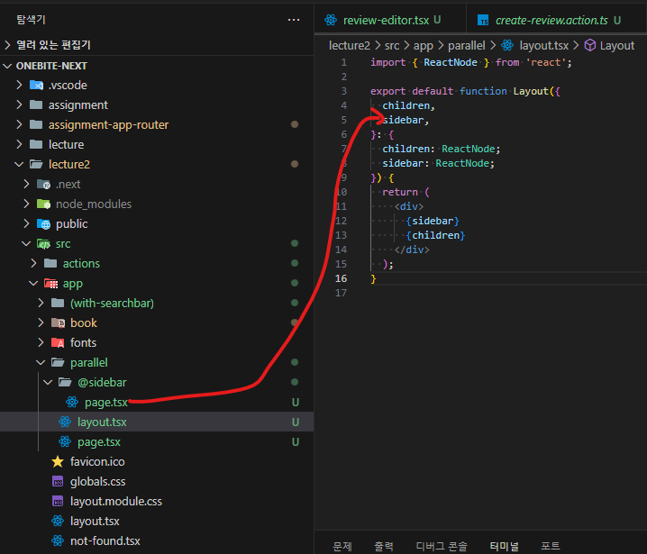

# Parallel Route 병렬라우트

- 하나의 화면안에 여러개의 페이지를 병렬로 함께 렌도링 시켜주는 패턴.여기서 페이지는 page.tsx
- Parallel Route 만드려면 슬롯이 필요하다.슬롯은 라우팅 폴더 밑에 @를 붙인 폴더를 말하는데, 여기서 슬롯의 역할은 병렬로 렌더링이 될 하나의 페이지 컴포넌트를 보관하는 역할을 하는 폴더
- 그리고 그 폴더 안에 page컴포넌트를 만들어주고 그 페이지컴포넌트는 자신을 감싸고 있는 레이아웃 컴포넌트에게 자신이 속한 슬롯의 이름으로 props로 전달이된다. 그림으로 설명하면 다음과 같다.

- 여기서 슬롯은(@이 있는 라우터는) URL경로에 아무런 영향을 끼치지 않는다.그리고 슬롯은 개수 제한없이 만들수 있다.

- 슬롯안에 페이지를 추가하는 것도 가능하다. 하지만, 슬롯 밑에 특정 페이지를 추가하는 경우에는 404페이지로 보내지는 문제가 발생할 수 있다. 그렇기 때문에, 이런 문제를 방지하기 위해서 디폴트 페이지를 추가하는 것이 좋다.
