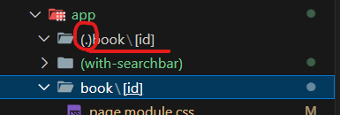
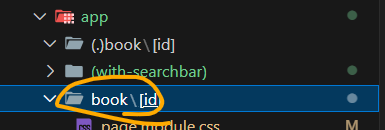

# 인터셉팅 라우트

- 사용자가 특정경로로 접속해서 새로운페이지를 요청할 때 이 요청을 가로채서 원래 렌더링 되어야 되는 페이지가 아닌, 개발자가 원하는 어떠한 페이지를 대신 렌더링 하도록 설정하는 라우팅 패턴

- 사용자가 동일한 경로에 접속하게 되더라도 특정조건을 만족하게 되면, 그때 원래 페이지가 아닌 다른 페이지를 렌더링 하도록 설정하는 기술. 여기서 특정조건은 초기 접속이 아닐때를 뜻한다. 구체적으로는 Link컴포넌트나 라우터객체에서 제공하는 푸시하는 경우

## 사용방법

여기서 보는 바와 같이 (.)뒤의 경로를 인터셉트 한다 여기서는 . 이 하나이기 때문에 동일한 경로상의 book/[id]를 인터셉트한다.

만약 폴더 구조가 동일한 경로에 있지 않고 두단계 위에 있다면 소괄호 안에 (..)이라고 기입하여 폴더를 만들어준다.

## reference

https://nextjs.org/docs/app/api-reference/file-conventions/intercepting-routes
