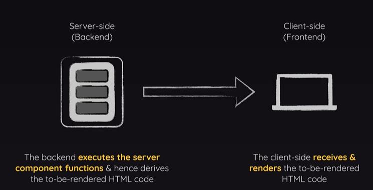
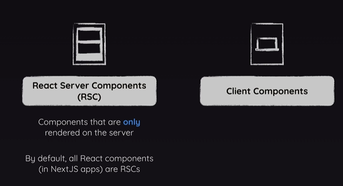
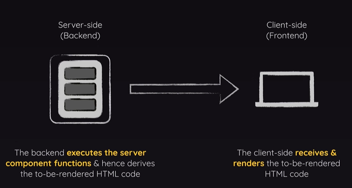
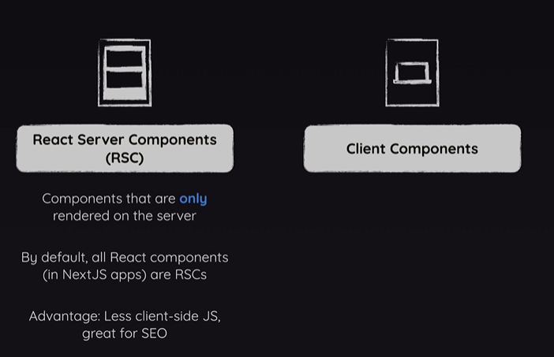
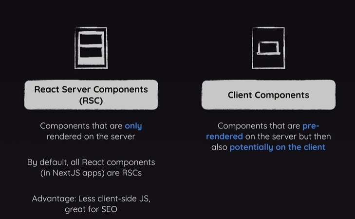
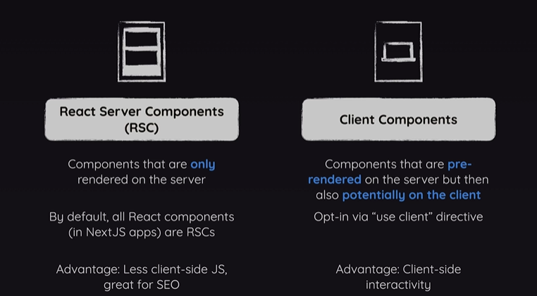

# 리액트 서버 컴포넌트 vs 클라이언트 컴포넌트

Next.js는 서버 컴포넌트와 리액트 서버 컴포넌트 그리고 클라이언트 컴포넌트들에 대해 압니다

그리고 사실 이것은 기술적으로 오직 Next.js만이 아니라

리액트 또한 대부분의 리액트 앱에서 자체적으로의 구분이 있습니다

creat React app이나 Vite의 도움을 받아 만드는

모든 바닐라 리액트 앱들에서 기본적으로 클라이언트 컴포넌트를 사용하고 있습니다

왜냐하면 그런 프로젝트들에서 React.js는 순수한 클라이언트 사이드 라이브러리로

브라우저에서 클라이언트 측에서 코드를 실행합니다

Next.js에서는 이것이 변경되는데 왜냐하면 Next.js는 풀스택 프레임워크이기 때문입니다

프론트엔드 뿐 아니라 백엔드가 있고 따라서 Next.js와 작업할 때

코드는 백엔드에서도 실행됩니다 예를 들어서 기본적으로 여러분의 Next.js 프로젝트에서 가지고 있는

모든 리액트 컴포넌트들은 그것들이 페이지인지, 레이아웃인지, 기본 컴포넌트인지에 상관없이

오직 서버에서만 렌더링됩니다 이것이 바로 그들이 리액트 서버 컴포넌트라 불리는 이유입니다

언급했듯이 이것은 사실상 리액트에 내장된 기능이지만 특정한 뒷단 빌드 프로세스와

구조로 잠겨있어서 대부분의 리액트 프로젝트의 일부가 아닙니다

그러나 이것은 잠금해제되어있고 Next.js 프로젝트에서 기본적인 것입니다

따라서 기본적으로 모든 리액트 컴포넌트는 서버에서만 렌더링됩니다

리액트 서버 컴포넌트이며 서버에서만 렌더링됩니다

이 말은 이 컴포넌트와 layout 컴포넌트 그리고 header 컴포넌트의 slideshow 컴포넌트

같은 모든 컴포넌트는 브라우저에서 실행되지 않는다는 것입니다

그러한 컴포넌트 함수들은 서버에서 실행됩니다

그리고 여러분은 실행중인 내용을 예를 들어 이 MainHeader 컴포넌트에 콘솔을 기록하면

확인할 수 있습니다

이렇게 하고 나서 page.js 파일로 가서 임시적으로

에러를 내고 있기 때문에 곧 고칠 이 ImageSlideshow 컴포넌트를 주석처리 합니다 또한 이 import도 주석처리 합니다

모든 것을 저장하고 다시 로딩한 후 브라우저 개발자 툴을 열면 실행 로그를 확인할 수 없습니다

실행중인 로그, 즉 우리가 메인 헤더에 로그를 출력하는 것은 여기에서 나타나지 않습니다

왜냐하면 MainHeader 컴포넌트는 절대 브라우저에서 실행되지 않고 대신에 서버에서 실행되기 때문입니다

따라서 개발자 서버를 시작하는 터미널을 열면 서버 사이드 코드가 돌아가고 있고 여기서 실행중인 로그를 볼 수 있습니다

이곳이 그 컴포넌트들이 실행되는 곳입니다 흥미로운 것은 이것이 초기 페이지를 로드할 때만의

사례가 아니라 이후의 내비게이션에도 같다는 것입니다 즉 예를 들어 이 Meals page에 무엇인가를 로그하고

여기에 console.log('Meals page')를 하고 시작 페이지를 다시 로딩하고

explore meals 를 눌러 meals page로 넘어가길 원한다면 여기에서 또한 로그를 볼 수 없습니다

비록 그 링크를 사용했고 따라서 새로운 페이지를 만든 것이 아니라

단일한 페이지 애플리케이션에 머물렀음에도 말입니다

이런 상황이더라도 여기서 로그를 확인할 수 없고 대신 이 백엔드 로드에서 볼 수 잇습니다

이런 상황의 이유는 단일 페이지 애플리케이션 모드에 있고 움직이고 있더라도

모든 컴포넌트는 아직도 백엔드에서의 서버에 렌더링 되고 결국은 이것은 이곳에서 렌더링 되도록 클라이언트에 보내지는

완성된 html 코드 같은 것이기 때문입니다 기술적으로 약간 다르지만 이렇게 생각해볼 수 있습니다

따라서 Next.js는 그러한 서버 컴포넌트를 가지는 이 컨셉을 수용합니다

이것은 중요한 컨셉이고 Next.js 프로젝트의 중요한 장점입니다

왜냐하면 서버 컴포넌트를 사용하면 다운로드해야 하는 클라이언트 측의 자바스크립트 코드가 줄어들 수 있어 웹사이트의 성능을 향상시킬 수 있습니다

이것은 검색엔진 최적화에도 좋습니다

웹 검색 크롤러들은 이제 완성 컨텐츠를 포함하는 페이지들을 볼 수 있기 때문입니다

이를 Next.js와 같은 프레임워크를 사용하지 않는 일반적인 자바스크립트 프로젝트와 비교해보겠습니다

거기에서 페이지의 소스 코드를 보면 그것이 본질적으로는 비어있는 것을 확인할 수 있습니다

왜냐하면 모든 내용은 클라이언트 측 코드와 클라이언트 측 컴포넌트의 도움으로 클라이언트 측에서 생성되고 채워지기 때문입니다

Next.js에서는 프로젝트의 상태가 다르게 나타납니다 여기의 소스 코드를 살펴보면 모든 컨텐츠가 여기에 있습니다

스크린에 보여지는 모든 텍스트는 실제 페이지 소스코드의 일부분이고 웹 검색엔진 크롤러들이 보는 것들이기도 합니다

따라서 이것이 왜 우리가 이 서버 컴포넌트를 가지고 이것이 중요한지에 대한 이유입니다

그러나 Next.js 프로젝트에서 클라이언트 컴포넌트도 만들 수 있습니다

그것들은 기술적으로 서버에서 아직 사전 렌더링 되는 것들이고 잠재적으로는 클라이언트에 렌더링될 수 있습니다

더 중요하게 이 컴포넌트들은 클라이언트에 무조건 렌더링 되야 하는 것으로 이유는 클라이언트에만 사용가능한 코드나 기능을 포함하기 때문입니다

예를 들어 여기 이 image-slideshow.js 파일에서 useState 훅이나 useEffect 훅을 사용하고 있습니다

이 훅들은 서버 측에서는 사용 불가한데 생각해보면 이해가 되는 이유는 우리는 이 interval (간격)을 서버 측에 설정하는 것에 관심 있는 것이 아니라 이 브라우저를 실행해서 페이지가 로드된 후에 이미지가 5초마다 변경되길 원하길 때문입니다

클라이언트 컴포넌트에서만 사용가능한 또 하나의 기능 예시는 eventHandler입니다

onClick 속성을 활용하여 몇 가지의 함수를 촉발하면 당연히 여기에서 어떤 사용자 상호작용을 기다리고 있기에

이는 클라이언트에서 실행되는 코드가 필요하므로 클라이언트 컴포넌트여야 합니다

그러나 기본적으로 Next.js에서는 모든 컴포넌트는 서버 컴포넌트입니다

클라이언트 컴포넌트를 만들고 싶다면 Next.js에게 컴포넌트를 잡고 있는 파일 위에 특별한 지시어를 사용하여 드러나게 알려야 합니다

정확히는 use Client 지시어를 사용하면 useClient 사이트 기능을 컴포넌트 내에 사용할 수 있도록 할 것입니다

eventHandler, useEffect 그리고 useState와 같이 말입니다

따라서 여기 이 slideshow 컴포넌트가 작동하게 하기 위해서는 우리는 이 파일 위에 use client 지시어를 추가해야합니다

그것이 추가되면 우리는 메인 페이지로 돌아가 여기 import와 컴포넌트를 다시 가져옵니다

그리고 다시 로드하면 작동하고 더 이상 에러가 뜨지 않고 5초마다 변경되는 이미지가 여기 있습니다

그리고 이것이 여기에서 원하는 동작이며 클라이언트 컴포넌트의 도움으로 해제 되었습니다

이 차이점에 대해 알고 이 두 컴포넌트 유형이 일반적으로 React에서 존재한다는 것을 이해하는 것은 매우 중요하며 실제로는 Next.js와 같은 프레임워크를 사용할 때에만 작동하고 사용될 수 있다는 점을 이해하는 것이 중요합니다
