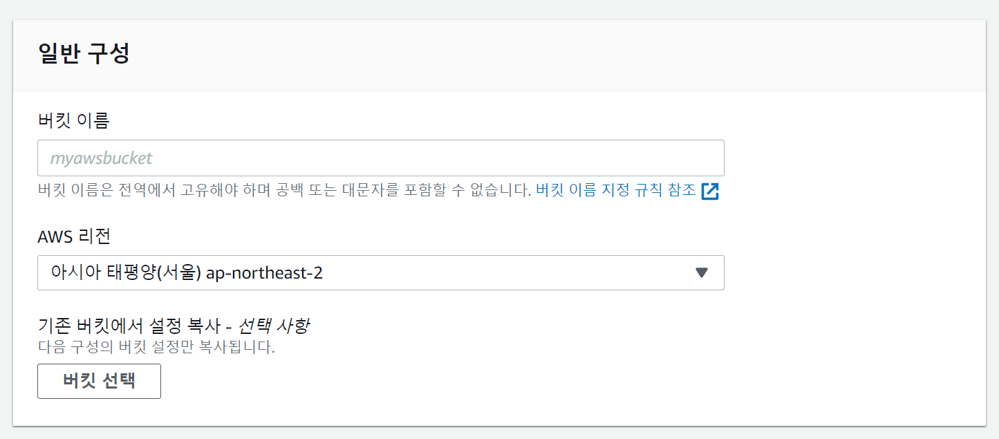
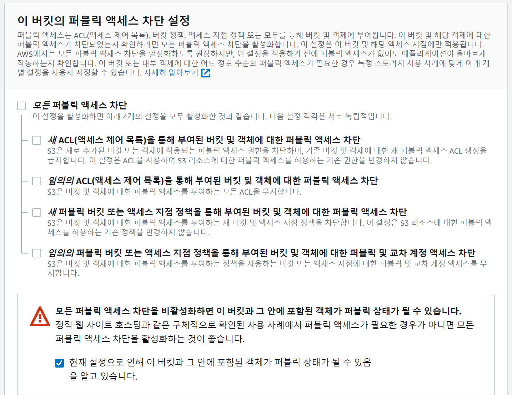
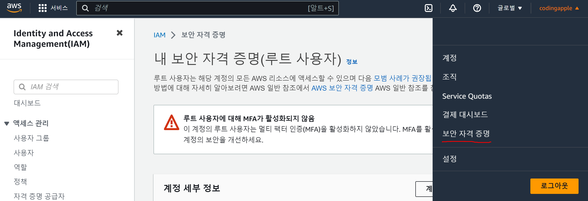
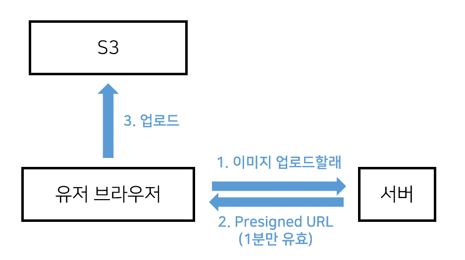
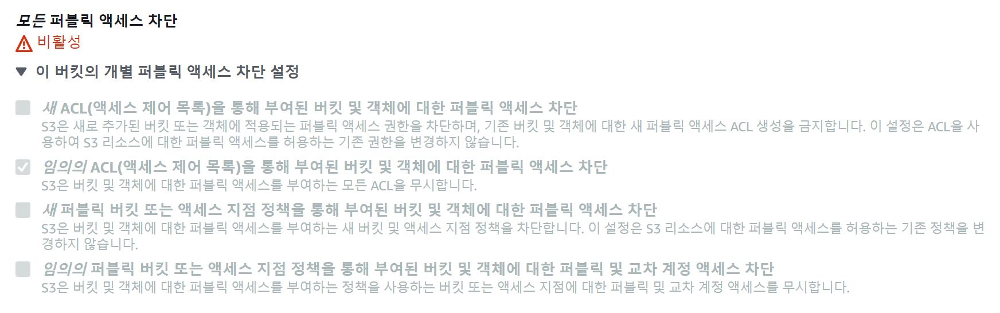

유저가 글작성시 이미지를 업로드할 수 있게 만들어봅시다.

업로드한 이미지를 하드에 저장해놓고 필요할 때 보여주면 될텐데

Vercel에 올려놨거나 AWS 인스턴스를 여러개 만들었거나 하는 경우 하드 이용이 난감한 경우가 있어서

AWS S3같은 파일저장용 클라우드 서비스 빌려서 거기 업로드해놓는게 좋습니다.

저번에 AWS 배포하면서 카드등록해놨으면 S3도 무료로 5GB까지 1년 이용가능하니까

AWS S3 사용해서 이미지 파일 올리는 법을 좀 알아봅시다.

근데 대충넣으려면 구글 firebase storage 같은게 더 쓰기쉽고 5GB 까지 아마 평생 무료임

AWS S3 셋팅

AWS 로그인하고 S3 검색해서 들어가봅시다.

그리고 어딘가에 있는 버킷만들기 버튼 누르면 됩니다.

▲ 버킷은 여러분만의 저장공간입니다.

작명은 유니크하게 해줍시다.

▲ 퍼블릭 액세스 설정을 이렇게 바꿔줍시다. 그래야 개발시 편합니다.

대충 이것만 채워서 버킷만들면 됩니다.

버킷정책 수정하기

보안을 신경써야한다면 일반 사람들은 읽기만 가능하게,

관리자는 수정, 삭제가 가능하게 바꾸는게 좋은데
▲ '권한' 눌러서 '버킷 정책' 편집을 눌러봅시다.

누가 버킷을 읽기, 수정, 삭제 할 수 있는지 정의하는 부분입니다.

{
"Version": "2012-10-17",
"Statement": [
{
"Sid": "1",
"Effect": "Allow",
"Principal": "_",
"Action": "s3:GetObject",
"Resource": "arn:aws:s3:::님들버킷명/_"
},
{
"Sid": "2",
"Effect": "Allow",
"Principal": {
"AWS": "arn:aws:iam::님들AWS계정ID:root"
},
"Action": [
"s3:PutObject",
"s3:DeleteObject"
],
"Resource": "arn:aws:s3:::님들버킷명/\*"
}
]
}
그래서 이렇게만 써놔도 일단은 안전한데 1번은 모든 유저는 GET이 가능하고

2번은 관리자만 PUT, DELETE가 가능하다고 적어놓은 것입니다.

- Principal은 어떤 유저인지 명시하는 부분인데 \* 쓰면 모든유저,

특정 AWS 계정을 넣고 싶으면 arn:aws:iam::님들AWS계정ID:root 넣으면 됩니다.

님들 계정 ID는 AWS 사이트 오른쪽 위 눌러보쇼

- 자료 읽기는 s3:GetObject

쓰기는 s3:PutObject

삭제는 s3:DeleteObject

를 의미합니다.

- Resource는 어떤 버킷인지 버킷명 잘 적어주면 됩니다.

저는 arn:aws:s3:::codingappleimage1/\* 이렇게 적어봄

그 밑에 CORS 설정은

[
{
"AllowedHeaders": [
"*"
],
"AllowedMethods": [
"PUT",
"POST"
],
"AllowedOrigins": [
"*"
],
"ExposeHeaders": [
"ETag"
]
}
]
어떤 사이트에서 버킷안의 파일들을 읽기, 쓰기, 삭제할 수 있는지 CORS 설정하는 부분입니다.

다른 사이트에서 자료 쓰기, 삭제 못하게 만들려면

AllowedOrigins 안에 님들 사이트 주소 넣으면 되는데 개발중이니 \* 넣어둡시다.

Access 키 발급

님이 만든 서버에서 S3로 접속하고 이미지올리고 이거저거 하고 싶으면

코드짤 때 Access key를 기입해줘야합니다.

그거 발급하려면 IAM 검색해서 들어갑시다.

▲ 아니면 우측 위에 님들 이름눌러도 아마 들어갈 수 있음

그럼 중간쯤에 액세스키 만들기가 있는데 하나만들어서 액세스키와 비밀키 2개 세트를

코딩할 때 사용하게 안전한 곳에 보관해둡시다.

분실했으면 지우고 새로 만들면 됩니다.

이거 털리면 님들 AWS 요금 월 1억 나오는 것임

요즘은 Presigned URL

유저가 업로드할 이미지를 하나 고르면 그걸 유저에게 미리 보여줘야하지 않겠습니까

createObjectURL 같은걸 써도 보여줄 수 있는데

근데 보통은 편하게하려면 유저가 이미지를 <input type="file">에서 고르는 순간 그냥 S3에 집어넣으면 됩니다.

그리고 집어넣은 후에 이미지 URL을  안에 넣으면 이미지를 보여줄 수 있습니다.

예전엔 직접 서버에서 이미지를 업로드하는 식으로 코드를 짰다면

요새 S3에서는 Presigned URL 이라는 방식으로 이미지를 업로드합니다.

Presigned URL을 가진 모든 유저는 브라우저에서 서버안거치고 직접 S3에 업로드가 가능한데

그러면 서버부담이 덜해져서 좋으니 그렇게 쓰는 것이고 어떤 식인지 구체적으로 설명해보면

1. 글작성 페이지의 <input>에서 유저가 이미지 고르는 순간 서버에게 GET요청을 합니다.

심심하니까 이미지 이름도 같이 보내줌

2. 그럼 서버는 괜찮은 유저인지 이거저거 검사해보고 Presigned URL을 만들어서 유저 브라우저로 보내줌

3. 유저는 브라우저에서 Presigned URL을 이용해서 S3로 POST요청해서 바로 이미지를 보냅니다.

4. 업로드 성공시 업로드된 이미지의 URL을 에 박아서 이미지 업로드된걸 보여줌

이런 식으로 개발합니다.

실은 개발할 것도 없고 그냥 사용법 복붙만 하면 되는거라 다음 시간에 알아봅시다.
이미지 업로드기능을 만들어봅시다.

Presigned URL 방식으로 유저 -> S3 이렇게 직접 이미지 업로드를 시키면 좋다고 했는데

▲ 이런 식으로 코드짜면 됩니다.

글로 적어보면

1. 글작성 페이지의 <input>에서 유저가 이미지 고르는 순간 서버에게 Presigned URL 달라고 GET요청을 합니다.

심심하니까 이미지 이름도 같이 보내줌

2. 그럼 서버는 괜찮은 유저인지 이거저거 검사해보고 Presigned URL을 만들어서 유저 브라우저로 보내줌

3. 유저는 브라우저에서 Presigned URL을 이용해서 S3로 이미지를 보냅니다.

4. 성공시 업로드된 이미지의 URL을 에 박아서 이미지 업로드된걸 보여줌

이런 식으로 코드짜면 되는데 이걸 어떻게 알았냐고요?

실은 next.js 공식예제로 나와있어서 그거 그대로 카피하면 됩니다.

1. 서버야 Presigned URL 줘

(/write/page.js)

'use client'
export default function Write(){
return (

<h4>글작성</h4>
<form action="/api/post/new" method="POST">
<input name="title" placeholder="글제목"/>
<input name="content" placeholder="글내용"/>
<button type="submit">전송</button>
</form>

      <input type="file" accept="image/*" onChange={
        async (e)=>{
          let file = e.target.files[0]
          let filename = encodeURIComponent(file.name)
          let res = await fetch('/api/post/image?file=' + filename)
          res = await res.json()
        }
      } />
      

    

)
}

1. 이미지 선택용 <input>과 그걸 보여줄 를 만들었습니다.

2. onChange안에 파일선택시 파일이름을 가져오고

3. 서버로 Presigned URL좀 달라고 GET요청을 합니다. 심심하니까 파일이름도 보냄

그럼 Presigned URL 발급해주는 서버기능을 만들어봅시다.

2. 서버는 Presigned URL 발급해서 보내주기

(/api/post/image.js)

import aws from 'aws-sdk'
export default async function handler(요청, 응답){
aws.config.update({
accessKeyId: process.env.ACCESS_KEY,
secretAccessKey: process.env.SECRET_KEY,
region: 'ap-northeast-2',
signatureVersion: 'v4',
})

    const s3 = new aws.S3();
    const url = await s3.createPresignedPost({
      Bucket: process.env.BUCKET_NAME,
      Fields: { key : 요청.query.file },
      Expires: 60, // seconds
      Conditions: [
        ['content-length-range', 0, 1048576], //파일용량 1MB 까지 제한
      ],
    })

    응답.status(200).json(url)

}

1. npm install aws-sdk 해서 AWS 다룰 수 있는 라이브러리 하나 설치합시다.

2. aws.config.update 안에 님들 정보 채워주면 됩니다.

정보는 직접 기입하는거보다 .env 파일을 이용했는데

ACCESS_KEY=액세스키어쩌구
SECRET_KEY=액세스키시크릿
BUCKET_NAME=님들버킷명
님들 프로젝트 루트경로에 .env 파일을 하나 만들어서

위와 같이 채워주면 사용가능합니다.

3. createPresignedPost 함수 이용하면 PresignedURL을 발급해줍니다.

key : 옆에 유저가 보낸 파일이름 기입해주면 됩니다.

업로드가능한 최대용량, 제한시간 설정도 가능합니다.

3. S3로 업로드하기

(/write/page.js)

'use client'
import { useState } from "react";

export default function Write(){
let [src, setSrc] = useState('')

return (

<h4>글작성</h4>
<form action="/api/post/new" method="POST">
<input name="title" placeholder="글제목"/>
<input name="content" placeholder="글내용"/>
<button type="submit">전송</button>
</form>

      <input type="file" accept="image/*" onChange={
        async (e) => {
          let file = e.target.files[0]
          let filename = encodeURIComponent(file.name)
          let res = await fetch('/api/post/image?file=' + filename)
          res = await res.json()

          //S3 업로드
          const formData = new FormData()
          Object.entries({ ...res.fields, file }).forEach(([key, value]) => {
            formData.append(key, value)
          })
          let 업로드결과 = await fetch(res.url, {
            method: 'POST',
            body: formData,
          })
          console.log(업로드결과)

          if (업로드결과.ok) {
            setSrc(업로드결과.url + '/' + filename)
          } else {
            console.log('실패')
          }

        }
      } />
      

    

)
}

1. 어딘가로 폼데이터 전송시 <form>쓰는게 귀찮으면 new formData()를 쓰고 거기에 폼데이터들을 넣으면 됩니다.

2. 서버에서 받아온 res라는 변수 안에 숨어있던 데이터들과 이미지를 formData안에 넣고

3. res.url 경로로 전송하면 됩니다. 그럼 S3에 이미지 올라감

4. 업로드결과.url 뒤에 /파일이름만 붙이면 그게 님들 방금 업로드한 이미지 경로입니다.

이미지 경로를  안에 넣거나 맘대로 하면 됩니다.

실은 이런 라이브러리 사용법은 공부하고 그럴 필요 없이 그냥 복사붙여넣기 해서 쓰면 잘쓰는 것입니다.

아무튼 이제 <input>에서 이미지를 선택하는 순간 이미지가 페이지에 보이는군요.

이제 글발행할 때 이미지 URL도 함께 DB에 저장해두면 필요한 페이지에서 보여줄 수 있지 않을까요

그건 여러분들이 직접 해봅시다.

- client component라서 글발행시 ajax요청으로 폼전송하는게 어떨까요

- 글의 상세페이지에선 글과 함께 업로드한 사진도 보여야합니다.

Q. 유저가 글발행 안하고 뒤로가기 누르면 S3 저장용량 낭비아님?

- 지금은 선택과 동시에 이미지를 업로드하고 있는데 글발행 누르면 이미지 업로드시키면 되겠군요.

업로드 전에 유저가 선택한 이미지 보여주려면 createObjectURL을 씁시다.

(참고) 이미지 업로드 잘되는지 확인 후에

AWS S3 콘솔에서 버킷의 권한설정 하던거 들어가서

▲ 이런거 체크해두는게 좋을 수도 있습니다.

왜냐면 지금 버킷정책 (Bucket policy) 으로 권한을 설정하고 있는데

ACL이라는 것으로도 권한을 설정할 수 있습니다.

두개의 권한이 겹치는 경우 최대한 느슨한 쪽으로 결정되기 때문에 ACL은 안쓰면 저렇게 차단해두는게 안전할 수 있습니다.

'임의의 ACL로 부여된 액세스 차단' 이라고 되어있는데

쉽게 말하면 '모든 ACL로 부여된 액세스를 차단하겠다'는 뜻입니다.

물론 이상한거 건드려서 뭔가 안되면 체크해제합시다.
