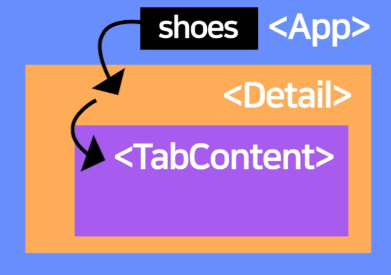

# Context API

App에 있던 state를 TabContent 컴포넌트에서 사용하고 싶어지면 어떻게 코드짜야하죠?

App -> Detail -> TabContent 이렇게 props를 2번 전송해주면 됩니다.



이게 귀찮으면 Context API 문법을 쓰거나 Redux 같은 외부 라이브러리 쓰면 되는데 오늘은 전자를 알아봅시다.

## Context API 문법으로 props 없이 state 공유하기

재고라는 state를 App 컴포넌트에 만들어봅시다.

이걸 TabContent라는 자식컴포넌트에서 쓰고싶다고 가정해봅시다.

Context API 문법을 쓰면 props 전송없이도 TabContent 컴포넌트가 쓸 수 있는데

이거 쓰려면 일단 셋팅부터 해야합니다.

```ts
App.js;

export let Context1 = React.createContext();

function App() {
  let [재고, 재고변경] = useState([10, 11, 12]);

  생략;
}
```

▲ 1. 일단 createContext() 함수를 가져와서 context를 하나 만들어줍니다.

context를 쉽게 비유해서 설명하자면 state 보관함입니다.

```ts
App.js;

export let 재고context = React.createContext();

function App() {
  let [재고, 재고변경] = useState([10, 11, 12]);

  return (
    <Context1.Provider value={{ 재고, shoes }}>
      <Detail shoes={shoes} />
    </Context1.Provider>
  );
}
```

▲ 2. 아까만든 Context1로 원하는 곳을 감싸고 공유를 원하는 state를 value 안에 다 적으면 됩니다.

그럼 이제 Context1로 감싼 모든 컴포넌트와 그 자식컴포넌트는

state를 props 전송없이 직접 사용가능합니다.

## Context 안에 있던 state 사용하려면

1. 만들어둔 Context를 import 해옵니다.

2. useContext() 안에 넣습니다.

그럼 이제 그 자리에 공유했던 state가 전부 남는데 그거 쓰면 됩니다.
```ts
(Detail.js)

import {useState, useEffect, useContext} from 'react';
import {Context1} from './../App.js';

function Detail(){
let {재고} = useContext(Context1)

return (

<div>{재고}</div>
)
}
```
▲ 예를 들어서 Detail 컴포넌트에서 Context에 있던 state를 꺼내 쓰려면

1. Context1을 import 하고

2. useContext() 안에 담으면 됩니다. Context 해체해주는 함수임

그럼 그 자리에 공유했던 모든 state가 남습니다.

변수에 담아서 가져다쓰거나 하면 됩니다.

심지어 Detail 안에 있는 모든 자식컴포넌트도 useContext() 쓰면 자유롭게 재고 state를 사용가능합니다.

TabContent 안에서 실험해봅시다.

Q. props보다 불편한데요?

A. 그럼 props를 씁시다. 이건 중첩해서 사용한 컴포넌트가 많을 때 편리한 문법입니다.

### Context API 단점

잘 안쓰는 이유

1. state 변경시 쓸데없는 컴포넌트까지 전부 재렌더링이 되고

2. useContext() 를 쓰고 있는 컴포넌트는 나중에 다른 파일에서 재사용할 때 Context를 import 하는게 귀찮아질 수 있습니다.
