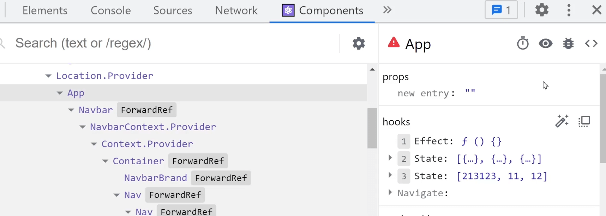

props를 보냈는데 출력이 안된다거나

이미지를 넣었는데 안보이는 버그같은게 생기면

개발자도구를 켜서 Elements 탭 살펴보면 되는데

여기선 여러분이 짠 코드가 실제 html css로 변환되어서 보여집니다.

그게 싫고 컴포넌트로 미리보고 싶으면 리액트 개발자도구를 설치해서 켜보면 됩니다.

## 크롬 확장프로그램 : React Developer Tools

https://chrome.google.com/webstore/

크롬 웹스토어 들어가면 확장프로그램 설치가 가능합니다.

여기서 React Developer Tools 설치하면 Components 탭이 생기는데

여러분들이 개발중인 리액트사이트를 컴포넌트로 미리볼 수 있습니다.



왼쪽에서 컴포넌트구조 파악이 가능하고

왼쪽상단 아이콘눌러서 컴포넌트 찍어보면

거기 있는 state, props 이런거 조회가능합니다. 수정해볼 수도 있음

그리고 우측 상단 여러가지 버튼도 있는데 함 눌러보시면 됩니다. 크게 쓸모는 없습니다.

## Profiler 탭에서 성능평가 가능


Profiler 탭 들어가서

- 녹화버튼 누르고

- 페이지 이동이나 버튼조작을 해보고

- 녹화를 끝내면

방금 렌더링된 모든 컴포넌트의 렌더링시간을 측정해줍니다.

이상하게 느린 컴포넌트가 있다면 여기서 범인을 찾을 수 있습니다.

`<div>`를 1만개 만들거나 그러지 않는 이상 보통은 걱정할 필요는 없습니다.

지연 원인 대부분은 서버에서 ajax 요청결과가 늦게 도착해서 그런 경우가 많습니다.

서버가 느린 건 어쩔 수 없음

## Redux Developer Tools

이것도 크롬 웹스토어에서 설치가능합니다.

Redux store에 있던 state를 전부 확인가능합니다.

그리고 dispatch 날릴 때 마다 뭐가 어떻게 바뀌었는지 로그를 작성해줍니다.

store 복잡해지면 유용함

## lazy import

리액트 코드 다 짰으면 npm run build 입력해서 여러분이 짰던 이상한 코드들을 역사와 전통의 html css js 파일로 변환해야한다.

근데 리액트로 만드는 Single Page Application의 특징은 html, js 파일이 하나만 생성됩니다.

그 안에 지금까지 만든 App / Detail / Cart 모든 내용이 들어있어서 파일사이즈가 좀 큽니다.

원래 그래서 리액트 사이트들은 첫 페이지 로딩속도가 매우 느릴 수 있습니다.

그게 싫다면 js 파일을 잘게 쪼개면 됩니다.

쪼개는 방법은 import 문법을 약간 고치면 되는데 지금 메인페이지 보면 Detail, Cart를 import 해서 쓰고있습니다.

근데 잘 생각해보면 Detail, Cart 컴포넌트는 메인페이지에서 전혀 보이지 않고 있기 때문에

이런 컴포넌트들은 이런 문법으로 import 해놓으면 좋습니다.

```ts
App.js;

import Detail from './routes/Detail.js';
import Cart from './routes/Cart.js';
```

이거를

```ts
App.js;
import { lazy, Suspense, useEffect, useState } from 'react';

const Detail = lazy(() => import('./routes/Detail.js'));
const Cart = lazy(() => import('./routes/Cart.js'));
```

이렇게 바꾸자.

lazy 문법으로도 똑같이 import가 가능한데 이 경우엔 "Detail 컴포넌트가 필요해지면 import 해주세요" 라는 뜻이 된다. 그리고 이렇게 해놓으면 Detail 컴포넌트 내용을 다른 js 파일로 쪼개줍니다.

그래서 첫 페이지 로딩속도를 향상시킬 수 있다.필요할 것 같으면 씁시다.하지만 그와동시에 해당 컴포넌트는 로딩시간이 발생하게됨 그 와동시에 Detail컴포넌트를 가게되면 로딩시간이 적용됨.

```ts
<Suspense fallback={<div>로딩중임</div>}>
  <Detail shoes={shoes} />
</Suspense>
```

이렇게 lazy 사용하면 당연히 Detail 컴포넌트 로드까지 지연시간이 발생할 수 있습니다. 그럴 땐

1. Suspense 라는거 import 해오고

2. Detail 컴포넌트를 감싸면

Detail 컴포넌트가 로딩중일 때 대신 보여줄 html 작성도 가능하다.

귀찮으면 `<Suspense>` 이걸로 `<Routes>` 전부 감싸도 됩니다.
