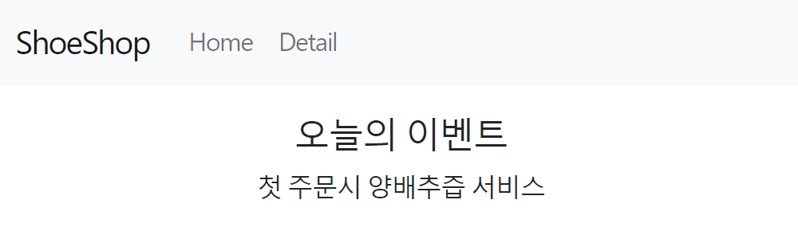
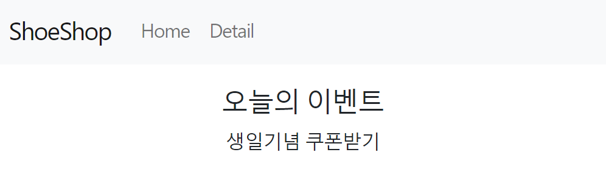

# 리액트 라우터 1 : 셋팅이랑 기본 라우팅

## 페이지나누기

페이지를 나누고 싶으면

일반 html css js 사이트는 그냥 html 파일 여러개 만들면 그게 하나의 페이지인데

근데 리액트는 html 파일을 하나만 사용합니다.

그래서 리액트에선 누가 다른 페이지 요청하면 그냥 내부에 있는 `<div>`를 갈아치워서 보여주면 됩니다.

근데 직접 코드짜면 귀찮으니 react-router-dom 이라는 외부 라이브러리 설치해서 구현하는게 일반적이라 그렇게 해봅시다.

## react-router-dom 설치하려면

외부라이브러리라서 설치 셋팅하는 법은

react-router-dom 홈페이지 들어가서 그대로 따라하면 되는데 그냥 알려드리자면

터미널 열어서

`npm install react-router-dom@6` 입력해서 설치합니다.

셋팅은 index.js 파일로 가서

```ts
import { BrowserRouter } from 'react-router-dom';

const root = ReactDOM.createRoot(document.getElementById('root'));
root.render(
  <React.StrictMode>
    <BrowserRouter>
      <App />
    </BrowserRouter>
  </React.StrictMode>
);
```

▲ import BrowserRouter하고

`<BrowserRouter>` 이걸로 `<App/>` 이걸 감싸면 끝입니다.

## 라우터로 페이지 나누는 법

다른 웹사이트를 잘 살펴보면

codingapple.com/어쩌구로 접속하면 A페이지를 보여주고

codingapple.com/저쩌구로 접속하면 B페이지를 보여줍니다.

이런 식으로 url 경로마다 다른 페이지를 보여주고 싶으면 이렇게 작성합니다.

```ts
(App.js)

import { Routes, Route, Link } from 'react-router-dom'

function App(){
return (
(생략)
<Routes>
<Route path="/detail" element={ <div>상세페이지임</div> } />
<Route path="/about" element={ <div>어바웃페이지임</div> } />
</Routes>
)
}
```

1. 우선 상단에서 여러가지 컴포넌트를 import 해오고

2. `<Routes>` 만들고 그 안에 `<Route>`를 작성합니다.

3. `<Route path="/url경로" element={ <보여줄html> } />` 이렇게 작성하면 됩니다.

그래서 방금 페이지 2개 만든 것임

진짜 페이지 보이나 url 뒤에 /about 입력해보고 /detail 도 입력해보십시오.

```ts
<Route path="/" element={<div>메인페이지에서 보여줄거</div>} />
```

▲ 이 url 경로는 메인페이지입니다.

Q. 저는 메인페이지 접속시에만 상품목록 보여주고 싶습니다

A. 그럼 element={ } 안에 상품목록 레이아웃 다 넣으면 되는거 아닙니까

```ts
<Route
  path="/"
  element={
    <>
      <div className="main-bg"></div>
      <div className="container">
        <div className="row">
          {shoes.map((a, i) => {
            return <Card shoes={shoes[i]} i={i}></Card>;
          })}
        </div>
      </div>
    </>
  }
/>
```

이러면 메인페이지 접속시에만 상품목록이 보이고

나머지 /detail 그리고 /about 페이지에선 안보이겠군요.

이렇게 페이지에서 보여줄 html 내용은 마음대로 작성하면 됩니다.

페이지 이동 버튼은

유저들은 주소창에 url 입력해서 들어가지 않고 링크타고 들어갑니다.

링크를 만들고 싶으면 react-router-dom에서 Link 컴포넌트 import 해오고

원하는 곳에서 `<Link> `쓰면 됩니다.

```ts
<Link to="/">홈</Link>
<Link to="/detail">상세페이지</Link>
```

이러면 각각 url 경로로 이동하는 링크를 생성할 수 있습니다.

진짜 이동하는지 눌러봅시다

오늘의 숙제 :

/detail로 접속하면 보여줄 상세페이지를 컴포넌트를 이용해서 만들어오십시오.

코드 너무 기니까 다른 파일에 작성해봅시다.

상세페이지에 들어갈 html 내용은

```ts
<div className="container">
  <div className="row">
    <div className="col-md-6">
      
    </div>
    <div className="col-md-6">
      <h4 className="pt-5">상품명</h4>
      <p>상품설명</p>
      <p>120000원</p>
      <button className="btn btn-danger">주문하기</button>
    </div>
  </div>
</div>
```

붙여넣으면 상세페이지같은 레이아웃이 하나 생성됩니다.

숙제 해답:

오늘은 navigate() 함수와

간단한 프로젝트에선 쓸데없는데 가끔 쓰는 nested routes라는 기능을 배워봅시다.

/detail 접속시 html 이쁜거 보여달라는 저번시간 숙제는 어떻게 했냐면

src폴더 안에 routes폴더하나 만들고 그 안에 Detail.js를 만들었습니다.

파일 어디다 보관할지는 본인 맘입니다.

```ts
function Detail(){
return (
저번강의에서 준 html 코드
)
}

export default Detail
```

그리고 이런 코드를 채워넣었습니다.

이제 다른 파일에서 Detail 컴포넌트를 가져다쓸 수 있겠군요.

```ts
import Detail from './routes/Detail.js'

function App(){
return (
(생략)
<Route path="/detail" element={ <Detail/> } />
)
}
```

App.js 가서 사용했습니다.

/detail 페이지 접속시 `<Detail>` 컴포넌트 만들어둔거 보여달라고 코드짰습니다.

# 리액트 라우터 2 : navigate, nested routes, outlet

## 리액트 프로젝트 폴더구조

리액트는 그냥 html 이쁘게 만들어주는 쪼그만한 라이브러리일 뿐입니다.

그래서 여러분이 만들 파일들은 95% 확률로 .js 파일이기 때문에 비슷한 .js 파일끼리 한 폴더에 묶어놓으면 그냥 그게 좋은 폴더구조입니다.

컴포넌트 역할하는 js 파일은 components 폴더에 묶고 페이지 역할하는 js 파일은 routes 아니면 pages 폴더에 묶고

자주 쓰는 함수가 들어있는 js 파일은 utils 폴더에 묶고

알아서 필요할 때마다 폴더 만들어쓰십시오

```ts
import { Routes, Route, Link, useNavigate, Outlet } from 'react-router-dom';
```

우선 상단에서 이런 것들을 import 해옵시다.

오늘 배울 것들입니다.

## 1. 페이지 이동기능을 만들고 싶으면 useNavigate() 씁니다.

페이지 이동은 Link 써도 된다고 했는데 그게 못생겼으면 이거 쓰면 됩니다.(a태그 때문에 못생김)

```ts
function App(){
let navigate = useNavigate()

return (
(생략)
<button onClick={()=>{ navigate('/detail') }}>이동버튼</button>
)
}
```

useNavigate() 쓰면 그 자리에 유용한 함수가 남습니다.

페이지 이동시켜주는 함수입니다.

그럼 이제 navigate('/detail') 이런 코드가 실행되면 /detail 페이지로 이동가능합니다.

navigate(2) 숫자넣으면 앞으로가기, 뒤로가기 기능개발도 가능합니다.

-1 넣으면 뒤로 1번 가기

2 넣으면 앞으로 2번 가기 기능입니다.

## 2. 404페이지는

유저가 이상한 경로로 접속했을 때 "없는 페이지입니다" 이런거 보여주고 싶으면

```ts
<Route path="*" element={<div>없는페이지임</div>} />
```

`<Route path="*"> `하나 맨 밑에 만들어두면 됩니다.

"\*" 경로는 모든 경로를 뜻해서 이외의 모든것이라 이해하면 좋다. 위에 만들어둔 /detail 이런게 아닌 이상한 페이지 접속시 \* 경로로 안내해줍니다.

## 3. 서브경로 만들 수 있는 nested routes

/about/member로 접속하면 회사멤버 소개하는 페이지

/about/location으로 접속하면 회사위치 소개하는 페이지

를 만들고 싶으면 어떻게 하냐

```ts
<Route path="/about/member" element={<div>멤버들</div>} />
<Route path="/about/location" element={ <div>회사위치</div> } />
```

이렇게 만들어도 되겠지만

```ts
<Route path="/about" element={<About />}>
  <Route path="member" element={<div>멤버들</div>} />
  <Route path="location" element={<div>회사위치</div>} />
</Route>
```

이렇게 만들어도 됩니다.

`<Route>`안에 `<Route>`를 넣을 수 있는데 이걸 Nested routes 라고 부릅니다.

저렇게 쓰면

/about/member로 접속시 `<About>` &`<div>멤버들</div>` 을 보여줍니다.

/about/location으로 접속시`<About>` & `<div>회사위치</div>` 을 보여줍니다.

진짜 보이는지 `<About>`컴포넌트 하나 만들어서 확인해봅시다.

Q. `<div>`는 안보이는데요

실은 위처럼 코드짜면

/about/member로 접속시 `<About>`안에 `<div>멤버들</div>` 을 보여줍니다.

그래서 `<About>` 컴포넌트 안에 `<div>`를 어디다 보여줄지 표기해야 잘보여줍니다.

```ts
<Route path="/about" element={<About />}>
  <Route path="member" element={<div>멤버들</div>} />
  <Route path="location" element={<div>회사위치</div>} />
</Route>;
function About() {
  return (
    <div>
      <h4>about페이지임</h4>
      <Outlet></Outlet>
    </div>
  );
}
```

위에서 import해온 `<Outlet>`은 nested routes안의 element들을 어디에 보여줄지 표기하는 곳입니다.

그래서 이렇게 해두면 /about/member로 접속시 `<Outlet>`자리에 아까의 `<div>` 박스들이 잘 보입니다.

그래서 유사한 서브페이지들이 많이 필요하다면 이렇게 만들어도 됩니다.

방금 만든거 보면 페이지 url을 바꿀 때 마다 각각 다른 UI를 보여주는데

이것도 동적인 UI 만드는 방법 중 하나입니다.

그래서 라우터써도 동적인 UI 만들 수 있습니다.

라우터쓰면 뒤로가기 버튼을 이용가능하다는 장점이 있을듯요

오늘의 숙제 :

▼ /event/one 페이지로 접속하면 하단처럼 생긴 페이지가 떠야합니다.



▼ /event/two 페이지로 접속하면 하단처럼 생긴 페이지가 떠야합니다.



위 2개의 페이지들을 nested routes 써서 아무렇게나 만들어봅시다.

생각을 하면 생각하는 능력향상됨

```ts
function EventPage() {
  return (
    <div>
      <h4>오늘의 이벤트</h4>
      <Outlet></Outlet>
    </div>
  );
}
```

1. 페이지부터 하단에 만들어놨습니다.

```ts
<Routes>
  <Route path="/event" element={<EventPage />}>
    <Route path="one" element={<p>첫 주문시 양배추즙 서비스</p>}></Route>
    <Route path="two" element={<p>생일기념 쿠폰받기</p>}></Route>
  </Route>
</Routes>
```

2. 그리고 `<Routes>`안에 `<Route>`를 하나 만들었는데 그 안에 2개의 페이지를 더 만들었습니다.

이제 /event/one 접속시 `<h4>`와 `<p>` 둘 다 잘 보임

# 리액트 라우터 3 : URL 파라미터로 상세페이지 100개 만들기

## 상세페이지에 상품명 넣어봅시다

임시 글자들만 들어있으면 밋밋해서 그렇습니다.

그래서 shoes 라는 state에 있던 상품정보들을 Detail 컴포넌트에 꽂아넣어봅시다.

근데 안타깝게도 shoes는 App 컴포넌트에 있으니 App -> Detail 이렇게 전송하면 쓸 수 있겠군요.

```ts
<Route path="/detail" element={<Detail shoes={shoes} />} />
```

그래서 App.js 안에 `<Detail>` 쓰는 곳에서 일단 props 전송하고

```ts
(Detail.js)

<div className="container>
  <div className="row">
    <div className="col-md-6">
      
    </div>
    <div className="col-md-6 mt-4">
      <h4 className="pt-5">{props.shoes[0].title}</h4>
      <p>{props.shoes[0].content}</p>
      <p>{props.shoes[0].price}원</p>
      <button className="btn btn-danger">주문하기</button>
    </div>
  </div>
</div>
```

Detail 컴포넌트는 props 파라미터 등록해서 shoes를 자유롭게 사용했습니다.

props.shoes[0].title 하면 0번째 상품명 나올듯

Q. 근데 shoes라는 state를 Detail.js 안에서 또 만들면 굳이 props 필요없지 않나요?

A. 나중에 수정이 필요하면 두군데 수정해야해서 귀찮으니 그러면 안됩니다.

상세페이지 여러개 만들려면

방금 만든건 0번 상품의 상세페이지일 뿐입니다.

상품이 3개니까 상세페이지도 3개 필요할텐데

그럼 이렇게 코드짜면 되겠군요.

`<Route>` 쓰면 페이지하나 만들 수 있다고 했으니까...

```ts
<Route path="/detail/0" element={ <Detail shoes={shoes}/> }/>
<Route path="/detail/1" element={ <Detail shoes={shoes}/> }/>
<Route path="/detail/2" element={ <Detail shoes={shoes}/> }/>
```

`<Route>`를 3개 만드는겁니다. 그럼 페이지 3개 완성

path 작명시 슬래시 기호도 맘대로 사용가능한데 단어간 띄어쓰기용으로 많이 사용합니다.

근데 상품이 100만개라면 `<Route>`도 100만개 만들것입니까?

그건 너무 끔찍하기 때문에 다른 방법을 사용합니다.

```ts
<Route path="/detail/:id" element={<Detail shoes={shoes} />} />
```

페이지를 여러개 만들고 싶으면 `URL 파라미터`라는 문법을 사용가능합니다.

path 작명할 때 /:어쩌구 이렇게 사용하면 "아무 문자"를 뜻합니다.

그래서 위의 `<Route>`는 누군가 주소창에 /detail/아무거나 입력했을 때

<Detail> 컴포넌트 보여달라는 뜻입니다.

이제 그럼

/detail/0

/detail/1

/detail/2

이렇게 접속해도 `<Detail>`컴포넌트 잘 보여줄 수 있습니다.

## 페이지마다 똑같은 내용은 보여주기 싫은데요

/detail/0

/detail/1

/detail/2

이렇게 페이지는 여러개 만들어놨지만 접속해보면 다 똑같은 0번째 상품명만 보여주고 있습니다.

왜냐면 0번째 상품명 보여달라고 여러분이 코드짰으니까요.

이게 싫으면 이렇게 코드짤 수 있지않을까요.

```ts
(Detail.js)

<h4 className="pt-5">{props.shoes[현재url에입력된숫자].title}</h4>
<p>{props.shoes[0].content}</p>
<p>{props.shoes[0].price}원</p>
<button className="btn btn-danger">주문하기</button>
```

0이라고 하드코딩해놨던 자리에

현재url파라미터에 입력된숫자를 넣는겁니다.

그럼 /detail/1로 접속하면 1번째 상품명을 보여줄 수 있을듯요.

저런 숫자를 가져올 수 있냐고요?

가져올 수 있습니다.

```ts
import { useParams } from 'react-router-dom'

function Detail(){
let {id} = useParams();
console.log(id)

return (

<div className="container>
<div className="row">
<div className="col-md-6">

</div>
<div className="col-md-6 mt-4">
<h4 className="pt-5">{props.shoes[id].title}</h4>
<p>{props.shoes[0].content}</p>
<p>{props.shoes[0].price}원</p>
<button className="btn btn-danger">주문하기</button>
</div>
</div>

  </div>
  )
}
```

useParams() 라는 함수를 상단에서 import 해오면 쓸 수 있는데

이거 쓰면 현재 /:url파라미터 자리에 유저가 입력한 값을 가져올 수 있습니다.

변수에 저장해서 쓰든가 하면 됩니다.

그래서 위처럼 사용하면

누가 /detail/1로 접속하면 id라는 변수에 1이 들어옵니다.

누가 /detail/2로 접속하면 id라는 변수에 2가 들어옵니다.

그래서 props.shoes[id].title 이러면 아까 의도했던 기능이 완성되겠군요.

페이지마다 각각 다른 상품명이 보입니다.

## (참고)

path 작명시 url 파라미터는 몇번이고 사용가능합니다. detail/:어쩌구/:저쩌구 이런식으로 가능

## 응용문제 :

Q. 자료의 순서가 변경되면 상세페이지도 고장나는 문제는 어떻게 해결할까요?

상품 순서를 가나다순으로 변경하는 버튼을 만들어버렸다고 가정합시다.

그거 누르면 shoes라는 state 안의 상품이 가나다순으로 정렬됩니다.

그럼 Grey Yordan이 0번 상품이 되겠군요.

그럼 평소엔 /detail/0으로 접속하면 0번째 상품을 보여주니까 White and Black 이 뜰텐데

버튼 누른 후엔 /detail/0으로 접속하면 0번째 상품을 보여주니까 Grey Yordan 이 뜨겠군요.

이처럼 상세페이지가 불규칙해지는 문제는 어떻게 해결하면 좋을까요?

그냥 바로 힌트드림 Detail.js에 데이터바인딩할 때 0번째 상품의 제목을 여기 보여주세요~ 라고 썼는데 상품의 영구번호가 0인 상품의 제목을 여기 보여주세요~ 하면 되겠군요.

영구번호는 shoes라는 상품 데이터안에 {id : 0} 이런 식으로 함께 저장되어있습니다.

그래서 현재 url에 입력한 번호와 같은 번호를 가진 상품을 찾아서 데이터바인딩 해달라고 코드짜면 끝일듯요

실은 리액트개념은 별로 필요없는 자바스크립트 문법문제입니다.

.find() .filter() 이런 문법 찾아봐도 유용할듯

답보기까지 1시간 드립니다

```ts
data.js[
  ({
    id: 0,
    title: 'White and Black',
    content: 'Born in France',
    price: 120000,
  },
  { 둘째상품 },
  { 셋째상품 })
];
```

현재 shoes라는 상품데이터들 안엔 id : 0 이런 영구번호가 있습니다.

그럼 현재 /:id 자리에 입력한 값과 영구번호가 같은 상품을 찾아서

데이터바인딩해주면 되는게 아닐까요.

자바스크립트엔 .find() 라는 문법이 있는데 이거 쓰면 array 자료안에서 원하는 항목만 찾아올 수 있습니다.

array자료.find(()=>{ return 조건식 })

이렇게 쓰면 조건식에 맞는 자료를 찾아서 이 자리에 남겨줍니다.

```ts
Detail.js;

function Detail(props) {
  let { id } = useParams();
  let 찾은상품 = props.shoes.find(function (x) {
    return x.id == id;
  });

  return (
    <div className="container">
      <div className="row">
        <div className="col-md-6">
          
        </div>
        <div className="col-md-6 mt-4">
          <h4 className="pt-5">{찾은상품.title}</h4>
          <p>{찾은상품.content}</p>
          <p>{찾은상품.price}원</p>
          <button className="btn btn-danger">주문하기</button>
        </div>
      </div>
    </div>
  );
}

export default Detail;
```

1. find()는 array 뒤에 붙일 수 있으며 return 조건식 적으면 됩니다. 그럼 조건식에 맞는 자료 남겨줌

2. find() 콜백함수에 파라미터 넣으면 array자료에 있던 자료를 뜻합니다. 전 x라고 작명해봤음

3. x.id == id 라는 조건식을 써봤습니다. 그럼 array자료.id == url에입력한번호 일 경우 결과를 변수에 담아줍니다.

그럼 {상품1개} 이런거 남을듯요 출력해봅시다.

4. 마지막으로 찾은 {상품1개}를 html에 데이터바인딩해놨습니다.

더 짧게 쓰고 싶으면

props.shoes.find((x) => x.id == id )

이렇게 써도 똑같습니다. arrow function에서 return과 중괄호는 동시에 생략가능
