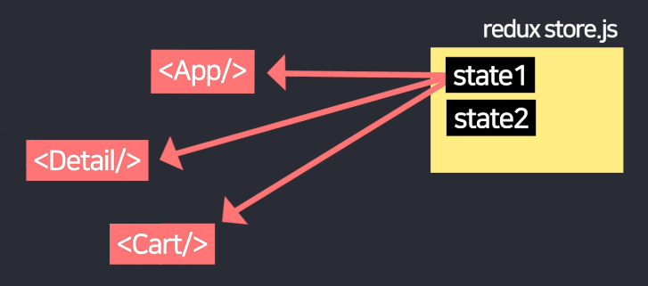
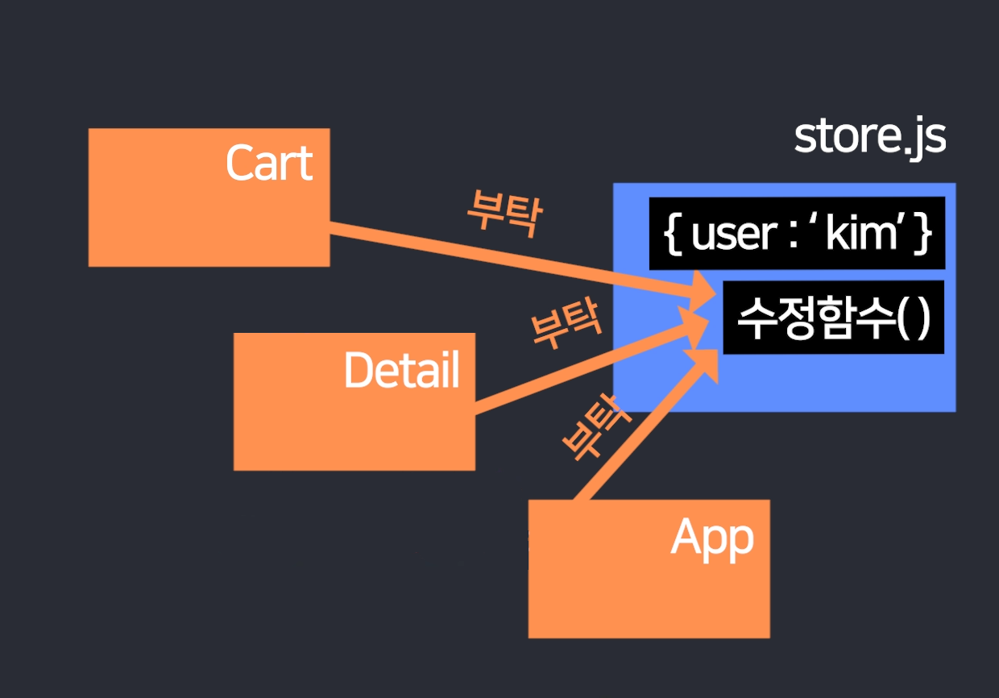

# Redux toolkit

## Redux 쓰면 좋은점
Redux는 props 없이 state를 공유할 수 있게 도와주는 라이브러리

리덕스 설치하면 js 파일 하나에 state들을 보관할 수 있는데

그걸 모든 컴포넌트가 직접 꺼내쓸 수 있다. props 전송이 필요없어진다.

## 리덕스 설치 및 세팅
**리덕스설치**
```
npm install @reduxjs/toolkit react-redux
```
**리덕스세팅**  

1. **store.js**파일 만들어서 밑의 코드 붙여줌. state들을 보관하는 파일
```
import { configureStore } from '@reduxjs/toolkit'

export default configureStore({
  reducer: { }
}) 
```
2. index.js 파일가서 Provider 라는 컴포넌트와 아까 작성한 파일을 import 한다. 
그리고 밑에 <Provider store={import해온거}> 이걸로 <App/> 을 감싸면 된다. 
그럼 이제 <App>과 그 모든 자식컴포넌트들은 store.js에 있던 state를 맘대로 꺼내쓸 수 있다.
```
import { Provider } from "react-redux";
import store from './store.js'

const root = ReactDOM.createRoot(document.getElementById('root'));
root.render(
  <React.StrictMode>
    <Provider store={store}>
      <BrowserRouter>
        <App />
      </BrowserRouter>
    </Provider>
  </React.StrictMode>
); 
```

## Redux store에 state 보관하는 법 

step 1. createSlice( ) 로 state 만들고

step 2. configureStore( ) 안에 등록하면 됩니다.

```
import { configureStore, createSlice } from '@reduxjs/toolkit'

let user = createSlice({
  name : 'user',
  initialState : 'kim'
})

export default configureStore({
  reducer: {
    user : user.reducer
  }
}) 
```
1. createSlice( ) 상단에서 import 해온 다음에 

{ name : 'state이름', initialState : 'state값' } 이거 넣으면 state 하나 생성가능합니다. 

(createSlice( ) 는 useState( ) 와 용도가 비슷하다고 보면 된다)

 

2. state 등록은 configureStore( ) 안에 하면 됩니다.

{ 작명 : createSlice만든거.reducer } 이러면 등록 끝입니다. 

여기 등록한 state는 모든 컴포넌트가 자유롭게 사용가능합니다. 

## Redux store에 있던 state 가져다쓰는 법

```
(Cart.js)

import { useSelector } from "react-redux"

function Cart(){
  let a = useSelector((state) => { return state } )
  console.log(a)

  return (생략)
}
```

## store의 state 변경하는 법 
- state 수정해주는 함수 만들고
- state변경시 그 함수 실행해 달라고 store.js에 요청  

state 수정해주는 함수부터 store.js에 만들어두고 그것을 컴포넌트에서 원할 때 실행하는 식으로 코드로 작성한다. 그이유는... state 변경하다가 갑자기 버그가 발생하면 그 버그를 찾기 위해 모든 컴포넌트를 다 챙겨봐야한다ㅠㅠ 그렇기 때문에 state 수정함수를 store.js에 미리 만들어두고 컴포넌트는 그거 실행해달라고 부탁만 하는 식으로 코드를 작성해야한다. 

### 1.  store.js 안에 state 수정해주는 함수부터 만든다. 
```
let user = createSlice({
  name : 'user',
  initialState : 'kim',
  reducers : {
   // 여기에 state 변경시켜주는 함수 작성
  }
})
 ```
### 2.  다른 곳에서 쓰기좋게 export 해준다
```
let user = createSlice({
  name : 'user',
  initialState : 'kim',
  reducers : {
   // 여기에 state 변경시켜주는 함수 작성
  }
})

export let { state 변경시켜주는 함수 } = user.actions 
 ```

### 3.  원할 때 import 해서 사용 (dispatch() 로 감싸서 사용) 
```
import { useDispatch, useSelector } from "react-redux"
import { changeName } from "./../store.js"

(생략) 
let a = useSelector((state) => { return state } )
let dispatch = useDispatch()

<button onClick={()=>{
  dispatch(state 변경시켜주는 함수() )
}}>
button
</button> 
```


## redux state가 array/object인 경우 변경
array/object 자료의 경우 state변경은 state를 직접 수정해도됨
state를 직접 수정하는 문법을 사용해도 잘 변경되는 이유는
Immer.js 라이브러리가 state 사본을 하나 더 생성해준 덕분인데 Redux 설치하면 함께 옴.