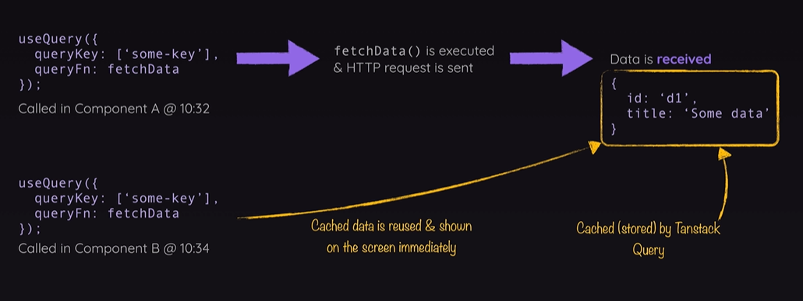
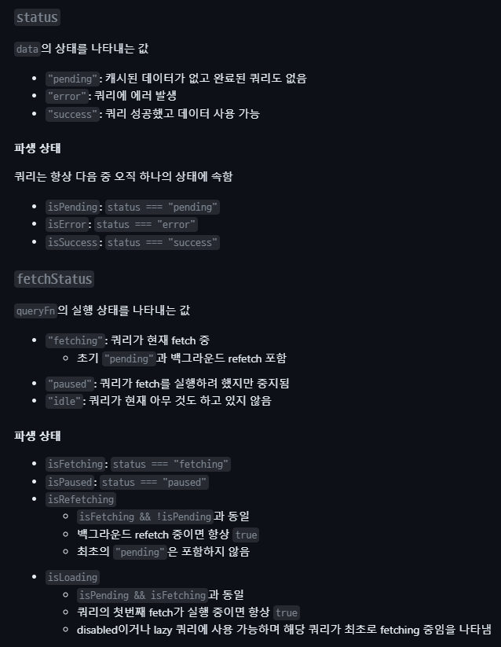

# TanstackQuery

정의

Tanstack 쿼리는 HTTP 요청을 전송하고 프론트엔드 사용자 인터페이스를 백엔드 데이터와 동기화된 상태로 유지하는 데 이용하는 라이브러리

## useQuery객체 분석

Tanstack 쿼리에는 HTTP 요청을 전송하는 로직이 내장돼 있지 않았다.

대신 Tanstack 쿼리는 요청을 관리하는 로직을 제공한다.

요청과 관련된 데이터와 발생 가능한 오류를 추적하는 역할 등을 한다.

요청을 전송하는 코드는 직접 작성해야 한다.
```ts
const {  data,  isPending,  isError,  error,} = 
  useQuery({
    queryKey: ["events"], //키는 배열이며, 문자열로 국한되지않음 객체를 사용하거나 중첩 배열이나  다른 종류의 값을 사용할 수도 있다.
    queryFn: fetchEvents, // queryFn은 쿼리함수 의미
    staleTime: 5000, //캐시에 데이터가 있을 때 업데이트된 데이터를 가져오기 위한 요청을 자체적으로 전송하기 전에 기다릴 시간을 설정
    gcTime: 40000, //가비지 수집 시간을 의미. 데이터와 캐시를 얼마나 오랫동안 보관할지를 제어.기본값 5분
  });
```
### queryFn
queryFn은 쿼리함수 의미
### queryKey
queryKey 프로퍼티:useQuery를 사용할 때 모든 쿼리 전송하는 모든 fetch 요청

즉, 전송하는 모든 GET HTTP 요청에는 쿼리 키가 있다.Tanstack 쿼리는 내부에서 이 쿼리 키를 이용해 요청으로 생성된 데이터를 캐시 처리한다

그래서 나중에 동일한 요청을 전송하면 이전 요청의 응답을 재사용할 수 있다.

키는 배열이다.이 값의 배열을 리액트 쿼리는 내부적으로 저장한다. 그래서 유사한 값으로 이루어진

유사한 배열을 사용할 때마다 리액트 쿼리는 이 배열을 확인하고 기존 데이터를 재사용 가능

키는 배열이며, 문자열로 국한되지않음 객체를 사용하거나 중첩 배열이나 다른 종류의 값을 사용할 수도 있다.



### data

data 프로퍼티 실제 응답 데이터가 값으로 들어 있습니다

이 데이터는 커스텀 fetch 함수를 통해 반환됩니다

그리고 쿼리 실행이 완료되면 결국 data 프로퍼티에 값으로 전달된다

### isPending

이 데이터가 즉각적으로 이루어지지는 않는다.

먼저 첫 번째 단계로 요청이 전송돼야 하고 응답이 있을 때까지 기다려야 한다

그래서 이 객체는 isPending 속성도 가진다.

요청이 여전히 실행 중인지 응답을 받았는지 알려준다.

### isError

응답으로 받은 결과가 반드시 데이터인 것은 아니다.

오류가 발생할 수도 있다. 서버에 문제가 있을 수도 있기 때문.

그래서 useQuery는 이 객체에 isError 프로퍼티도 사용 오류 응답을 받은 경우가 True이다.

오류 발생 시 isError가 True가 되게 하려면, 요청을 전송하는 코드에서

잘못된 응답이 반환된 경우 즉, 응답에 오류 상태 코드가 있는 경우 오류를 발행하도록 해야 한다

400이나 500 같은 응답 코드를 받았는지 확인하고 코드가 있으면 오류를 생성해 발행한다

### Error

이 경우 error 프로퍼티도 사용한다. 발생한 오류에 대한 정보가 포함된 프로퍼티.

예시) 오류 메시지

그 외에도 여러 데이터를 이 객체에서 추출할 수 있다.

다양한 부울을 이용해 여러 가지를 확인할 수 있고 refetch 함수를 수동으로 호출해

사용자가 버튼을 눌렀을 때 동일한 쿼리를 다시 전송할 수 있다

### staletime

캐시에 데이터가 있을 때 업데이트된 데이터를 가져오기 위한 요청을 자체적으로 전송하기 전에 기다릴 시간을 설정한다

예를 들어 5,000으로 설정하면 5,000밀리초 동안 기다린 후에 추가 요청을 보낸다
사용 예시)

```ts
staleTime: 5000
```

### gcTime

가비지 수집 시간을 의미. 데이터와 캐시를 얼마나 오랫동안 보관할지를 제어. 기본값 5분
이 시간 이후에 컴포넌트를 다시 렌더링하면 캐시된 데이터가 없기 때문에 리액트 쿼리가 데이터를 표시하려면 데이터를 가져오기 위한 새 요청을 전송해야 한다
사용 예시)

```ts
gcTime: 40000
```