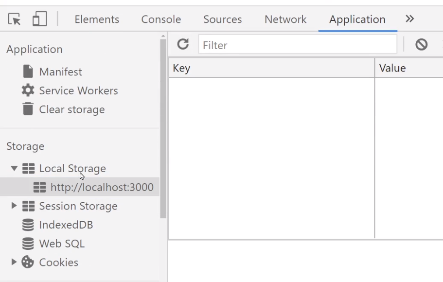

# localStorage


▲크롬개발자 도구에서 Application 탭 들어가면 구경가능합니다.

- 사이트마다 5MB 정도의 "문자 데이터"만을 저장할 수 있습니다.

- object 자료랑 비슷하게 key/value 형태로 저장합니다.

유저가 브라우저 청소를 하지 않는 이상 영구적으로 남아있습니다.

밑에 있는 Session Storage도 똑같은데 브라우저 끄면 삭제됩니다.

```ts
localStorage.setItem('데이터이름', '데이터'); // 데이터 저장은 localStorage.setItem("이름","값")
localStorage.getItem('데이터이름'); //데이터 출력 localStorage.getItem("이름")
localStorage.removeItem('데이터이름'); //데이터 삭제는 localStorage.removeItem("이름")
```

데이터 수정방법?>>>수정문법은 없음 꺼내서 수정하고 집어넣자!

### localStorage에 array/object 자료를 저장하려면

```ts
localStorage.setItem('obj', JSON.stringify({ name: 'kim' }));
```

array/object 자료를 저장하려면 JSON형태로 바꾸면된다.
그리고 꺼낼때도 JSON으로 꺼내야한다.

```ts
let 불러올자료 = localStorage.getItem('obj');
console.log(JSON.parse(불러올자료)); //JSON은 불러올때도 JSON으로 불러온다.
```

## 예제)최근 본 상품 UI 기능 만들기

```ts
function App() {
  useEffect(() => {
    localStorage.setItem('watched', JSON.stringify([]));
  }, []);
}
```

```ts
useEffect(() => {
  let 꺼낸거 = localStorage.getItem('watched');
  꺼낸거 = JSON.parse(꺼낸거);
  꺼낸거.push(찾은상품.id);

  //Set으로 바꿨다가 다시 array로 만들기
  꺼낸거 = new Set(꺼낸거);
  꺼낸거 = Array.from(꺼낸거);
  localStorage.setItem('watched', JSON.stringify(꺼낸거));
}, []);
```

localStorage에 state를 자동저장되게 만들고 싶으면

 

직접 코드짜도 되긴 하는데 

redux-persist 이런 라이브러리 설치해서 쓰면 redux store 안에 있는 state를 자동으로 localStorage에 저장해줍니다.

state 변경될 때마다 그에 맞게 localStorage 업데이트도 알아서 해줌 

하지만 셋팅문법 복잡하고 귀찮습니다. 

 

그래서 요즘은 신규 사이트들은 Redux 대신 Jotai, Zustand 같은 라이브러리를 사용합니다. 

같은 기능을 제공하는데 셋팅도 거의 필요없고 문법이 훨씬 더 쉬우니까요.

그리고 그런 라이브러리들도 아마 localStorage 자동저장기능들이 있습니다. 

 

물론 빨리 취업하려면 리덕스 떡칠된 포트폴리오 만들어서 보여주면 됩니다.

 

 

 

 

 

 

응용사항

 

지금은 사이트 새로고침시 localStorage에 있던 항목도 싹 [] 이렇게 비워집니다.

왜냐면 App컴포넌트 로드시 [] 이거 새로 넣으라고 코드짰으니까요.

이게 싫으면

이미 localStorage에 watched 항목이 있으면 [] 이거 새로 넣지 말라고 코드를 짜봅시다. 