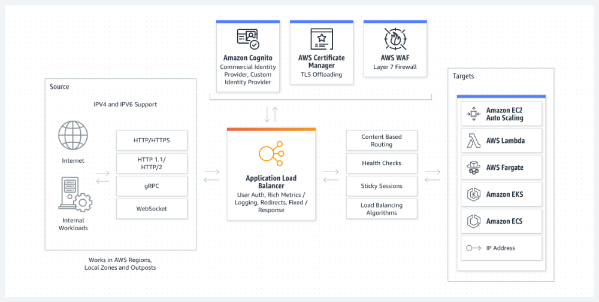

# 로드 밸런싱이란 무엇인가요?

## 개요
로드 밸런싱은 애플리케이션을 지원하는 리소스 풀 전체에 네트워크 트래픽을 균등하게 배포하는 방법. 많은 양의 트래픽을 처리하기 위해 대부분의 애플리케이션에는 데이터가 중복되는 리소스 서버가 많이 있다. 로드 밸런서는 사용자와 서버 그룹 사이에 위치하며 보이지 않는 촉진자 역할을 하여 모든 리소스 서버가 동일하게 사용되도록 하는 디바이스.

## 로드 밸런싱의 이점은 무엇인가요?
로드 밸런싱은 애플리케이션 서버와 방문자 또는 클라이언트 간의 인터넷 트래픽을 지시하고 제어합니다. 결과적으로 애플리케이션의 가용성, 확장성, 보안 및 성능이 향상됩니다.

### 애플리케이션 가용성
서버 장애 또는 유지 관리로 인해 애플리케이션 가동 중지 시간이 늘어 방문자가 애플리케이션을 사용할 수 없게 될 수 있습니다. 로드 밸런서는 서버 문제를 자동으로 감지하고 클라이언트 트래픽을 사용 가능한 서버로 리디렉션하여 시스템의 내결함성을 높입니다. 로드 밸런싱을 사용하여 다음 태스크를 더 쉽게 수행할 수 있습니다.

- 애플리케이션 가동 중지 없이 애플리케이션 서버 유지 관리 또는 업그레이드 실행
- 백업 사이트에 자동 재해 복구 제공
- 상태 확인을 수행하고 가동 중지를 유발할 수 있는 문제 방지

### 애플리케이션 확장성
로드 밸런서를 사용하여 여러 서버 간에 네트워크 트래픽을 지능적으로 전달할 수 있습니다. 로드 밸런싱이 다음을 수행하므로 애플리케이션에서 수천 개의 클라이언트 요청을 처리할 수 있습니다.

- 한 서버에서 트래픽 병목 현상 방지
- 필요한 경우 다른 서버를 추가하거나 제거할 수 있도록 애플리케이션 트래픽을 예측합니다.
- 안심하고 조정할 수 있도록 시스템에 중복성을 추가합니다.

### 애플리케이션 보안
로드 밸런서에는 인터넷 애플리케이션에 또 다른 보안 계층을 추가할 수 있는 보안 기능이 내장되어 있습니다. 이는 공격자가 서버 장애를 일으키는 수백만 개의 동시 요청으로 애플리케이션 서버를 가득 채우는 분산 서비스 거부 공격을 처리하는 데 유용한 도구입니다. 로드 밸런서는 다음을 수행할 수도 있습니다.

- 트래픽 모니터링 및 악성 콘텐츠 차단
- 공격 트래픽을 여러 백엔드 서버로 자동으로 리디렉션하여 영향 최소화
- 추가 보안을 위해 네트워크 방화벽 그룹을 통해 트래픽 라우팅

### 애플리케이션 성능
로드 밸런서는 응답 시간을 늘리고 네트워크 지연 시간을 줄여 애플리케이션 성능을 향상시킵니다. 다음과 같은 몇 가지 중요한 태스크를 수행합니다.

- 서버 간에 로드를 균등하게 배포하여 애플리케이션 성능 향상
- 라이언트 요청을 지리적으로 더 가까운 서버로 리디렉션하여 지연 시간 단축
- 물리적 및 가상 컴퓨팅 리소스의 신뢰성 및 성능 보장

## 로드 밸런싱은 어떻게 작동하나요?
회사는 일반적으로 여러 서버에서 애플리케이션을 실행합니다. 이러한 서버 배열을 서버 팜이라고 합니다. 애플리케이션에 대한 사용자 요청은 먼저 로드 밸런서로 이동합니다. 그런 다음 로드 밸런서는 요청을 처리하는 데 가장 적합한 서버 팜의 단일 서버로 각 요청을 라우팅합니다.

로드 밸런싱은 레스토랑에서 관리자가 수행하는 작업과 같습니다. 5명의 웨이터가 있는 식당을 생각해 보세요. 고객이 웨이터를 선택할 수 있는 경우 한두 명의 웨이터는 업무에 과부하가 걸리고 나머지는 유휴 상태일 수 있습니다. 이러한 경우가 발생하지 않도록 레스토랑 관리자는 고객에게 가장 적합한 특정 웨이터에게 고객을 할당합니다.

## 로드 밸런싱 유형으로 무엇이 있나요?
로드 밸런서가 트래픽을 리디렉션하기 위해 클라이언트 요청에서 확인하는 콘텐츠에 따라 로드 밸런싱을 3가지 주요 범주로 분류할 수 있습니다.

### 애플리케이션 로드 밸런싱
복잡한 최신 애플리케이션에는 단일 애플리케이션 기능을 전담하는 여러 서버를 포함하는 여러 서버 팜이 있습니다. Application Load Balancer는 HTTP 헤더 또는 SSL 세션 ID와 같은 요청 콘텐츠를 확인하여 트래픽을 리디렉션합니다. 

예를 들어, 전자 상거래 애플리케이션에는 제품 디렉터리, 장바구니 및 결제 기능이 있습니다. Application Load Balancer는 이미지와 비디오를 포함하지만 열린 연결을 유지할 필요가 없는 서버에 제품 검색 요청을 전송합니다. 이에 비해 많은 클라이언트 연결을 유지하고 장바구니 데이터를 오랫동안 저장할 수 있는 서버로 장바구니 요청을 전송합니다.

### 네트워크 로드 밸런싱
Network Load Balancer는 IP 주소 및 기타 네트워크 정보를 검사하여 트래픽을 최적으로 리디렉션합니다. 애플리케이션 트래픽의 소스를 추적하고 여러 서버에 고정 IP 주소를 할당할 수 있습니다. Network Load Balancer는 앞에서 설명한 고적 및 동적 로드 밸런싱 알고리즘을 사용하여 서버 로드를 배포합니다.

### 글로벌 서버 로드 밸런싱
글로벌 서버 로드 밸런싱은 지리적으로 분산된 여러 서버에서 발생합니다. 예를 들어, 회사는 여러 데이터 센터, 여러 국가 및 전 세계의 타사 클라우드 제공업체에 서버를 둘 수 있습니다. 이 경우 로컬 로드 밸런서는 리전 또는 영역 내에서 애플리케이션 로드를 관리합니다. 그리고 클라이언트와 지리적으로 더 가까운 서버 대상으로 트래픽을 리디렉션하려고 합니다. 서버 장애가 발생한 경우에만 클라이언트의 지리적 영역 외부의 서버로 트래픽을 리디렉션할 수 있습니다.

### DNS 로드 밸런싱
DNS 로드 밸런싱에서는 도메인의 리소스 풀에서 네트워크 요청을 라우팅하도록 도메인을 구성합니다. 도메인은 웹 사이트, 메일 시스템, 인쇄 서버 또는 인터넷을 통해 액세스할 수 있는 다른 서비스에 해당할 수 있습니다. DNS 로드 밸런싱은 애플리케이션 가용성을 유지하고 전역적으로 분산된 리소스 풀에서 네트워크 트래픽을 분산하는 데 유용합니다. 