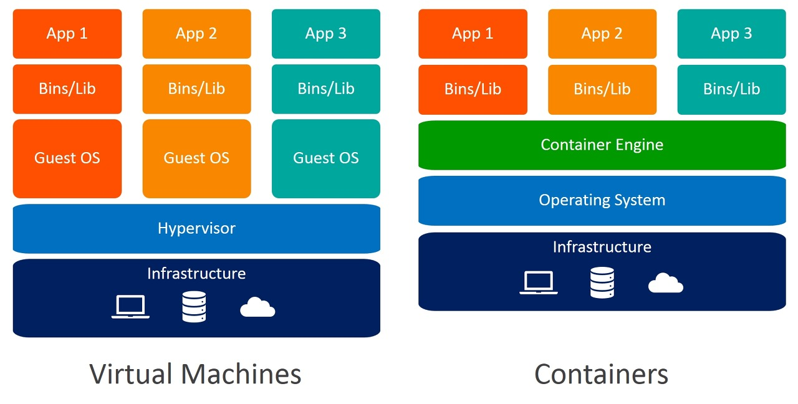

# 도커는 무엇이고 왜쓰신건가요

도커(Docker)는 컨테이너(가상화 기술을 이용하여 어플리케이션과 개발 환경을 격리된 공간에서 실행하는 단위) 기반 가상화 플랫폼으로, 응용 프로그램과 그 종속성을 격리된 환경인 컨테이너로 패키징하여 실행하는 기술이다. 이것을 통해서 응용 프로그램을 서로 다른 환경에서도 일관되게 실행할 수 있고, 개발 환경과 운영 환경 사이의 차이로 인한 문제를 줄일 수 있다.  
도커 컨테이너는 가볍고 빠르며 확장성이 좋아서 개발 및 배포 프로세스를 간소화하는 데 사용된다.

```
가상화(virtualization)는 하나의 물리적 컴퓨팅 환경에서 여러 운영 체제나 애플리케이션을 동시에 실행할 수 있게 해주는 기술입니다. 이 기술을 통해 하드웨어 리소스를 효율적으로 활용하고, 시스템 관리를 간소화하며, 운영 비용을 절감할 수 있습니다.
```

도커 컴포즈(Docker Compose)는 여러 개의 도커 컨테이너를 정의하고 실행하기 위한 도구로, 하나의 설정 파일로 여러 개의 컨테이너를 관리하고, 컨테이너 간의 네트워크 및 종속성을 설정하는 데 사용된다. 주로 복잡한 응용 프로그램이 여러 컴포넌트로 구성되어 있을 때 사용한다.

## 가상 머신 vs Docker


컨테이너 기술이 아닌 기존의 가상화 방식은 주로 OS를 가상화했다. VMware, VirtualBox와 같은 가상머신은 호스트 OS 위에 게스트 OS 전체를 가상화하여 사용하는 방식으로 도커의 컨테이너 방식과는 큰 차이가 있다.

결론을 먼저 얘기하면 기존 가상머신은 무겁고 느리지만, 도커 컨테이너는 가볍고 빠르게 실행되며 호스트의 운영체제의 커널을 공유하는 방식으로 동작한다는 것이다. 또한 컨테이너 기술은 애플리케이션 배포와 관리를 더 효율적으로 처리할 수 있는 방법을 제공한다.

### 가상머신

- 가상머신은 호스트 운영체제 위에 가상화된 하드웨어 계층을 생성하고, 각 가상 머신은 독립된 운영체제, 커널, 드라이버 등을 가짐
- 이로 인해 무겁고 높은 자원 소비가 필요
- 운영체제의 부팅 과정이 필요하므로 시간이 오래 걸림
- 독립된 운영체제를 가지므로 메모리, 디스크 공간 등 자원을 많이 소비

### Docker 컨테이너

- Docker 컨테이너는 호스트 운영체제의 커널을 공유하며, 가볍게 격리된 환경을 생성
- 가상 머신보다 더 가벼우며 효율적으로 실행
- 이미지와 컨테이너 레이어를 사용하여 빠르게 생성되며, 실행 속도가 매우 빠름
- 컨테이너는 호스트 운영체제의 커널을 공유하므로 가볍고 효율적으로 자원을 활용

## 도커를 사용하는 이유

도커란 개발을 편하기 하기 위한 도구이다. 개발자에게 개발 환경 세팅이란 번거럽고 시간이 많이 소요되는 작업이며,특히 여러 개발자가 협업을 하는 경우, 각자 다른 운영체제나 라이브러리 버전으로 인해 일관된 개발 환경을 유지하기 어려울 수 있다. 하지만 도커를 사용하면 각각의 프로젝트를 격리된 컨테이너로 실행하여 개발할 수 있다. 이로써 각자의 개발 환경을 구성하는 번거로움을 덜 수 있고, 더욱 효율적인 개발과 협업이 가능해지는 것이다.

- 환경 일치성: 다양한 환경에서 동일한 실행 환경을 보장한다. 개발 환경과 운영 환경의 차이로 인한 문제를 방지하며, 응용 프로그램을 어디서든 실행할 수 있다.
- 편리한 배포: 도커 컨테이너는 이미지로 패키징되어 배포되므로, 어플리케이션 배포가 간단해진다. 이미지를 공유하거나 배포할 때 용이하며, 빠른 확장이 가능하다.
- 격리된 환경: 도커는 각 컨테이너를 격리된 환경으로 실행하므로, 하나의 컨테이너에서 발생한 문제가 다른 컨테이너에 영향을 주지 않는다.
- 자원 효율성: 가상 머신과 비교해 더 가볍고 빠르며, 호스트 시스템의 리소스를 효율적으로 활용할 수 있다.
- 스케일링: 컨테이너 기반 아키텍처는 쉬운 스케일링이 가능하여 요구에 따라 응용 프로그램을 확장할 수 있다.

## 도커 사용 예시

- 웹 개발: 도커를 사용하여 웹 애플리케이션을 개발하면, 개발 환경을 동일하게 설정하고 다른 팀원과의 협업을 용이하게 할 수 있다. 개발 중인 애플리케이션의 서버, 데이터베이스, 캐싱 시스템 등을 각각의 도커 컨테이너로 실행하면 환경 일치성을 유지하면서 작업할 수 있다.

- 서버 개발: 마이크로서비스 아키텍처에서는 각 서비스를 독립적인 도커 컨테이너로 구성하여 개발하고 배포할 수 있다. 각 서비스는 독립된 코드베이스와 종속성을 가지며, 개별적으로 스케일링이 가능하다.

- AI 모델 개발: AI 모델을 개발하고 배포할 때도 도커를 활용할 수 있다. 예를 들어, AI 모델을 실행하는 도커 컨테이너를 생성하고 배포할 수 있다. 이 컨테이너는 모델 추론을 수행하고, 필요한 라이브러리 및 종속성을 포함할 수 있다.

## Reference

https://mvje.tistory.com/161
