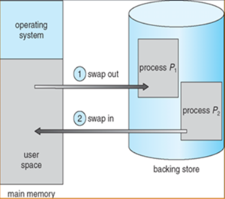

# 메모리 관리 전략

- 제한된 물리 메모리의 효율적인 사용과 메모리 참조 방식을 제공하기 위한 전략

## 효과적인 메모리 사용

### 1. 메모리 낭비 방지

(1) 동적 적재(Dynamic Loading)

- 프로그램 실행에 반드시 필요한 루틴과 데이터만 적재하는 기법
- 모든 루틴(ex. 오류처리)과 데이터(ex. 배열)는 항상 사용하지 않고, 실행 시 필요하다면 그때 해당 부분을 메모리에 적재

(2) 동적 연결(Dynamic Linking)

- 라이브러리 루틴연결을 컴파일 시점에 하는 것이 아닌 실행 시점까지 미루는 기법

(3) 스와핑(Swapping)

- CPU에서 실행중이지 않는 프로세스는 저장장치의 Swap 영역으로 이동(Swap in/Swap out)해 메모리를 확보
- 문맥 교환으로 인한 오버헤드가 발생할 수 있고 속도가 느려지지만, 메모리 공간 확보에는 효율적
  
  → 이 과정을 swap (스왑시킨다) 이라 한다. 주 기억장치(RAM)로 불러오는 과정을 swap-in, 보조 기억장치로 내보내는 과정을 swap-out 이라 한다. swap 에는 큰 디스크 전송시간이 필요하기 때문에 현재 메모리 공간이 부족할 때 Swapping이 시작된다.

## 배치전략

디스크에 있는 프로세스를 주기억장치의 어느위치에 저장할것인지 결정하는 방법

a. 최초 적합(First fit)

- 가장 처음 만나는 빈 메모리 공간에 프로세스를 할당
- 빠름

b. 최적 적합(Best fit)

- 빈 메모리 공간의 크기와 프로세스의 크기 차이가 가장 적은 곳에 프로세스를 할당

c. 최악 적합(Worst fit)

- 빈 메모리 공간의 크기와 프로세스의 크기 차이가 가장 큰 곳에 프로세스를 할당
- 이렇게 생긴 빈 메모리 공간에 또 다른 프로세스를 할당할 수 있을 거라는 가정에 기인

## 반입기법

주 기억장치에 적재할 다음 프로세스의 반입시기를 결정하는 기법

- 요구 적재: 요청시 메모리에 적재
- 예상 적재: 미리 예상하여 메모리에 적재

## Reference

https://dheldh77.tistory.com/entry/%EC%9A%B4%EC%98%81%EC%B2%B4%EC%A0%9C%EB%A9%94%EB%AA%A8%EB%A6%AC-%EA%B4%80%EB%A6%AC-%EC%A0%84%EB%9E%B5Memory-Management-Strategy
https://so-kyte.tistory.com/130
