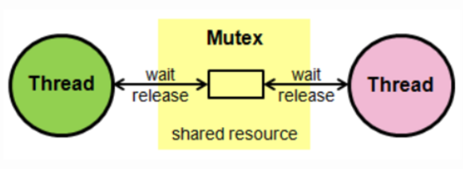
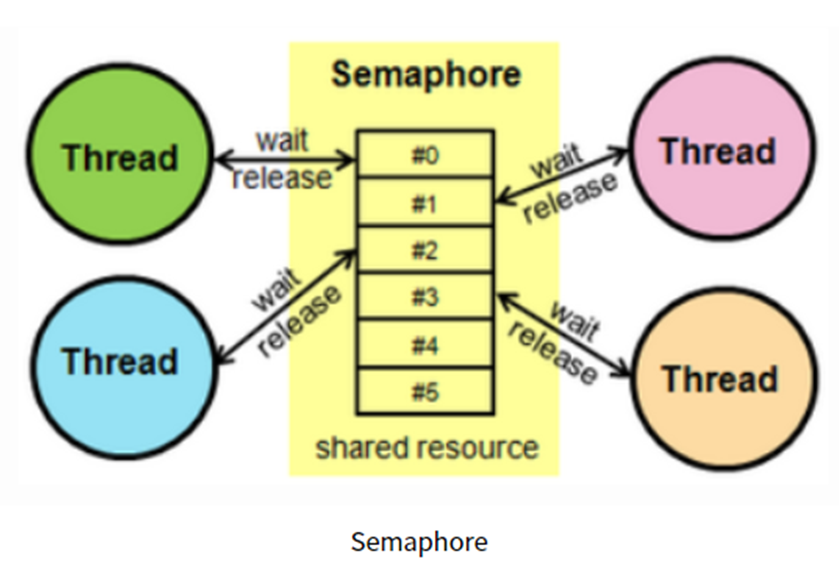

# 뮤텍스와 세마포어

## 공유 자원 
공유자원은 시스템안에서 각 프로세스,스레드가 함께 접근할수있는 모니터, 프린터, 메모리,파일,데이터 등의 자원이나 변수등을 의미. 
기 공유자원을 두개 이상의 프로세스가 동시에 읽거나 쓰는 상황을   
**경쟁상태** (동시에 접근을 시도할 때  접근의 타이밍이나 순서등이 결과값에 영향을 줄수 있는 상태)라고 한다. 

## 임계영역
공유자원에 접근할때 순서등의 이유로 결과 값이 달라지는 영역을 임계영역 
임계 영역을 해결하기 위한방법 뮤텍스/ 세파모어 /모니터 

## 뮤텍스

임계구역(Critical Section)을 가진 스레드들의 실행시간(Running Time)이 서로 겹치지 않고 각각 단독으로 실행(상호배제_Mutual Exclusion)되도록 하는 기술.
뮤텍스는 공유 자원을 사용하기 전에 설정하고 사용후에는 해제하는 잠금이다. 
잠금이 설정되면 다른 스레드는 잠긴 코드 영역에 접근할 수없다. 또한 뮤텍스는 하나의 상태(잠금 또는 잠금해제)만 가진다.

## 세파모어 
  
공유된 자원의 데이터 혹은 임계영역(Critical Section) 등에 여러 Process 혹은 Thread가 접근하는 것을 막아줌 (동기화 대상이 하나 이상)

세파 모어는 일반화된 뮤텍스., 간단한 정수 값과 두가지 함수 wait(P함수)및 signal(V함수)로 공유자원에 대한 접근을 처리 
wait()는 자신의 차례가 올때까지 기다리는 함수 signal()은 다음 프로세스로 순서를 넘겨주는 함수. 

프로세스가 공유 자원에 접근하면 세마포어에서 wait()작업을 수행하고 프로세스가 공유 자원을 해제 하면 세마포어에서 signal()작업을 수행합니다. 세마포어에는 조건 변수가 없고 프로세스가 세모퍼어 값을 수정할때 다른 프로세스는 동시에 세마포어 값을 수정하지 못한다. 

## 차이점
Mutex는 동기화 대상이 오직 1개일 때 사용, Semaphore는 동기화 대상이 1개 이상일 때 사용합니다. 
  Mutex는 자원을 소유할 수 있고, 책임을 가지는 반면 Semaphore는 자원 소유가 불가합니다. 
  Mutex는 상태가 0, 1 뿐이므로 Lock을 가질 수 있고, 소유하고 있는 스레드만이 이 Mutex를 해제할 수 있습니다. 반면 Semaphore는 Semaphore를 소유하지 않는 스레드가 Semaphore를 해제할 수 있습니다. 
  Semaphore는 시스템 범위에 걸쳐 있고, 파일 시스템 상의 파일로 존재합니다. 반면, Mutex는 프로세스의 범위를 가지며 프로세스 종료될 때 자동으로 Clean up 됩니다.

## REFERENCE
면접을 위한 CS전공지식 노트 

https://heeonii.tistory.com/14