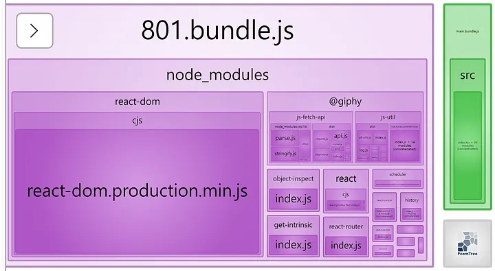

# 애플리케이션 번들 크기 줄이는 방법에 대해 설명해 주세요

웹 번들러의 번들 분할: 코드와 코드에서 사용하는 다양한 종속성을 단일 파일로 번들하고 가능한 가장 적합하게 분할하려고 시도하는 프로세스

트리 쉐이킹: 트리 쉐이킹은 앱에서 실제로 사용되지 않는 코드를 제거하여 번들 크기를 최소화하는 프로세스. 그러나 트리 쉐이킹은 코드의 사이드 이펙트(부수 효과)를 고려해야 한다. 
코드가 실행되지 않더라도 모듈을 가져오고, 이로 인해 사이드 이펙트가 발생할 수 있다.

## 소스 코드 최소화  — minify, uglify
### Minify
- Minify는 압축하기라고 할 수 있는데, 불필요한 모든 공백과 개행을 지우고, 문법적으로 필수가 아닌 (자바스크립트에서는 세미콜론 등)을 제거하는 과정

### Uglify
- Uglify는 난독화라고 번역되는데, 변수 명과 함수 명을 변경해 해석을 어렵게 하는 과정을 의미 
- 이름을 단축해 불필요한 데이터를 제거하는 것과 더불어서 외부인이 소스 코드를 열어보더라도 그 변수와 함수가 하는 역할을 해석하는 것을 어렵게 하는 효과가 있다. 
- 매우 일차적인 수준이긴 하지만 가장 기초적인 보안 효과를 가지고 있다.

### CSS 압축
- CSS도 자바스크립트와 마찬가지로 불필요한 공백을 제거할 수 있습니다.
- CssMinimizerPlugin과 MiniCssExtractPlugin을 사용하여 CSS를 압축하고 별도의 파일로 분리할 수 있습니다.


## 코드 스플릿팅 (Code Splitting)
코드 스플릿팅을 통해 번들된 파일을 여러 개의 작은 파일로 나눌 수 있다.
Webpack 설정 및 React.lazy를 사용하여 동적으로 모듈을 불러오는 방식으로 구현할 수 있다.

1. Webpack 설정 
webpack에서 자동으로 중복되는 코드를 판단해서 별도의 파일로 분리하도록 하는 설정.
설정을 적용하기만 하면 아래와 같이 소스 코드와 패키지들이 분리된다.
하지만 이와 같은 방식으로는 모든 페이지에서 동일한 패키지 번들을 불러오게 될 것이다. 따라서 특정 페이지에서 사용하는 패키지의 코드만 불러오려면 추가 작업이 필요하다.

설정하는법)
```ts
output: {
// 번들에 별도의 이름 => 생성되는 파일 이름 충돌 발생 방지
  filename: '[name].bundle.js', 
  path: path.join(__dirname, '/dist'),
  clean: true
},

splitChunks: {
  chunks: 'all'
}
```




2. React.lazy를 활용해 페이지를 분리하기

dynamic import:소스 코드 자체를 분리하는 데에 사용

EcmaScript 모듈을 비동기적으로, 동적으로 불러올 수 있도록 해주는 방식이다. 이를 활용하면 의존하는 모듈을 같은 번들 안에 포함하지 않고, 코드가 실행되며 그 모듈이 필요한 시점이 되었을 때 불러온다.

React에서 이 과정을 통해서 동적으로 컴포넌트를 불러올 수 있도록 해주는 기능이 React.lazy이다. 이와 함께 Suspense를 사용하면 컴포넌트를 불러오는 것을 필요한 시점까지 미뤘다가 성공적으로 불러왔을 때 렌더링 해줄 수 있다. 
## Reference

https://medium.com/@uk960214/%EC%84%B1%EB%8A%A5-%EC%B5%9C%EC%A0%81%ED%99%94-1-%EB%B2%88%EB%93%A4-%ED%81%AC%EA%B8%B0-%EC%A4%84%EC%9D%B4%EA%B8%B0-react-webpack-minify-code-splitting-e2391e7e5f1b

https://velog.io/@lky5697/reduce-webapp-bundle-size

https://velog.io/@hazae23/webapp-bundle-size-down