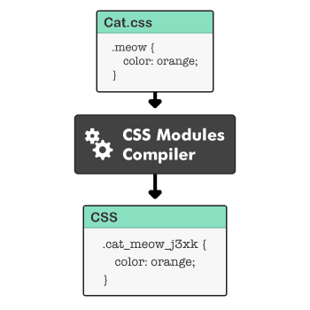

# css in js , css module,scss(sass) 에 대해 설명해 주세요
## CSS-in-JS 
- CSS-in-JS: 자바스크립트 코드에서 CSS를 작성하는 방식
- 대표적으로 Styled Components가 있는데, Styled Components는 CSS-in-JS 스타일링을 위한 프레임워크 
- 자바스크립트의 태그가 지정된 템플릿 리터럴과 CSS의 기능을 사용하여 구성 요소에 반응하는 스타일을 제공
- Styled Components는 스타일링을 위한 코드 사용량이 줄어들고 CSS 문법에 친화적

**장점**
 - CSS 모델을 문서 레벨이 아닌 컴포넌트 레벨로 추상화하는 모듈성 
 - CSS-in-JS는 JavaScript 환경을 최대한 활용 
 - 자바스크립트와 CSS 사이의 상수와 함수를 공유 
 - 현재 사용 중인 스타일만 DOM에 포함 
 - 짧은 길이의 유니크 한 클래스를 자동으로 생성하는 코드 경량화

**단점**
- 러닝 커브(Learning Curve) 
- 새로운 의존성 발생
- 별도의 라이브러리 설치에 따른 번들 크기 증대 
- CSS-in-CSS에 비해 느린 속도 

## CSS-in-CSS
### CSS module
- CSS 모듈은 CSS를 모듈화 하여 사용하는 방식
- css-module은 컴포넌트 단위로 css 스타일을 적용할 수 있다.
- 장점:동일 프로젝트 소스 안에 CSS 클래스 이름이 중복되어도 새로운 이름이 입혀져 중복 및 관리의 위험성이 적다. CSS 네이밍 규칙이 간소화
- 단점:한 곳에서 모든 것을 작성하지 않기 때문에 별도로 많은 CSS 파일을 만들어 관리해야 한다.

- CSS 클래스를 만들면 자동으로 고유한 클래스네임을 만들어서 scope를 지역적으로 제한,모듈화된 CSS를 번들러로 불러오면 다음과 같이 사용자가 정의했던 클래스네임과 고유한 클래스네임으로 이뤄진 객체가 반환

### CSS Preprocessor (CSS 전처리기(Preprocessor))
- CSS가 동작하기 전에 사용하는 기능. 자신만의 특별한 구문(Syntax)을 가지고 CSS를 생성하는 프로그램.작성한 전처리기는 웹에서 동작 가능한 표준의 CSS로 컴파일하고 동작시킨다.
- CSS의 문제점을 프로그래밍 방식, 즉 변수·함수·상속 등 일반적인 프로그래밍 개념을 사용하여 보완
-  Sass·Less·Stylus가 많이 사용됨
- 장점:공통 요소 또는 반복적인 항목을 변수 또는 함수로 대체할 수 있는 재사용성, 임의 함수 및 내장 함수로 인해 개발 시간과 비용 절약, 중첩·상속과 같은 요소로 인해 구조화된 코드 유지 및 관리 용이 
- 단점: 전처리기를 위한 도구가 필요하고 다시 컴파일하는데 시간이 소요된다

#### scss(sass) 
별도의 문법, 변수, 믹스인, 네스팅과 같은 문법을 사용해 재사용성을 높힐 수 있다.

특징, 장점
variable 선언 가능
- 변수 선언 뒤 !global을 붙여주면 해당 변수를 전역으로 할당 가능
nesting 구조
- &이용해 코드 연결 가능
mixin
- @mixin 어노테이션을 붙인 함수를 만들고 @include로 가져다 쓸 수 있다

SASS = Syntactically Awesome Style Sheets
- 더 간결하고 작성하기 편리하며, 중괄호나 세미콜론 없이 깔끔한 코드를 작성할 수 있다.

SCSS = Sassy CSS
- 한 줄로 인라인 코드를 작성할 수 있고, CSS와 유사한 문법을 가지기 때문에 코드 통합이 훨씬 쉽습니다.
- CSS 구문과 완전히 호환되도록 새로운 구문을 도입해 만든 Sass의 모든 기능을 지원하는 CSS의 상위집합이다.
즉, CSS와 거와 거의 같은 문법으로 Sass 기능을 지원한다.
## CSS-in-JS vs CSS-in-CSS
Styled Components에 비해서  CSS 파일이 추출되는 CSS 모듈 방식은 자바스크립트 해석 과정이 따로 없기 때문에 페이지가 훨씬 빨리 전환됩니다.

## 정리
작업자의 성향이나 판단이 필요한 부분이나 개발 효율성에 중점을 둔 컴포넌트 위주의 프로젝트라면 CSS-in-JS를 고려하는 것이 좋습니다. 필요한 컴포넌트 페이지의 CSS 스타일 요소만 로딩하기 때문입니다. 반면 사용자 편의에 방점을 둔 인터렉티브한 웹 프로젝트라면 랜더링 시 모든 CSS 스타일 요소를 로딩하는 CSS-in-CSS 방식을 권장
## Reference
https://www.samsungsds.com/kr/insights/web_component.html  
https://velog.io/@gygy/Sass-css-in-js-css-module#css-preprocessor