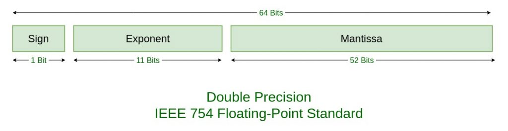

# 0.1 + 0.2 = 0.30000000000000004이 되는 이유

자바스크립트에서 0.1 + 0.2 를 하면 0.30000000000000004이 나온다.이것을 설명하기 위해서는 부동소수점개념을 알아야한다. 

## 부동소수점
자바스크립트는 숫자를 저장할 때 64비트 부동소수점을 사용함.64비트 부동소수점 저장 원리는 자바스크립트 숫자 타입의 값이 IEEE 754의 부동소수점 표현 형식 중 배정밀도 64비트 부동소수점 형식을 따른다.

- Sign은 부호부분으로써 양수(0)인지 음수(1)인지를 나타내고 1비트를 사용합니다.
- Exponent는 지수부분으로써 11비트를 차지합니다.
- Mantissa는 가수부분으로써 52비트를 차지합니다.
- 총 64비트로 이루어져 있습니다.

컴퓨터는 숫자를 계산할 때 2진법으로 계산하는데,몇몇 소수는 10진법에서 2진법으로 변환하는 과정에서 무한 소수가 되어버린다.  

자바스크립트 뿐만 아니라 부동소수점으로 숫자(Number)를 저장하는 모든 프로그래밍 언어는
동일한 문제를 지닌다.그러나 타언어(자바의 경우)는 숫자를 선언할 때 변수의 타입을 다르게 선언함으로써 내부의 연산오류를 제어한다.

이때 저장공간의 한계가 있는 컴퓨터는 무한 소수를 유한 소수로 바꾸게 된다.
이 과정에서 미세한 오차가 발생하면서 값들이 손실되거나 초과하게 된다.
이것을 정밀도 문제라고 한다.  

0.1과 0.2를 더해서 0.3이 나오지 않는 것과 동일한 문제입니다.

소수점 이하 굉장히 깊게 다룰 때, 그리고 굉장히 큰 숫자를 다룰 때는 bignumber.js 같은 오픈소스 라이브러리를 사용한다.그렇기 때문에 사실 실무에서는 이런현상 때문에 오류가 발생할 일은 거의 없습니다.

## reference
https://unpasoadelante.tistory.com/23  
https://velog.io/@harimad/0.10.2-0.3-in-JS