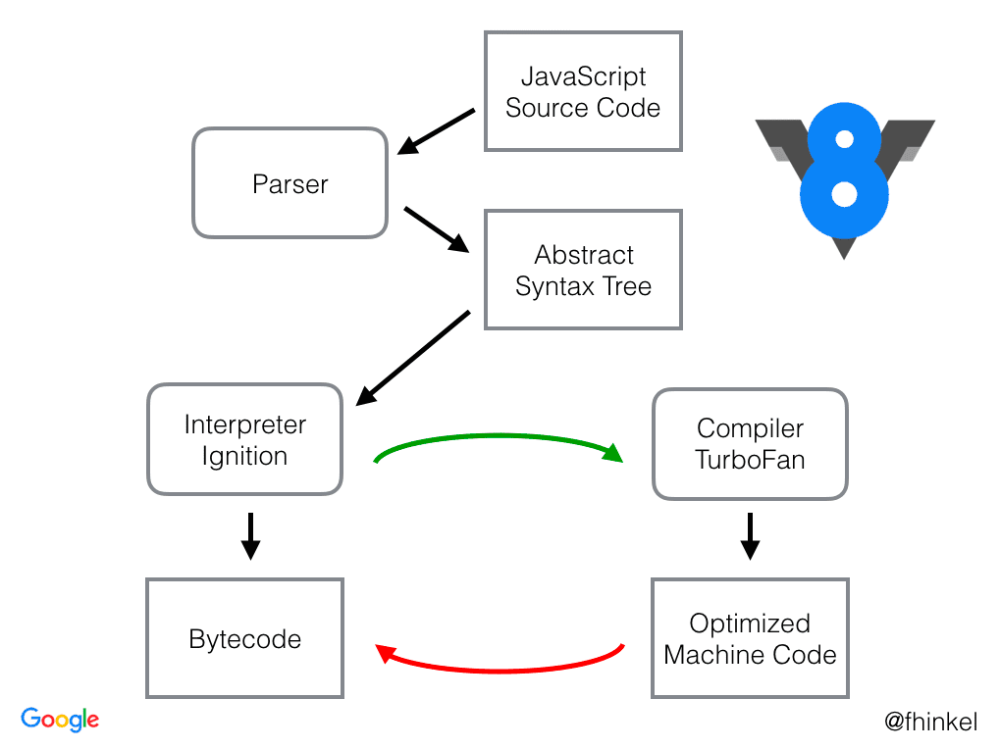

# JavaScript V8 Engine
- V8은 웹 브라우저를 만드는데 기반을 제공하는 구글에서 개발한 오픈소스 자바스크립트 엔진
- V8은 자바스크립트 코드를 실행 전에 최적화된 머신 코드로 컴파일하는 엔진이다.
- V8엔진은 인터프리터를 사용하는 대신 JIT(Just In Time) 컴파일러를 구현함으로써 코드 실행 시에 자바스크립트 코드를 머신 코드로 컴파일한다.

## JITC 컴파일러
- 프로그램을 실제 실행하는 시점에 기계어로 번역하는 컴파일 기법
- Just In Time Compiler로 프로파일링을 통해 최적화 할 코드를 선별한 후 해당 코드들만 컴파일한다. 

**1. V8 Engine는 자바스크립트 소스코드를 가져와서 Parser에게 보낸다.**  

**2. Parser는 낱말 분석(Lexical Analysis) 이라는 과정을 통해 코드를 토큰으로 분해**  

**3. AST (Abstract Syntax Tree)**
- Parser에서 분해된 토큰을 바탕으로 AST tree를 생성  

**4. Interpreter Ignition → Bytecode**  
- AST에서 나온 코드가 인터프리터(Ignition)에게 전달(💡var 호이스팅은 이단계에서 이루어짐.)  
- Ignition에서는 코드를 빠르게 AST를 Bytecode(중간 코드로 한번 컴파일한걸 의미)로 '중간 번역' 하고 실행

**5. Bytecode 실행 → TurboFan → Optimized**  
- Bytecode가 실행될 때 Profiler는 프로파일링 데이터를 수집하여 최적화 할 수 있는 부분을 기록 (반복되어 사용하는 코드 등 과열지점) 

**6. 컴파일러는 프로파일러에게 전달받은 내용을 토대로 기계어로 변환하여 최적화를 진행**
- 과열 코드를 TurboFan(최적화 컴파일러)으로 보내 최적화 컴파일을 진행   

**7. 최적화한 코드를 수행할 차례가 되면 Bytecode 대신 Optimized code가 실행**

## V8 기능 정의
- 자바스크립트 코드 컴파일 및 실행
- 콜스택을 핸들링해서 자바스크립트 함수를 특정 순서에 따라 실행
- 힙메모리 객체에 대한 메모리 할당 관리
- 가비지컬렉터
- 모든 데이터 타입, 연산자, 객체, 함수를 제공
- 이벤트 루프를 제공 (이벤트 루프를 사용하여, Callback 함수들의 변화 감지)
# Reference
https://velog.io/@remon/V8-%EC%97%94%EC%A7%84%EC%9D%B4-%EB%8C%80%EC%B2%B4-%EB%AD%90%EC%95%BC
https://velog.io/@jeb1225/JavaScript-V8-Engine