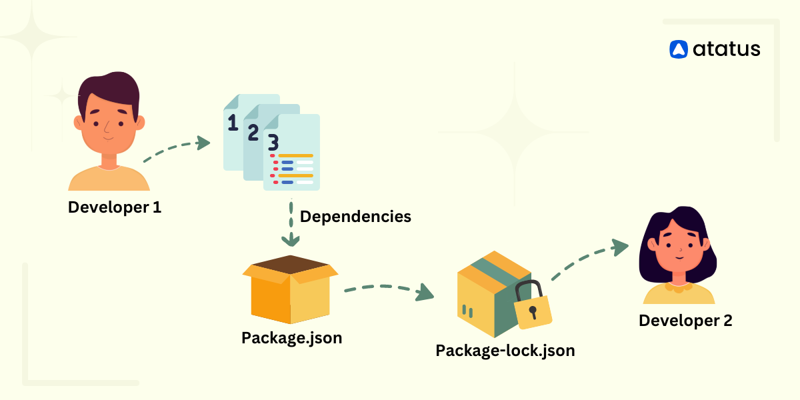
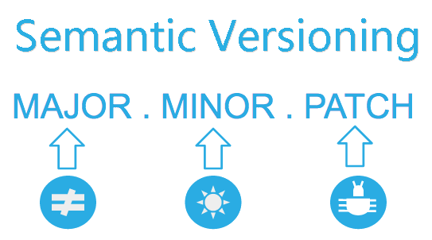

# package.json과 package-lock.json의 차이

## 1. package.json

package.json 파일은 Node.js 프로젝트에서 사용되는 파일로, 일반적으로 이 안에는 프로젝트의 이름, 버전, 설명, 작성자, 라이센스, 프로젝트 실행에 필요한 서드파티 패키지인 의존성 목록을 포함한다. (참고로 \*의존성이란, 모듈과 모듈간의 관계를 나타내며 의존성을 관리하는 것은 유지보수나 확장성에 영향을 미치므로 소프트웨어 개발에서 매우 중요하다.)

package.json에서는 버전정보를 저장할 때 version range를 사용한다.version range는
"express": "~4.16.1"라고 쓰고 4.16.1버전 이상, 그리고 4.17.0 미만의 패키지를 사용한다는 뜻이다.
만약 package.json에 패키지 버전명을 정확히 명시하게 된다면, 프로젝트에서 사용하고 있는 패키지의 버그 수정이 이루어질 때 마다 프로젝트의 package.json에 적혀있는 버전도 수정을 해야하기 때문에 번거로움이 높아진다.그대신에 package.json에서 version range로 명시함으로 그 수고로움을 덜어준다.

## 2. package-lock.json

package-lock.json은 package.json으로는 부족한 정보를 도와주는 파일이다

협업을 할때, 같은 package.json을 사용해서 각자의 컴퓨터에 같은 패키지들을 설치해서 같은 개발환경을 구성하게 되는데,서로 버젼이 달라 시간낭비를 하는 경우가 많다고 한다. 그 때문에 package-lock.json이 탄생하게 되었는데 package.json에서 version range로 저장된 모듈들이 package-lock.json에는 버전명이 정확히 명시 되어있다.

package-lock.json은 npm이 node_modules트리 또는 package.json이 수정될 때, 자동으로 생성된다.

package-lock.json은 정확한 버전 정보를 가지고 있기 때문에 package-lock.json 파일이 작성된 시점의 의존성 트리가 다시 생성될 수 있도록 보장한다.

그래서 같이 협업을 위해서는 package.json 파일뿐만 아니라 package-lock.json 또한 함께 커밋해야 한다.

package-lock.json 파일 안에는 프로젝트의 의존성 트리를 포함한 각 의존성의 정확한 버전, 버전 충돌 등의 정보가 포함되기 때문에 설치 당시 의존성을 재현하고, 다른 개발자와 공유할 때 일관성을 유지하는 데에 사용된다.

## 버전의 숫자의 의미

- 기존 버전과 호환되지 않게 API가 바뀌면 “Major 버전”을 올리고,

- 기존 버전과 호환되면서 새로운 기능을 추가할 때는 “Minor 버전”을 올리고,

- 기존 버전과 호환되면서 버그를 수정한 것이라면 “Patch 버전”을 올린다.
## Reference

https://velog.io/@songyouhyun/Package.json%EA%B3%BC-Package-lock.json%EC%9D%98-%EC%B0%A8%EC%9D%B4

https://dev-ellachoi.tistory.com/65
