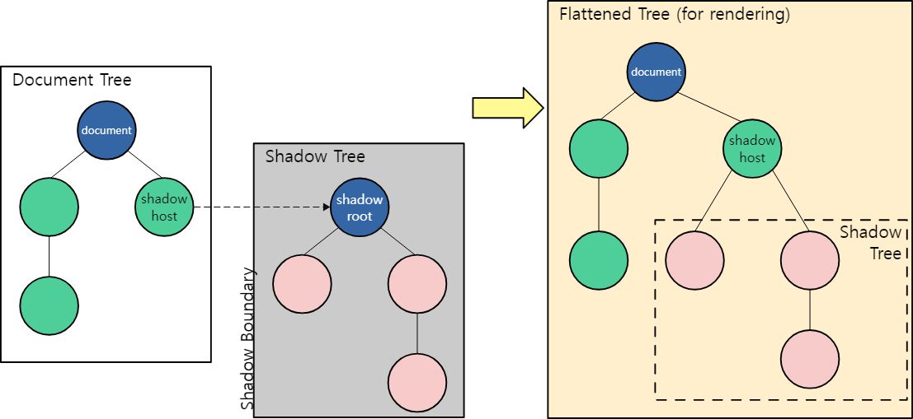

 DOM(Document Object Model)은 HTML 문서의 구조화된 표현

DOM은 하나의 큰 글로벌 범위 내에 있다.
페이지의 요소가 문서 내에 깊이 중첩되어 있거나 어디에 배치되어있는지 상관없이 document.querySelector() 메서드를 사용하여 접근이 가능.  

shadow DOM은 웹 컴포넌트의 핵심 중 하나
  
웹 컴포넌트는 재사용할 수 있는 커스텀 HTML element를 생성하고, 해당 요소를 캡슐화하는 기술입니다.

캡슐화를 통해 마크업, 스타일, 동작을 외부로부터 격리하여, 웹페이지의 다른 구성 요소의 간섭을 방지할 수 있게 도와줍니다.

그중에서도 shadow DOM API는 숨겨지고 분리된 DOM을 기존 HTML 요소에 부착하는 방법을 제공

Shadow DOM 은 일반적인 DOM과 조작 방법(자식 요소 추가나 스타일을 넣는 등)에서 차이가 없지만, shadow DOM 내부의 어떤 코드도 외부에 영향을 줄 수 없는 캡슐화를 허용

## shadow DOM에 쓰이는 용어 
- Shadow host: shadow DOM이 부착되는 통상적인 DOM 노드, host element입니다.
- Shadow tree: shadow DOM 내부의 DOM 트리.
- Shadow boundary: shadow DOM이 끝나고, 통상적인 DOM이 시작되는 장소.
- Shadow root: shadow 트리의 root 노드.

 https://wit.nts-corp.com/2019/03/27/5552

 https://developer.mozilla.org/ko/docs/Web/API/Web_components/Using_shadow_DOM

 https://tech.inflab.com/202208-shadow-root/#3-shadow-dom