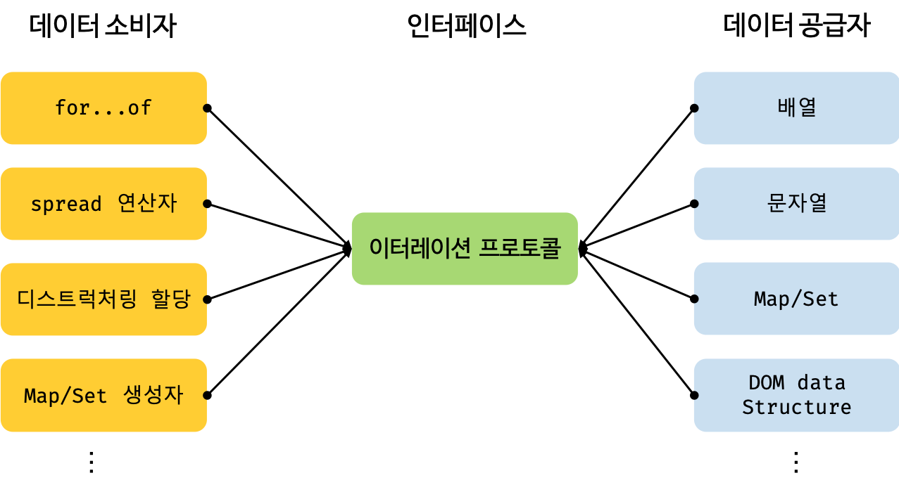

# 이터러블
이터레이션 프로토콜(iteration protocol)은 데이터 컬렉션을 순회하기 위한 프로토콜(미리 약속된 규칙)이다. 이터레이션 프로토콜을 준수한 객체는 for…of 문으로 순회할 수 있고 Spread 문법의 피연산자가 될 수 있다.
이터레이션 프로토콜에는 이터러블 프로토콜(iterable protocol)과 이터레이터 프로토콜(iterator protocol)이 있다.

## 이터러블
이터러블 프로토콜을 준수한 객체를 이터러블이라 한다. 이터러블은 Symbol.iterator 메소드를 구현하거나 프로토타입 체인에 의해 상속한 객체를 말한다. Symbol.iterator 메소드는 이터레이터를 반환한다. 이터러블은 for…of 문에서 순회할 수 있으며 Spread 문법의 대상으로 사용할 수 있다.

배열이 대표적 예이며,일반 객체는 Symbol.iterator 메소드를 소유하지 않는다. 따라서 일반 객체는 이터러블 프로토콜을 준수한 이터러블이 아니다.

일반 객체는 이터레이션 프로토콜을 준수(Symbol.iterator 메소드를 소유)하지 않기 때문에 이터러블이 아니다. 따라서 일반 객체는 for…of 문에서 순회할 수 없으며 Spread 문법의 대상으로 사용할 수도 없다. 하지만 일반 객체도 이터러블 프로토콜을 준수하도록 구현하면 이터러블이 된다.

## 이터레이터
이터레이터 프로토콜은 next 메소드를 소유하며 next 메소드를 호출하면 이터러블을 순회하며 value, done 프로퍼티를 갖는 이터레이터 리절트 객체를 반환하는 것이다. 이 규약을 준수한 객체가 이터레이터이다.

이터러블 프로토콜을 준수한 이터러블은 Symbol.iterator 메소드를 소유한다. 이 메소드를 호출하면 이터레이터를 반환한다. 이터레이터 프로토콜을 준수한 이터레이터는 next 메소드를 갖는다.

이터레이터의 next 메소드를 호출하면 value, done 프로퍼티를 갖는 이터레이터 리절트(iterator result) 객체를 반환한다.

이터레이터의 next 메소드는 이터러블의 각 요소를 순회하기 위한 포인터의 역할한다. next 메소드를 호출하면 이터러블을 순차적으로 한 단계씩 순회하며 이터레이터 리절트 객체를 반환한다.

## 이터레이션 프로토콜의 필요성

for…of 문, spread 문법 등은 아래와 같이 다양한 데이터 소스를 사용한다.이터러블은 데이터 공급자(Data provider)의 역할을 한다.  

다양한 데이터 소스가 각자의 순회 방식을 갖는다면 데이터 소비자는 다양한 데이터 소스의 순회 방식을 모두 지원해야 한다. 이는 효율적이지 않다. 하지만 다양한 데이터 소스가 이터레이션 프로토콜을 준수하도록 규정하면 데이터 소비자는 이터레이션 프로토콜만을 지원하도록 구현하면 된다.  

이터레이션 프로토콜은 다양한 데이터 소스가 하나의 순회 방식을 갖도록 규정하여 데이터 소비자가 효율적으로 다양한 데이터 소스를 사용할 수 있도록 데이터 소비자와 데이터 소스를 연결하는 인터페이스의 역할을 한다.

https://poiemaweb.com/es6-iteration-for-of