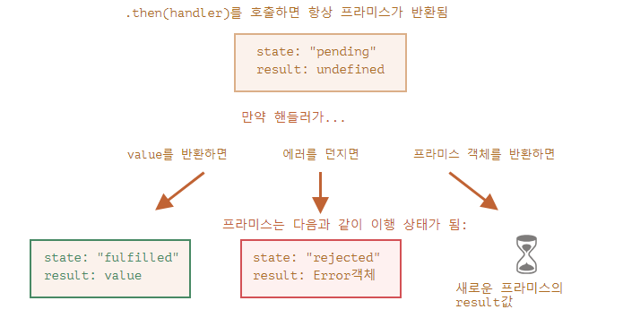

## 비동기 프로그래밍
비동기 프로그래밍이란 특정 코드의 처리가 완료되기 전, 처리하는 도중에도 아래로 계속 내려가며 수행을 하는 것이다.

## 콜백
다른 코드의 인수로서 넘겨주는 실행 가능한 코드를 말한다. 콜백을 넘겨받는 코드는 이 콜백을 필요에 따라 즉시 실행할 수도 있고, 아니면 나중에 실행할 수도 있다

## Promise
프로미스는 비동기 작업을 조금 더 편하게 처리 할 수 있도록 ES6 에 도입된 기능
이전에는 비동기 작업을 처리 할 때에는 콜백 함수로 처리를 해야 했었는데요, 콜백 함수로 처리를 하게 된다면 비동기 작업이 많아질 경우 코드가 쉽게 난잡해지게 되었습니다.(콜백지옥)
  
  Promise는 생성자에 인자로 들어가는 함수에 첫 번째 인자로는 수행할 비동기 작업, 두 번째 인자로는 그 결과물을 콜백함수에 전달하는 함수가 들어간다.

promise 예시

```
const myPromise = new Promise((resolve, reject) => {
  // 구현..
})
```
Promise 는 성공 할 수도 있고, 실패 할 수도 있습니다. 성공 할 때에는 resolve 를 호출해주면 되고, 실패할 때에는 reject 를 호출해주면 됩니다. 작업이 끝나고 나서 또 다른 작업을 해야 할 때에는 Promise 뒤에 .then(...) 을 붙여서 사용하면 됩니다.
실패하는 상황에서는 reject 를 사용하고, .catch 를 통하여 실패했을시 수행 할 작업을 설정 할 수 있습니다.

Promise 를 사용하면, 비동기 작업의 개수가 많아져도 코드의 깊이가 깊어지지 않게 됩니다.

하지만, 이것도 불편한점이 있긴 합니다. 에러를 잡을 때 몇번째에서 발생했는지 알아내기도 어렵고 특정 조건에 따라 분기를 나누는 작업도 어렵고, 특정 값을 공유해가면서 작업을 처리하기도 까다롭습니다. 다음 섹션에서 배울 async/await 을 사용하면, 이러한 문제점을 깔끔하게 해결 할 수 있습니다.

.then 또는 .catch, .finally의 핸들러(어떤 경우도 상관없음)가 프라미스를 반환하면, 나머지 체인은 프라미스가 처리될 때까지 대기합니다. 처리가 완료되면 프라미스의 result(값 또는 에러)가 다음 체인으로 전달됩니다.

이를 그림으로 나타내면 아래와 같습니다.


.catch 는 프라미스에서 발생한 모든 에러를 다룹니다. reject()가 호출되거나 에러가 던져지면 .catch에서 이를 처리합니다.
.catch는 에러를 처리하고 싶은 지점에 정확히 위치시켜야 합니다. 물론 어떻게 에러를 처리할지 알고 있어야 하죠. 핸들러에선 에러를 분석하고(커스텀 에러 클래스가 이때 도움이 됩니다) 알 수 없는 에러(프로그래밍 실수로 발생한 에러일 확률이 높습니다)는 다시 던질 수 있습니다.
에러 발생 시, 회복할 방법이 없다면 .catch를 사용하지 않아도 괜찮습니다.
unhandledrejection 이벤트 핸들러를 사용해 처리되지 않은 에러를 추적하고, 이를 사용자(혹은 서버에)에게 알려서 애플리케이션이 아무런 설명도 없이 ‘그냥 죽는걸’ 방지합시다. 브라우저 환경에선 예방에 unhandledrejection을, 다른 환경에선 유사한 핸들러를 사용할 수 있습니다.


Promise 클래스에는 5가지 정적 메서드가 있습니다.

Promise.all(promises) – 모든 프라미스가 이행될 때까지 기다렸다가 그 결괏값을 담은 배열을 반환합니다. 주어진 프라미스 중 하나라도 실패하면 Promise.all는 거부되고, 나머지 프라미스의 결과는 무시됩니다.
Promise.allSettled(promises) – 최근에 추가된 메서드로 모든 프라미스가 처리될 때까지 기다렸다가 그 결과(객체)를 담은 배열을 반환합니다. 객체엔 다음과 같은 정보가 담깁니다.
status: "fulfilled" 또는 "rejected"
value(프라미스가 성공한 경우) 또는 reason(프라미스가 실패한 경우)
Promise.race(promises) – 가장 먼저 처리된 프라미스의 결과 또는 에러를 담은 프라미스를 반환합니다.
Promise.resolve(value) – 주어진 값을 사용해 이행 상태의 프라미스를 만듭니다.
Promise.reject(error) – 주어진 에러를 사용해 거부 상태의 프라미스를 만듭니다.
실무에선 다섯 메서드 중 Promise.all을 가장 많이 사용합니다.


## async/await

function 앞에 async 키워드를 추가하면 두 가지 효과가 있습니다.

- 함수는 언제나 프라미스를 반환합니다.
- 함수 안에서 await를 사용할 수 있습니다.  

프라미스 앞에 await 키워드를 붙이면 자바스크립트는 프라미스가 처리될 때까지 대기합니다. 처리가 완료되면 조건에 따라 아래와 같은 동작이 이어집니다.

- 에러 발생 – 예외가 생성됨(에러가 발생한 장소에서 throw error를 호출한 것과 동일함)
- 에러 미발생 – 프라미스 객체의 result 값을 반환  

**async/await**를 함께 사용하면 읽고, 쓰기 쉬운 비동기 코드를 작성할 수 있습니다.

**async/await**를 사용하면 promise.then/catch가 거의 필요 없습니다. 하지만 가끔 가장 바깥 스코프에서 비동기 처리가 필요할 때같이 promise.then/catch를 써야만 하는 경우가 생기기 때문에 async/await가 프라미스를 기반으로 한다는 사실을 알고 계셔야 합니다. 여러 작업이 있고, 이 작업들이 모두 완료될 때까지 기다리려면 Promise.all을 활용할 수 있다는 점도 알고 계시기 바랍니다.