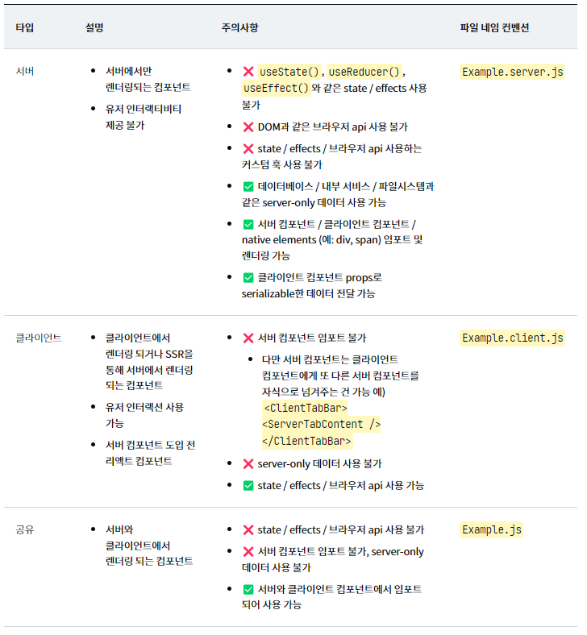

# 리액트 서버 컴포넌트(React Server Component)
리액트 서버 컴포넌트는 용어 그대로 서버에서 동작하는 리액트 컴포넌트.  
서버 컴포넌트를 사용하면 컴포넌트 렌더링을 클라이언트가 아닌 서버에서 수행할 수 있다.   
서버에서 Render를 수행하기 때문에 API를 통한 데이터 요청의 latency를 줄일 수 있고, 클라이언트에서의 연속된 API 호출을 제거하여 client-server waterfall를 막을 수 있다.  
 클라이언트 컴포넌트에서 발생하던 client-server waterfall을 제거하여 컴포넌트에서 필요한 데이터만 fetching하는 방식을 유지하면서 퍼포먼스를 향상시킬 수 있다.  

 서버 컴포넌트는 서버에서 동작하고 렌더링 된다는 특성상 다양한 종류의 백엔드 리소스에 접근할 수 있고 HTML이 아닌 ‘특별한’ 형태로 렌더링 되어 클라이언트에 전달되기 때문에 클라이언트로 전달되는 번들 사이즈 또한 감소시킬 수 있습니다.  

### 자유로운 서버 리소스 접근
서버 컴포넌트는 서버에서 동작하기 때문에 데이터베이스, 파일 시스템 그리고 인터널 서비스 같은 서버 사이드 데이터 소스에 직접 접근할 수 있습니다.  

### 제로 번들 사이즈 컴포넌트
유저 인터랙션이 없는 컴포넌트들을 서버 컴포넌트로 마이그레이션 한다면 동일한 뷰를 제공함과 동시에 번들 사이즈와 초기 로딩 시간을 감소시킬 수 있을 것입니다.

### 자동 코드 분할
 서버 컴포넌트에서 import 되는 모든 클라이언트 컴포넌트를 code splitting 포인트로 간주하기 때문에 더 이상 React.lazy로 메뉴얼 하게 명시하지 않아도 됩니다. 또한 서버에서 미리 필요한 컴포넌트를 선택하기 때문에 클라이언트는 렌더링 프로세스 초기에 번들을 다운로드할 수 있습니다.

## 서버, 클라이언트 그리고 공유 컴포넌트
서버 컴포넌트가 도입되면서 리액트 컴포넌트는 크게 세 가지 컴포넌트로 분류

## 서버 컴포넌트와 서버 사이드 렌더링의 차이
- 서버 컴포넌트의 코드는 클라이언트로 전달되지 않습니다. 하지만 서버 사이드 렌더링의 모든 컴포넌트의 코드는 자바스크립트 번들에 포함되어 클라이언트로 전송됩니다.

- 서버 컴포넌트는 페이지 레벨에 상관없이 모든 컴포넌트에서 서버에 접근 가능합니다. 하지만 Next.js의 경우 가장 top level의 페이지에서만 getServerProps()나 getInitialProps()로 서버에 접근 가능합니다.

- 서버 컴포넌트는 클라이언트 상태를 유지하며 refetch 될 수 있습니다. 서버 컴포넌트는 HTML이 아닌 특별한 형태로 컴포넌트를 전달하기 때문에 필요한 경우 포커스, 인풋 입력값 같은 클라이언트 상태를 유지하며 여러 번 데이터를 가져오고 리렌더링하여 전달할 수 있습니다. 하지만 SSR의 경우 HTML로 전달되기 때문에 새로운 refetch가 필요한 경우 HTML 전체를 리렌더링 해야 하며 이로 인해 클라이언트 상태를 유지할 수 없습니다.

### 결론

 서버 컴포넌트를 사용한다면 클라이언트 data fetching의 큰 문제점인 네트워크 waterfall을 해결할 수 있습니다. 더불어 번들 사이즈 감소, 다양한 백엔드 data source 사용, 자동 코드 분할, 컴포넌트 별 관심사 분리 등 다양한 이점으로 사용자 경험뿐만이 아니라 개발자 경험 또한 향상될 수 있습니다.

서버 컴포넌트는 클라이언트와 함께 사용될 수 있고 필요에 의해 자유롭게 추가나 마이그레이션 될 수 있습니다. 또한 서버 컴포넌트는 서버 사이드 렌더링과 유사한 점이 있으나 대체제가 아니며 사용자 경험을 향상을 위해 서버 사이드 렌더링과 함께 서로 보완하여 사용될 수 있습니다.