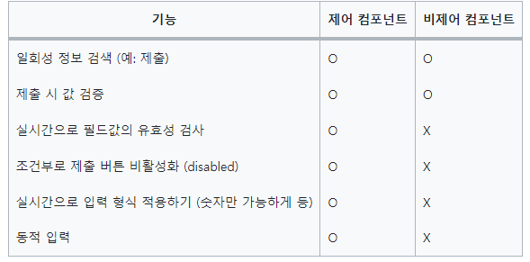

# 제어 컴포넌트 비제어 컴포넌트에 대해 설명해 주세요
3줄요약

1. React에 의해서 값이 제어되는 컴포넌트를 제어 컴포넌트
2. React에 의해서 값이 제어되지 않는 컴포넌트를 비제어 컴포넌트
3. 대부분 경우에 폼을 구현하는데 제어 컴포넌트를 사용하는 것이 좋다.

## 제어 컴포넌트 (Controlled Component)
input, textarea, select등 입력 폼 요소의 value 속성을 지정하여 값을 제어할 수 있는 컴포넌트를 제어 컴포넌트라고 한다.

제어 컴포넌트로 사용하면, input의 값은 항상 React state에 의해 결정됩니다. 코드를 조금 더 작성해야 한다는 의미이지만, 다른 UI 엘리먼트에 input의 값을 전달하거나 다른 이벤트 핸들러에서 값을 재설정할 수 있습니다.
## 비제어 컴포넌트
입력 폼 요소의 value 속성을 제어하지 않는 것
비제어 컴포넌트를 만들려면 ref를 사용하여 DOM에서 폼 값을 가져올 수 있습니다

비제어 컴포넌트는 DOM에 신뢰 가능한 출처를 유지하므로 비제어 컴포넌트를 사용할 때 React와 non-React 코드를 통합하는 것이 쉬울 수 있습니다. 빠르고 간편하게 적은 코드를 작성할 수 있지만, 그 외에는 일반적으로 제어된 컴포넌트를 사용해야 합니다.

## 제어 컴포넌트는 되고 비제어 컴포넌트는 안되는 것들

## Reference
https://ko.legacy.reactjs.org/docs/uncontrolled-components.html  

https://ko.legacy.reactjs.org/docs/forms.html#controlled-components  

https://medium.com/ecube-labs/%EC%A0%9C%EC%96%B4-%EC%BB%B4%ED%8F%AC%EB%84%8C%ED%8A%B8-%EA%B7%B8%EB%A6%AC%EA%B3%A0-%EB%B9%84%EC%A0%9C%EC%96%B4-%EC%BB%B4%ED%8F%AC%EB%84%8C%ED%8A%B8-2c160c639c20

https://velog.io/@yukyung/React-%EC%A0%9C%EC%96%B4-%EC%BB%B4%ED%8F%AC%EB%84%8C%ED%8A%B8%EC%99%80-%EB%B9%84%EC%A0%9C%EC%96%B4-%EC%BB%B4%ED%8F%AC%EB%84%8C%ED%8A%B8%EC%9D%98-%EC%B0%A8%EC%9D%B4%EC%A0%90-%ED%86%BA%EC%95%84%EB%B3%B4%EA%B8%B0