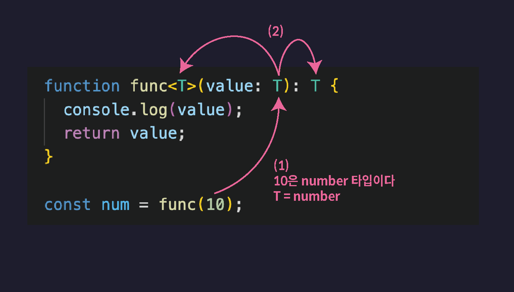

# 제네릭이란?

- 제네릭이란 함수나 인터페이스, 타입 별칭, 클래스 등을 다양한 타입과 함께 동작하도록 만들어 주는 타입스크립트의 놀라운 기능.
- 제네릭은 선언 시점이 아니라 생성 시점에 타입을 명시하여 하나의 타입만이 아닌 다양한 타입을 사용할 수 있도록 하는 기법이다. 한번의 선언으로 다양한 타입에 재사용이 가능하다는 장점이 있다.
- 제네릭을 사용하면 코드의 일반성을 높이고, 타입 안정성을 유지하면서도 재사용성을 확보할 수 있다.

T는 제네릭을 선언할 때 관용적으로 사용되는 식별자로 타입 파라미터(Type parameter)라 한다. T는 Type의 약자로 반드시 T를 사용하여야 하는 것은 아니다.

또한 함수에도 제네릭을 사용할 수 있다. 제네릭을 사용하면 하나의 타입만이 아닌 다양한 타입의 매개변수와 리턴값을 사용할 수 있다.

## 제네릭(Generic) 함수

제네릭 함수는 다른 모든 타입의 값을 다 적용할 수 있는 그런 범용적인 함수

```ts
function func<T>(value: T): T {
  //T에 어떤 타입이 할당될 지는 함수가 호출될 때 결정
  return value;
}

let num = func(10); //func(10) 처럼 Number 타입의 값을 인수로 전달하면 매개변수 value에 Number 타입의 값이 저장되면서 T가 Number 타입으로 추론 이때
//T가 Number 타입으로 추론
//func 함수의 반환값 타입또한 Number 타입
// number 타입

function func1<T>(value: T): T {
  return value;
}

let arr = func1<[number, number, number]>([1, 2, 3]);
//제네릭 함수를 호출할 때 다음과 같이 타입 변수에 할당할 타입을 직접 명시하는 것도 가능
```



## 다양한 사례

1. 타입 변수를 제한하는 사례.
   타입 변수를 제한한다는 것은 함수를 호출하고 인수로 전달할 수 있는 값의 범위에 제한을 두는 것을 의미

```ts
function getLength<
  T extends { length: number } //타입 변수를 제한할 때에는 확장(extends)을 이용
>(data: T) {
  return data.length;
}

getLength('123'); // ✅

getLength([1, 2, 3]); // ✅

getLength({ length: 1 }); // ✅

getLength(undefined); // ❌

getLength(null); // ❌
```

1번 호출은 인수로 length 프로퍼티가 존재하는 String 타입의 값을 전달 했으므로 허용됩니다.

2번 호출은 인수로 length 프로퍼티가 존재하는 Number[] 타입의 값을 전달 했으므로 허용됩니다.

3번 호출은 인수로 length 프로퍼티가 존재하는 객체 타입의 값을 전달 했으므로 허용됩니다.

4번 호출은 인수로 undefined을 전달했으므로 오류가 발생합니다.

5번 호출은 인수로 null을 전달했으므로 오류가 발생합니다


## 제 네릭 인터페이스

## Reference

https://ts.winterlood.com/0e41a293-21d9-419e-8e2a-57b5813e0582
