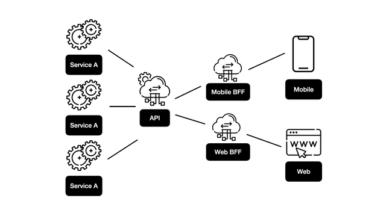

# BFF(Backend For Frontend)는 무엇인가요

- Backend For Frontend라는 말 그대로 프론트엔드를 위한 중간 서버를 구현하는 것
- API를 다이렉트로 의존할 때의 이슈들을 해결하고자 BFF사용
- BFF는 프론트엔드 프레임워크(Web, Android, iOS, Desktop, 스마트 워치 등) 별로 필요에 맞게 각각 백엔드를 구성하는 아키텍처 방법론

하나의 프론트엔드에 대해 하나의 BFF가 있어야 하며 BFF를 프론트엔드 요구사항에 맞게 구현할 수 있습니다. (여러 플랫폼을 지원하지 않을 경우에는 BFF가 의미 없을 수 있습니다.)

BFF의 가장 큰 장점 중 하나는 플랫폼 별로 적절한 서버가 돌아가고 있기 때문에 seamless한 사용자 경험을 줄 수 있다는 점이다. 또한 각각의 플랫폼 별로 BFF를 잘 따라서 설계가 되어 있다면 어플리케이션을 실행하는 동안에 자원 사용량도 최적화를 할 수가 있다.

### 장점
- 여러 개의 프론트엔드 어플리케이션 인터페이스가 각각의 BFF 서버를 병렬적으로 호출하므로, 각각의 응답이 빨라진다.
- BFF 아키텍처를 따름으로서, 백엔드 시스템의 수정을 하거나 개선을 하는 과정에서 팀이 사용하는 시간이 줄어든다.
- 프론트엔드 어플리케이션으로 데이터를 전송하는 과정에서 민감하거나 불필요한 데이터는 숨길 수 있어서 시스템을 간결하게 할 수 있다.

### 단점
- Fan Out : 하나의 서비스가 전체 BFF 시스템을 다운 시킬 수 있다. (안티패턴)
- Fuse : 각각의 서비스가 여러 BFF에게 호출되었을 때 발생한다.
- 많은 부분의 코드가 중복되거나 재작성될 수 있다. 이 과정에서 많은 커뮤니케이션 비용이 발생한다.

 BFF를 구현하여 프론트엔드를 백엔드에서 분리된 상태로 유지할 수 있습니다. BFF는 프론트엔드 요구사항을 충족하기 위해 존재하며, 이상적으로는 프론트엔드 개발자가 빌드 해야 한다.

  API 의존성 이슈들을 BFF쪽에서 처리를 해줄 수 있습니다.

- MSA 환경에서 API 엔드포인트가 분리될 때 팔로업
- 브라우저의 숙명인 CORS 처리
- API 입장에서 여러 플랫폼과 스펙을 맞출 때의 커뮤니케이션 비용 감소
- 플랫폼별로 다를 수 밖에 없는 인증 방식 처리
= 클라이언트의 꿈인 ‘화면에 필요한 데이터만 받는’ partial response

BFF의 가장 큰 장점은 실제 비즈니스 로직의 구현과 응답 데이터를 클라이언트에서 요구되는 데이터로 파싱하는 두가지 관점을 분리하여 복잡도를 낮추고, 필요한 작업에 집중하기 쉬워지는 것이라고 생각합니다.

### Q.MSA에 대해서 알고계신가요?

- MSA는 Microservice Architecture의 약자로 독립적인 배포가 가능한 서비스들로 구성된 아키텍처라는 의미
- MSA는 작은 자율 서비스 컬렉션으로 구성된다. 각 서비스는 독립적이며 제한된 컨텍스트 내에서 단일 비즈니스 기능을 구현해야 한다
#### 특징
- 작고, 독립적이며, 느슨하게 결합되어 있다.
- 각 서비스는 작은 개발팀이 관리할 수 있다.
= 서비스를 독립적으로 배포할 수 있다. 팀이 전체 어플리케이션을 빌드한 후 재배치하지 않고도 기존 서비스를 업데이트 할 수 있다.
- 서비스가 잘 정의된 API를 사용하여 서로 통신한다. 각 서비스의 내부 구현 정보는 다른 서비스에서 숨겨진다.
- 다중 저장소 프로그래밍을 지원한다. 예를 들어 서비스가 동일한 기술 스택, 라이브러리 또는 프레임워크를 공유할 필요가 없다.

https://fe-developers.kakaoent.com/2022/220310-kakaopage-bff/

https://devowen.com/453