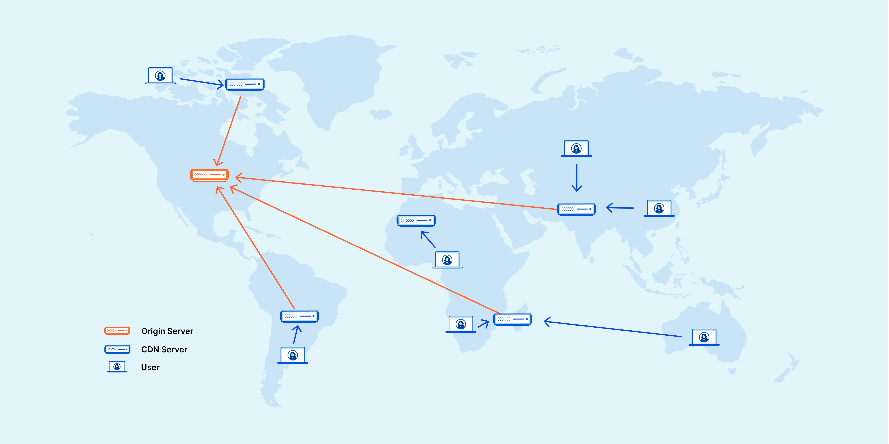

# CDN이란 무엇인가요?
콘텐츠 전송 네트워크(CDN)는 데이터 사용량이 많은 애플리케이션의 웹 페이지 로드 속도를 높이는 상호 연결된 서버 네트워크이다. 
CDN(콘텐츠 전송 네트워크)은 최종 사용자와 가까운 곳에 콘텐츠를 캐시하는 지리적으로 분산된 서버 그룹입니다. CDN을 사용하면 HTML 페이지, JavaScript 파일, 스타일시트, 이미지, 동영상 등 인터넷 콘텐츠를 로드하는 데 필요한 자산을 빠르게 전송할 수 있습니다
  
CDN을 올바로 구성하면 DDOS(Distributed Denial of Service) 공격 같은 일반적인 악성 공격으로부터 웹사이트를 보호하는 데도 도움이 될 수 있습니다.

## CDN이 중요한 이유는 무엇인가요?
콘텐츠 전송 네트워크(CDN)의 주 목적은 대기 시간을 줄이거나 네트워크 설계로 인해 발생하는 통신 지연을 줄이는 것입니다. 인터넷의 글로벌하고 복잡한 특성으로 인해 웹 사이트(서버)와 사용자(클라이언트) 간의 통신 트래픽은 아주 먼 물리적 거리를 이동해야 합니다. 또한 클라이언트에서 서버로 요청을 보내고 응답을 반환하는 양방향 통신입니다.

CDN은 클라이언트와 웹 사이트 서버 간에 중간 서버를 두어 효율성을 높입니다. 이러한 CDN 서버는 클라이언트-서버 통신의 일부를 관리합니다. 웹 서버에 대한 웹 트래픽을 줄이고, 대역폭 소비를 줄이며, 애플리케이션의 사용자 환경을 개선합니다.

## CDN을 사용시 이점
콘텐츠 전송 네트워크(CDN)는 웹 사이트 성능을 높이고 핵심 네트워크 인프라를 지원하는 여러 가지 이점을 제공합니다. 예를 들어 CDN은 다음을 실현할 수 있습니다.

### 페이지 로드 시간 단축
페이지 로드 시간이 너무 느리면 웹 사이트 트래픽이 감소할 수 있습니다. CDN은 반송률을 줄이고 사용자가 사이트에서 보내는 시간을 늘릴 수 있습니다.

### 대역폭 비용 절감
들어오는 모든 웹 사이트 요청은 네트워크 대역폭을 사용하기 때문에 대역폭 비용이 상당히 높습니다. 캐싱 및 기타 최적화를 통해 CDN은 오리진 서버가 제공해야 하는 데이터의 양을 줄여 웹 사이트 소유자의 호스팅 비용을 절감할 수 있습니다.

### 콘텐츠 가용성 제고
한 번에 너무 많은 방문자가 방문하거나 네트워크 하드웨어 오류가 발생하면 웹 사이트가 중단될 수 있습니다. CDN 서비스는 더 많은 웹 트래픽을 처리하고 웹 서버의 로드를 줄일 수 있습니다. 또한 하나 이상의 CDN 서버가 오프라인으로 전환되면 다른 운영 서버가 해당 서버를 대체하여 서비스가 중단되지 않도록 할 수 있습니다.

### 웹 사이트 보안 강화
분산 서비스 거부(DDoS) 공격은 대량의 가짜 트래픽을 웹 사이트로 전송하여 애플리케이션이 작동 중지되도록 만들려고 시도합니다. CDN은 여러 중간 서버 간에 로드를 분산하여 오리진 서버에 미치는 영향을 줄임으로써 이러한 트래픽 급증을 처리할 수 있습니다.

## CDN 작동 원리
기본적으로 CDN은 콘텐츠를 가능한 한 빠르고, 저렴하고, 신뢰할 수 있고, 안전하게 전송하기 위해 상호 연결된 서버의 네트워크입니다. CDN은 속도와 연결을 개선하기 위해 다양한 네트워크 사이의 익스체인지 포인트에 서버를 배치합니다.
```
인터넷 익스체인지 포인트(IXP)는 인터넷 서비스 공급자(ISP), CDN 등의 인터넷 인프라 회사가 서로 연결되는 물리적 위치입니다.서로 다른 네트워크의 "가장자리"에 존재하는 이러한 위치 덕분에 네트워크 공급자가 자체 네트워크 외부에서 전송을 공유할 수 있습니다
```


이러한 인터넷 익스체인지 포인트(IXP)는 다른 네트워크에서 발생한 트래픽에 대한 상호 액세스를 제공하기 위해 다양한 인터넷 제공자들이 연결하는 주요 위치입니다. CDN 제공자는 이러한 고속 대규모 상호 연결 장소에 연결하여 고속 데이터 전송 시 비용과 전송 시간을 줄일 수 있습니다.

CDN은 IXP에 서버를 배치하는 것 이외에도 표준 클라이언트/서버 데이터 전송을 다양하게 최적화합니다. CDN은 전 세계 전략적 위치에 데이터 센터를 배치하고, 보안을 강화하고, 다양한 유형의 장애와 인터넷 정체를 극복하도록 제작됩니다.

## CDN의 사용처.
콘텐츠 전송 네트워크(CDN)는 일반적인 웹 사이트 기능을 개선하고 고객 만족도를 높입니다. 다음은 몇 가지 사용 사례 예입니다.

### 고속 콘텐츠 전송
정적 및 동적 인터넷 콘텐츠 전송을 결합하여 CDN을 사용하여 고객에게 글로벌 고성능 전체 사이트 환경을 제공할 수 있습니다. 예를 들어 Reuters는 BBC, CNN, New York Times, Washington Post와 같은 주요 채널에 뉴스를 공급하는 세계 최대 뉴스 통신사입니다. 뉴스 미디어로서 Reuters의 과제는 전 세계 고객에게 뉴스 콘텐츠를 신속하게 제공하는 것입니다. Reuters는 위성 링크 통신에 대한 의존도를 최소화하고 보다 저렴하고 가용성이 높으며 안전한 글로벌 분산 네트워크 플랫폼을 구축하기 위해 Amazon의 CDN 서비스인 Amazon CloudFront를 Amazon Simple Storage Service(Amazon S3)와 함께 사용합니다.

### 실시간 스트리밍
CDN은 고품질의 풍부한 미디어 파일을 안정적이고 비용 효율적으로 제공할 수 있도록 지원합니다. 비디오 및 오디오를 스트리밍하는 기업은 CDN을 사용하여 대역폭 비용 절감, 확장성 향상, 제공 시간 단축이라는 세 가지 과제를 해결합니다. Walt Disney Company가 소유한 온라인 비디오 스트리밍 플랫폼인 Hulu를 예로 들어보겠습니다. 이 플랫폼은 Amazon CloudFront를 사용하여 증가하는 고객 기반에 20GBps 이상의 데이터를 지속적으로 스트리밍합니다.

### 다중 사용자 확장
CDN은 다수의 동시 사용자를 지원하는 데 도움이 됩니다. 웹 사이트 리소스는 한 번에 제한된 수의 클라이언트 연결만 관리할 수 있습니다. CDN은 애플리케이션 서버에서 로드 일부를 가져옴으로써 이 수를 빠르게 확장할 수 있습니다. 예를 들어 King은 언제 어디서든 디바이스에 관계없이 플레이할 수 있는 소셜 연결 교차 플랫폼 게임을 만드는 게임 회사입니다. King에는 항상 3억 5천만 명 이상의 플레이어가 접속하여 플랫폼에서 하루에 106억 개의 게임을 즐깁니다.

King의 게임 애플리케이션은 중앙 데이터 센터에 사용자의 게임 데이터를 기록하여 게임 진행 데이터 그대로 다른 디바이스에서 게임을 할 수 있게 합니다. 데이터 센터는 대역폭이 제한된 구형 컴퓨터에서 사용자가 게임에 참여하더라도 사용자에게 일관된 환경을 제공하는 것을 목표로 합니다.

King은 Amazon CloudFront를 사용하여 매일 수백 테라바이트의 콘텐츠를 제공하며, 이 규모는 새로운 게임을 출시하거나 대규모 마케팅 프로그램을 시작할 때 0.5 페타바이트 이상으로 급증합니다.  

https://aws.amazon.com/ko/what-is/cdn/  

https://www.cloudflare.com/ko-kr/learning/cdn/what-is-a-cdn/