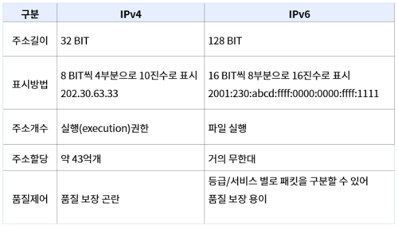

# IPv4와 IPv6

## IPv4
### IPv4 개념
IPv4는 인터넷에서 사용되는 패킷 교환 네트워크상에서 데이터를 교환하기 위한 32비트 주소체계를 갖는 네트워크 계층의 프로토콜이다. 

### IPv4 헤더 
- ip 패킷의 앞부분에서 주소 등 각종 제어 정보를 담고있는부분. 
- IPv4 헤더 사이즈는 옵션 미지정시 최소 20 바이트 이상(IPv6같은 경우 최소 40바이트 이상.)

### IPv4 주소체계 
- IPv4 주소체계는 10진수로 총 12자리 네개의 영역으로 나뉨.
- 각 부분은 -~255까지 3자리의 수로 표현됨.
-  IPv4 주소는 32비트로 구성되어 있으며, 인터넷 사용자의 증가로 인해 128비트 주소체계를 가진 IPv6 의 등장하였다.
- 32비트 IP주소는 네트워크르 나타내는 부분과 호스트를 나타내는 부분으로 구성되어있고, 네트워크 부분과 호스트부분을 구분하는 것은 서브넷 마스크다.

## IPv6

### IPv6 개념
- IPv6는 인터넷 프로토콜 스택 중 네트워크 계층의 프로토콜로서 버전 6 인터넷 프로토콜로 제정된 차세대 인터넷 프로토콜
- 현재 IPv4가 가지고 있는 주소 고갈, 보안성, 이동성 지원등의 문제점을 해결하기위해  개발된 128비트 주소체계를 가진 차세대 인터넷 프로토콜

### IPv6 특징
IPv6의 특징으로는 IP주소의 확장, 이동성, 인증및 보안기능, 개선된 QOS지원 plug&play지원 Ad-hoc네트워크 지원 단순헤더 적용 실시간 패킷 추적가능이 있다. 

### IPv6 헤더 
기존 Ipv4헤더에 비해 IPv6헤더가 IPv6 출발지 주소, 목적지 주소의 주소길이로 인하여 커졌고, IPv4의 불필요한 필드를 제거함으로써 헤더가 단순해졌다. 

### IPv4 주소체계
- 128비트의 주소공간 제공
- IPv6주소의 경우 일반적으로 16비트단위로 나누어지며 각 16비트 블록은 다시 4자리 16진수로 변환되고 콜론으로 구분된다. 
- 64비트 기준으로 앞 64비트를 네트워크 주소 뒤 64비트를 네트워크에 연결된 랜카드 장비등에 할당하는 인터페이스 주소로 활용
- 128비트 주소체계인 IPv6는 최대 1조개 이상(2^128. 거의 무한대.)을 부여할 수 있다는 점이 가장 큰 강점이다.
- 서비스에 따라 각기 다른 대역폭을 확보할 수 있도록 지원, 일정수준의 서비스품질을 요구하는 실시간 서비스를 더욱 쉽게 제공할 수 있고 인증, 데이터무결성, 데이터기밀성 등을 지원하도록 보안기능을 강화한것이 IPv6이다. 
- 또한 인터넷주소를 기존 IPv4의 A/B/C/D 클래스별 할당이 아닌, 

유니캐스트, 애니캐스트, 멀티캐스트 형태의 유형으로 할당하기 때문에 할당된 주소의 낭비자원이 사라지고,

더욱 간단하게 주소를 자동 설정할 수 있다.

앞으로의 유비쿼터스에서는 모든 전자사물들이 고유IP를 갖기되는 IoT환경에 적용하기에 적합하다고 보여진다.

