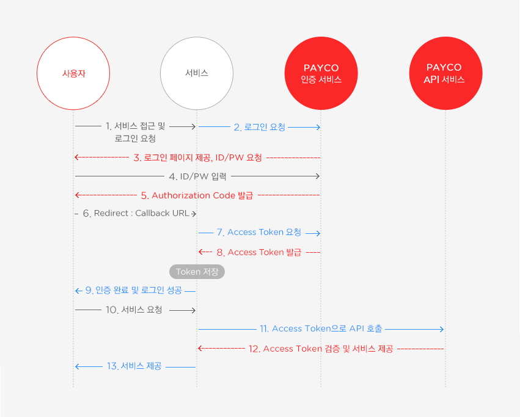
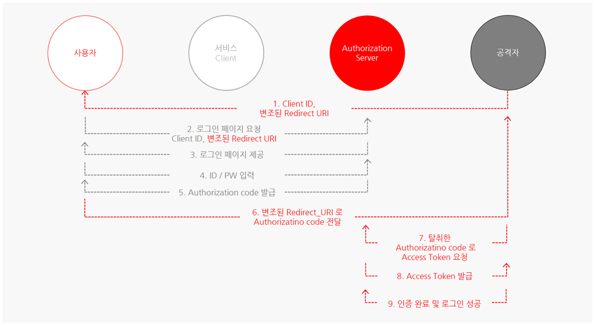

# OAuth의 로직과 취약점과 보완하는방법

## OAuth 정의
OAuth 2.0은 다양한 플랫폼 환경에서 권한 부여를 위한 산업 표준 프로토콜.

(정의) 제 3의 앱이 자원의 소유자인 서비스 이용자를 대신하여 서비스를 요청할 수 있도록 자원 접근 권한을 위임하는 방법
### Authorization code grant 방식의 인증 과정

1~5 단계는 Authorization Code 발급 요청 URL을 통해 진행할 수 있습니다.

7~8 단계는 서비스에서 callback URL 을 통해 전달받은 Authorization Code를 사용하여 Access Token 요청 API를 통해 진행할 수 있습니다.

8 단계에서 발급받은 Access Token은 서비스에서 자체적으로 저장, 관리해야 합니다.

10~11 사용자의 서비스 요청 시 회원정보가 필요하다면 Access Token을 사용해 API를 호출할 수 있습니다.
## 미흡한 CSRF 보호
클라이언트 어플리케이션에서 CSRF 보호가 미흡한 경우, CSRF 취약점을 이용해 사용자에게 공격자의 프로필을 강제로 연결시킬 수 있습니다.
state 값이 CSRF token 역할을 할수 있는데, 만약 state 값에 대해 검증이 누락되어 있거나 미흡할 경우 사용자 계정을 탈취할 수 있다

/oauth-linking?code=[...] 와 같은 페이지에 사용자가 강제로 접속하도록 하면 공격자의 소셜 프로필이 사용자의 계정에 강제로 연결될 수 있습니다.

### 🔒 대응방안
CSRF 토큰과 같은 역할을 하는 state 파라미터를 이용하여 CSRF 취약점에 대응합니다. 또한, OAuth만을 이용하여 로그인하도록 구현할 경우에도 해당 취약점에 대응할 수 있습니다.

## 인증 코드 및 액세스 토큰 누출
정상적인 경로라면 사용자(Resource Owner)가 로그인 성공 후 발급받은 Authorization code를 Client로 전달해야한다. 

하지만  그림과 같은 방법으로 공격자는 사용자(피해자)에게 변조된 Redirect URI를 보내 로그인을 유도합니다.  
 4번 단계에서 사용자(피해자)가 Redirect URI 값이 변조된 URL로 로그인할 경우, Authorization code 값이 공격자 서버로 전달되어 공격자는 사용자(피해자)의 계정을 탈취할 수 있습니다.

### 🔒 대응방안
대응 방안은 Authorization Server 에서 Redirect URI 값에 대해 Full Path 검증을 진행해야합니다.
만일 도메인까지만 검증하거나 일부 경로까지만 검증하도록 조치할 경우, Redirect 취약점이 존재하는 Client는 여전히 Authorization code를 탈취할 수 있   다
## Reference
https://velog.io/@thelm3716/OAuth-Vulnerabilities#-02-%EB%AF%B8%ED%9D%A1%ED%95%9C-csrf-%EB%B3%B4%ED%98%B8
https://meetup.nhncloud.com/posts/105
https://developers.payco.com/guide/development/start