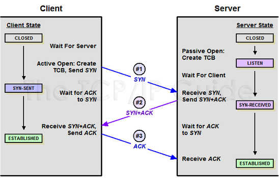
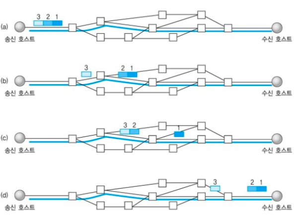
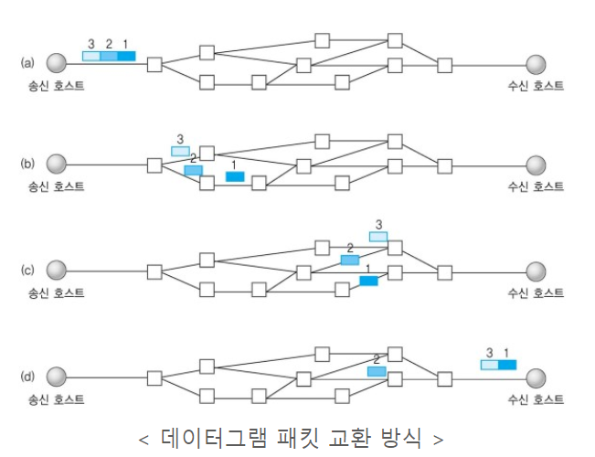

# TCP,UDP에 대해 설명해 주세요
둘다 전송계층에 해당. 

## TCP
TCP는 패킷사이의 순서를 보장하고 연결지향 프로토콜을 사용해서 연결을 하여 신뢰성을 구축해서 수신여부를 확인하며 '가상 패킷 교환 방식'을 사용. 

```
Q. 패킷(Packet)이란?
 
인터넷 내에서 데이터를 보내기 위한 경로배정(라우팅)을 효율적으로 하기 위해서 데이터를 여러 개의 조각들로 나누어 전송을 하는데 이때, 이 조각을 패킷이라고 합니다.

```
###  [TCP 특징]

- 연결 지향 방식으로 패킷 교환 방식을 사용한다(가상 회선 방식이 아님).
- 3-way handshaking과정을 통해 연결을 설정하고 4-way handshaking을 통해 해제한다.
- 흐름 제어 및 혼잡 제어.
- 높은 신뢰성을 보장한다.
- UDP보다 속도가 느리다.
- 전이중(Full-Duplex), 점대점(Point to Point) 방식.

### 3-way handshaking
TCP는 연결 신뢰성을 보장할때  3-way handshaking을 진행한다. 

1. SYN단계: 클라이언트는 서버에 클라이언트의 ISN을 담아 SYN(요청연결 플래그)을 보낸다 (ISN은 새로운 TCP연결의 첫번째 패킷에 할당된 임의의 시퀀스 번호를 말하며 장치마다 다를수있다.) 
2. SYN단계+ACK(응답 플래그)단계:서버는 클라이언트의 SYN을 수신하고 서버의 ISN을 보내며 승인번호로 클라이언트의 ISN+1을보낸다.
3. ACK단계:클라이언트는 서버의  ISN+1한 값인 승인번호를 담아 ACK를 서버에 보낸다 . 

이 과정을 통해 신뢰성이 구축되고 데이터 전송을 시작한다. 


### 4-way handshaking

1. 먼저 close를 실행한 클라이언트가 FIN(연결 끊자!)을 보내고 FIN-WAIT-1 상태로 대기한다.
2. 서버는 CLOSE-WAIT으로 바꾸고 응답 ACK(알겠어! 잠시만~)를 전달한다. 동시에 해당 포트에 연결되어 있는 애플리케이션에게 close를 요청한다.
3. ACK를 받은 클라이언트는 상태를 FIN-WAIT-2로 변경한다.
4. close 요청을 받은 서버 애플리케이션은 종료 프로세스를 진행하고 FIN(나도 끊을게!)을 클라이언트로 보내 LAST_ACK 상태로 바꾼다.
5. FIN을 받은 클라이언트는 ACK(알겠어!)를 서버에 다시 전송하고 TIME-WAIT으로 상태를 바꾼다.
TIME-WAIT에서 일정 시간이 지나면 CLOSE 된다. ACK를 받은 서버도 포트를 CLOSED로 닫는다.

※ TIME-WAIT : 먼저 연결을 끊는 쪽에서 생성되는 소켓으로, 혹시 모를 전송 실패에 대비하기 위해 존재하는 소켓이며,
TIME-WAIT이 없다면, 패킷의 손실이 발생하거나 통신자 간 연결 해제가 제대로 되지 않을 수 있다.

### 가상 패킷 교환방식 
가상 회선 패킷 교환 방식은 각패킷에는 가성회선 식별자가 포함되며 모든 패킷을 전송하면 가상회선이 해제되고 패킷들은 전송된 순서대로 도착하는 방식. 

## UDP
UDP는 순서를 보장하지 않고 수신여부를 확인하지 않으며 단순히 데이터만 주는 데이터그램 패킷 교환 방식을 사용. 

UDP는 비연결형 서비스이기 때문에, 연결을 설정하고 해제하는 과정이 존재하지 않는다.   
서로 다른 경로로 독립적으로 처리함에도 패킷에 순서를 부여하여 재조립을 하거나 흐름 제어 또는 혼잡 제어와 같은 기능도 처리하지 않기때문에 TCP보다
속도가 빠르고 네트워크 부하가 적다는 장점이 있다.   
하지만 신뢰성있는 데이터의 전송을 보장하지는 못한다. 그래서 신뢰성보다는 연속성이 중요한 서비스 예를 들면 실시간 서비스(streaming)에 자주 사용된다. 


### [ UDP 특징 ]

- 비연결형 서비스로 데이터그램 방식을 제공한다
- 정보를 주고 받을 때 정보를 보내거나 받는다는 신호절차를 거치지 않는다.
- UDP헤더의 CheckSum 필드를 통해 최소한의 오류만 검출한다.
- 신뢰성이 낮다
- TCP보다 속도가 빠르다

### 데이터그램 패킷 
데이터그램 패킷 교환방식: 패킷이 독립저긍로 이동하며 최적의  경로를 선택하여  가는데, 하나의 메시지에서 분할된 여러 패킷은 서로 다른 경로로 전송될 수 있으며 도착한 선수가 다를 수 잇는 방식을 뜻함 


## Reference
https://mangkyu.tistory.com/15

https://dev-coco.tistory.com/144