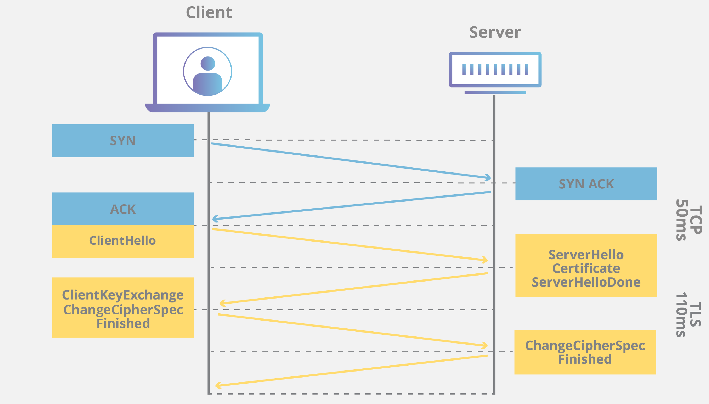

# TLS(Transport Layer Security)는 무엇

- 전송 계층 보안(TLS)은 인터넷 상의 커뮤니케이션을 위한 개인 정보와 데이터 보안을 용이하게 하기 위해 설계되어 널리 채택된 보안 프로토콜
- TLS의 주요 사용 사례: 웹 사이트를 로드하는 웹 브라우저와 같이 웹 응용 프로그램과 서버 간의 커뮤니케이션을 암호화
- TLS는 또한 이메일, 메시지, 보이스오버 IP(VoIP) 등 다른 커뮤니케이션을 암호화하기 위해 사용
## TLS의 역할
TLS 프로토콜은 암호화, 인증, 무결성이라는 세 가지 주요 요소를 달성합니다.

- 암호화: 제3자로부터 전송되는 데이터를 숨김.
- 인증: 정보를 교환하는 당사자가 요청된 당사자임을 보장.
- 무결성: 데이터가 위조되거나 변조되지 않았는지 확인.
## TLS 작동원리
TLS 연결은 TLS Handshake로 알려진 일련의 순서를 사용하여 초기화

- 브라우저는 SSL/TLS 인증서를 사용하여 SSL/TLS 핸드셰이크를 통해 웹 서버와의 보안 연결을 시작한다. 
- SSL/TLS 핸드셰이크는 HyperText Transfer Protocol(HTTPS) 통신 기술의 구성 요소 중 하나로, HTTP와 SSL/TLS의 조합이다.

### TLS Handshake 동안 사용자 장치와 웹 서버가 하는일

- 사용할 TLS 버전(TLS 1.0, 1.2, 1.3 등)을 지정
- 사용할 암호 제품군(아래 참고)을 결정합니다
- 서버의 TLS 인증서를 사용하여 서버의 신원을 인증합니다.
- Handshake가 완료된 후 키 간의 메시지를 암호화하기 위한 세션 키를 생성

1. 브라우저가 SSL/TLS 보안 웹 사이트를 열고 웹 서버에 연결합니다.
2. 브라우저는 식별 가능한 정보를 요청하여 웹 서버의 진위 여부를 확인하려고 시도합니다. 
3. 웹 서버는 공개 키가 포함된 SSL/TLS 인증서를 회신으로 보냅니다.
4. 브라우저는 SSL/TLS 인증서가 유효하고 웹 사이트 도메인과 일치하는지 확인. 브라우저가 SSL/TLS 인증서에 만족하면 공개 키를 사용하여 비밀 세션 키가 포함된 메시지를 암호화하고 전송합니다.
5. 웹 서버는 개인 키를 사용하여 메시지를 해독하고 세션 키를 검색. 그런 다음 세션 키를 사용하여 암호화하고 브라우저에 승인 메시지를 보냅니다.
6. 이제 브라우저와 웹 서버 모두 동일한 세션 키를 사용하여 메시지를 안전하게 교환하도록 전환합니다. 

### 공개 키 암호란?
공개 키 암호화는 서로 다른 두 개의 키로 데이터를 암호화하거나 서명하고 그 중 하나인 공개 키를 누구나 사용할 수 있도록 하는 방식.  
다른 하나의 키를 개인 키라고 합니다. 공개 키로 암호화된 데이터는 개인 키로만 해독할 수 있습니다. 
이렇게 키가 하나가 아닌 두 개를 사용하므로 공개 키 암호화를 비대칭 암호화라고도 합니다. 이는 특히 TLS/SSL에 널리 사용되며, 이 경우 HTTPS가 가능해집니다.

## TLS와 SSL의 차이점
TLS는 SSL(Secure Sockets Layer)이라고 불리는 이전의 암호화 프로토콜에서 발전한 것
## TLS와 HTTPS의 차이점
HTTPS는 HTTP 프로토콜 상위에서 TLS 암호화를 구현한 것으로 모든 웹 사이트와 다른 웹 서비스에서 사용됩니다. 따라서 HTTPS를 사용하는 웹 사이트는 TLS 암호화를 이용

## Reference
https://www.cloudflare.com/ko-kr/learning/ssl/transport-layer-security-tls/
https://aws.amazon.com/ko/what-is/ssl-certificate/